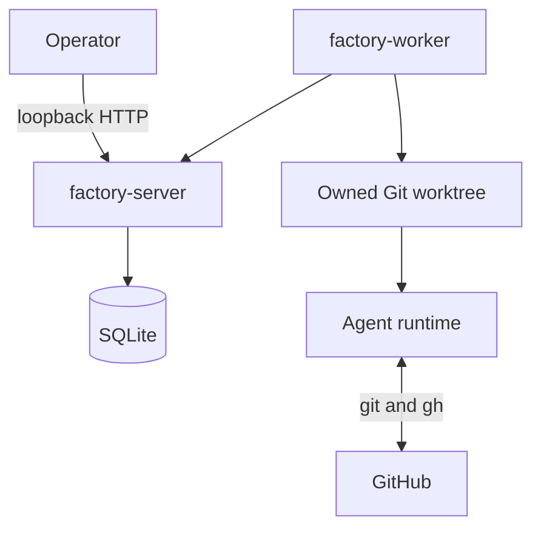
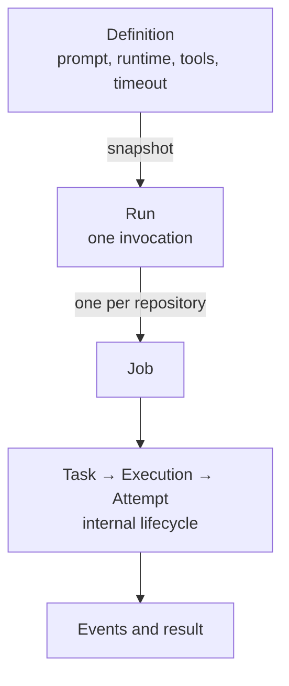

# Factory architecture

> **Status:** Current implementation
>
> **Verification basis:** Working tree based on commit `e460e64`
>
> **Direction:** The [target architecture](docs/software-factory/design.md)
> describes the intended product model. This document describes what runs
> today. A future durable backend is tracked in
> [#259](https://github.com/owainlewis/factory/issues/259); the current code has
> one SQLite orchestration path.

## 1. Executive summary

Factory runs software-engineering agents against Git repositories. An operator
saves a **Definition**, starts a **Run** against one or more repositories, and
tracks one **Job** per repository. The control plane stores the work in SQLite.
Workers pull jobs, prepare isolated Git worktrees, launch Pi, Codex, or Claude
Code, and report events and results.

The main boundary is simple: the control plane owns durable coordination;
Workers own execution. Workers initiate every connection. The server never
connects to a Worker. A contributor must preserve that split and must not let an
agent run in a shared repository checkout.

Factory is local-first. The browser and operator API are loopback-only. Remote
Workers use a separate authenticated HTTPS listener. Agents still run with the
Worker user's filesystem, network, and credentials, so a worktree is isolation
for Git state, not a security sandbox.

## 2. System context

`factory-server` is the control plane. It admits Runs, schedules Jobs, stores
state, serves the API, and embeds the React UI. `factory-worker` is the execution
plane. It discovers local runtime capabilities, pulls compatible work, manages
repository caches and worktrees, and supervises agent processes.

## 3. Architectural invariants

1. **The control plane is the durable owner.** SQLite transactions create Runs,
   Jobs, assignments, attempts, and idempotency records. Workers do not invent
   work or choose Run targets.
2. **Admission freezes intent.** A Run stores a full Definition snapshot,
   parameters, target repositories, and concurrency limit. Reusing a
   `request_key` with different input is rejected.
3. **One Job targets one repository.** A Run may fan out, but each Job has its
   own assignment, lifecycle, result, retry, and worktree.
4. **Only an eligible Worker may claim work.** Claim selection checks recent
   health, runtime capability, repository access, retained-worktree capacity,
   and free session capacity in one transaction.
5. **A lease owns an active attempt.** Start, heartbeat, events, and completion
   require the lease token. The database stores only its SHA-256 digest. Lease
   loss stops the supervised process group and fails the execution.
6. **Agent work runs in an owned worktree.** The Worker freezes a base commit,
   creates a `factory/...` branch, writes a durable manifest, and launches the
   runtime from that worktree. It never runs the agent in the shared cache.
7. **Cleanup fails closed.** Automatic cleanup happens only when identity, Git
   state, and publication are proven. Dirty, unpublished, failed, cancelled, or
   uncertain work is retained for inspection.
8. **Remote access uses separate trust boundaries.** Plain HTTP remains
   loopback-only. Remote Workers require TLS and a per-Worker credential.
   GitHub webhooks use a separate TLS listener and HMAC verification.

## 4. Components and dependencies

| Component | Owns | Does not own |
| --- | --- | --- |
| `factory-server` | API, scheduling, SQLite, migrations, leases, Automations, metrics, embedded UI | Agent processes, worktrees, provider credentials |
| `internal/controlplane` | Validation, idempotency, state transitions, routing, persistence | Runtime-specific execution |
| `factory-worker` | Worker identity, health, claims, repository cache, worktrees, process supervision, cleanup | Run admission, target selection, durable global history |
| Agent runtime | Model interaction and engineering tool use inside one worktree | Scheduling, leases, cleanup policy |
| React UI | Operator views over the same-origin API | Durable state or scheduling decisions |

The server depends on SQLite and the committed `web/dist` assets. Normal
operator builds do not need Node.js. Workers depend on Git, at least one
configured agent CLI, and `gh` when managed GitHub repository access is needed.

## 5. Critical flows

### Run admission

1. The operator selects a Definition and one or more configured repositories.
2. The control plane validates the request and returns an existing Run when the
   `request_key` is an exact replay.
3. One transaction freezes the Definition, parameters, repository identities,
   and concurrency limit, then creates one Job per repository.
4. Runnable Jobs are assigned to healthy compatible Workers. Jobs without an
   eligible Worker remain blocked with a reason.

Schedules and signed GitHub webhooks use the same Run and Job path. A Trigger
decides when to admit work; it does not execute an agent.

### Job execution

1. A Worker registers its capabilities and polls for a compatible claim.
2. The control plane assigns the oldest eligible work and creates a leased
   attempt.
3. The Worker acquires or refreshes the repository cache, freezes the origin
   base commit, creates an owned worktree and branch, and writes its manifest.
4. A supervisor subprocess launches the selected runtime and streams bounded
   events while the Worker renews the lease.
5. Completion records the result and terminal state. Cancellation or lease loss
   terminates the runtime process group.
6. The Worker removes only proven-safe successful worktrees. Everything else is
   retained with a reason and cleanup command.

### Recovery

At server startup, expired attempts become `lost`. At Worker startup, manifests,
process groups, worktrees, and server state are reconciled before new work is
accepted. Recovery prefers preserving work over deleting uncertain state.

## 6. Interfaces and data

The operator-facing model is:

- **Definition:** a saved prompt, runtime, allowed tools, timeout, and declared
  inputs. Updates increment its generation; Runs keep their original snapshot.
- **Run:** one manual, scheduled, or webhook invocation across a frozen set of
  repositories.
- **Job:** one repository within a Run. Jobs fail, cancel, and retry
  independently.
- **Worker:** one stable identity with one or more runtime capabilities and a
  bounded pool of sessions.
- **Repository:** a centrally configured GitHub identity or a compatible legacy
  checkout advertised by a Worker.

Task, Execution, Attempt, and Attempt Event are the lower-level execution
records behind a Job. Workflow, Workflow Revision, and legacy polling
Automation records remain for migration and compatibility. New schedule and
webhook Automations can admit Definition-backed Runs.

The main API groups are `/definitions`, `/runs`, `/jobs`, `/repositories`,
`/workers`, and `/metrics`. Workers use only registration, claim, attempt,
heartbeat, event, and completion routes. The optional remote Worker listener
exposes only that narrow lifecycle surface.

SQLite is the source of truth. It runs with foreign keys, WAL journaling, a
five-second busy timeout, and embedded migrations. The default database is
`~/.factory/server/factory.sqlite3`. Online backup and stopped-server restore
use validated SQLite snapshots; see the [local guide](docs/local.md).

## 7. Security and trust boundaries

- The browser and operator API trust one local OS user. They bind only to
  loopback and have no login or tenant boundary.
- Remote Workers enroll once over TLS, then use a stored per-Worker bearer
  credential. Server-side credentials are stored only as digests.
- Signed GitHub webhook bytes are bounded and verified before JSON parsing.
- The enabled repository catalog controls managed clones. A prompt or webhook
  cannot supply an arbitrary clone URL.
- Factory probes provider CLIs but does not store their tokens. Agents use the
  credentials available to the Worker OS user.
- Definition prompts are trusted operator policy. Webhook fields, GitHub item
  data, and agent output are untrusted data.
- A worktree isolates Git state only. The agent can access anything available to
  the Worker process. Factory cannot guarantee exactly-once GitHub side effects
  when a Job is retried.

Factory's loopback operator listener must not be exposed directly to a network.

## 8. Failure, capacity, and operations

| Constraint | Current value |
| --- | ---: |
| Worker sessions | 1 to 100, default 10 |
| Run repositories | Up to 200 |
| Run concurrency | 1 to 100, default 3 |
| Attempt lease | 30 seconds |
| Default / maximum timeout | 2 hours / 8 hours |
| Retained work per Worker repository | 10 |
| Managed repository cache | 100 per Worker |

A Worker or lease loss fails the current execution. Recovery is an explicit Job
retry, not automatic cross-Worker rescheduling. Retry may repeat external agent
effects, so the API and UI expose that warning.

The server sweeps leases, runs Automation admission, checkpoints SQLite during
shutdown, and writes structured JSON logs. Workers stop claiming during
shutdown, terminate active process groups, and report terminal state when the
server is reachable.

Task history and results remain until explicitly deleted. Retained worktrees and
repository caches are bounded but are not evicted by age. Operators should use
the documented backup, restore, and cleanup commands for recovery and storage
management.

## 9. Verification

The important contracts are covered by:

- control-plane store, HTTP, migration, Run, Automation, lease, and metrics
  tests in `internal/controlplane`;
- Worker configuration, runtime supervision, repository, cancellation,
  restart, and cleanup tests in `internal/worker`;
- server and Worker command tests in `cmd`;
- embedded asset tests in `web` and React tests in `web/src`;
- build and local-launch checks in `scripts/test-build.sh` and
  `scripts/test-run-local.sh`.

The full contributor check set is in [CONTRIBUTING.md](CONTRIBUTING.md).

## 10. Known limitations

- The operator API has no authentication or tenant isolation.
- Agent processes are not sandboxed.
- Windows Workers are unsupported.
- SQLite is the only orchestration backend. There is no backend abstraction.
- Worker loss does not automatically move active work to another Worker.
- Repository caches and terminal history have no age-based retention policy.
- GitHub is the only provider implemented by typed legacy polling Automations.
- A unified `factory` CLI is designed but not implemented.

## 11. Source map

| Area | Source |
| --- | --- |
| Server entry point and listeners | `cmd/factory-server` |
| Worker entry point and configuration | `cmd/factory-worker`, `internal/worker/config.go` |
| HTTP routes and trust boundaries | `internal/controlplane/http.go`, `server.go` |
| Definitions and Runs | `internal/controlplane/definitions.go`, `runs.go` |
| Scheduling and Automations | `internal/controlplane/automation_runtime.go`, `schedule_runtime.go`, `github_webhook_http.go` |
| State machine and persistence | `internal/controlplane/state.go`, `store.go`, `migrations` |
| Shared contracts and limits | `internal/protocol` |
| Worker orchestration | `internal/worker/manager.go`, `claiming.go`, `attempt_lifecycle.go` |
| Git worktrees and cleanup | `internal/worker/git.go`, `repository_cache.go`, `reconcile.go`, `cleanup.go` |
| Embedded UI | `web/src`, `web/embed.go`, `web/dist` |
| Builds and checks | `Justfile`, `CONTRIBUTING.md` |
