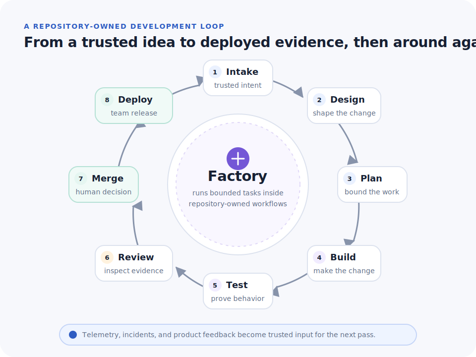
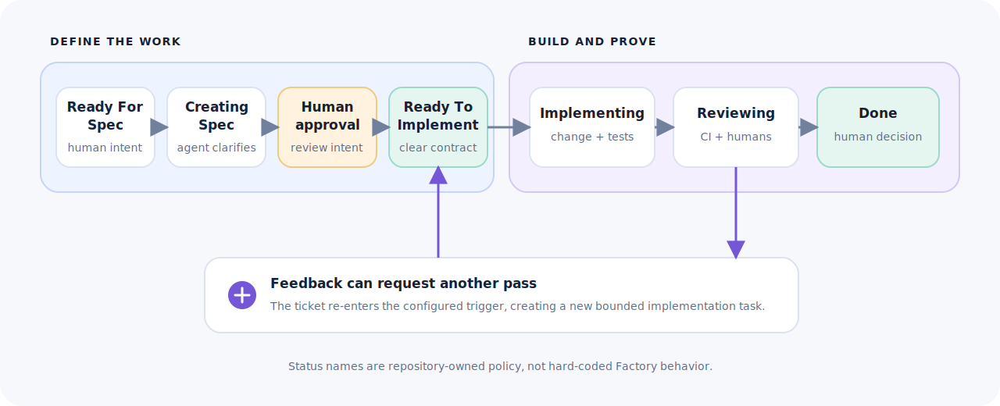

# Factory

[](https://github.com/owainlewis/factory/actions/workflows/ci.yml)
[](LICENSE)

Factory keeps coding agents working on a repository without making a human
orchestrate every step from a terminal.

It watches a trusted ticket queue. When a configured condition matches, Factory
creates a durable task, prepares an isolated workspace, and gives one Markdown
workflow to an agent. The agent uses normal tools such as `gh` and `git` to do
the work. When nothing matches, Factory does nothing and spends no model tokens.



## Why Factory exists

Coding agents can implement increasingly substantial changes, but most teams
still operate them as one-off terminal sessions. Every developer uses different
prompts, skills, checks, and handoff conventions. Humans remain responsible for
noticing ready work, starting an agent, waiting for CI, forwarding review
feedback, and remembering to try again.

That does not scale. Bugs sit in backlogs while capable agents are idle, and the
quality of the result depends on who happened to run the session.

Factory makes the agentic process repeatable. It plays a similar role to CI/CD:
it does not replace engineering judgement, but it ensures that work enters a
consistent system, receives the same checks and feedback loops, and keeps moving
until it reaches a human decision.

The goal is not to replace developers. Humans still decide what matters, supply
product context, review the result, and remain accountable for what ships.
Factory removes the manual coordination between those decisions.

## The ticket is the control plane

The issue tracker is where humans and agents coordinate. A ticket records the
problem, scope, acceptance criteria, decisions, status, and evidence. Moving a
ticket into a configured state is an explicit request for an agent pass.

This makes ticket quality load-bearing. A vague ticket is not ready for either a
human or an agent. A triage workflow can inspect the codebase, reproduce the
problem, clarify scope, add testable acceptance criteria, and ask for the
smallest missing human decision. Once the ticket is clear, it becomes the spec
for implementation.

A useful team workflow looks like this:



These names are not built into Factory. They are ordinary GitHub Project status
values and repository-owned prompts.

## A deliberately small model

Factory has four concepts:

| Concept | Responsibility |
| --- | --- |
| Source | The ticket queue and control plane. GitHub in v1. |
| Trigger | A status, label, or schedule condition. |
| Workflow | A plain Markdown prompt describing the outcome and policy. |
| Worker | The agent runtime, sandbox, timeout, and concurrency limit. |

The boundary is intentional:

- Factory owns polling, trust checks, deduplication, durable claims,
  concurrency, timeouts, sandbox lifecycle, supervision, cancellation, history,
  and recovery.
- The workflow and agent own adaptive engineering work: reading the issue,
  inspecting code, clarifying requirements, implementing changes, using `gh`
  and `git`, opening a pull request, responding to CI and review, and updating
  the ticket.

Factory does not encode a fixed SDLC, a workflow graph, or deterministic GitHub
effects. A trigger means only: **when this condition is true, run this prompt**.

## Configuration

Factory v1 is scoped to one repository and one GitHub source. Configuration and
workflows live with the code:

```text
.factory/
  config.toml
  workflows/
    triage/WORKFLOW.md
    implement/WORKFLOW.md
```

A complete worktree configuration looks like this:

```toml
version = 1
poll_every = "30s"

[worker]
runtime = "codex"
sandbox = "worktree"
timeout = "2h"
maximum_timeout = "8h"
max_concurrent = 1

[source]
type = "github"
project_owner = "owainlewis"
project_number = 16
status_field = "Status"
trusted_users = ["owainlewis"]

[trigger.triage]
type = "status"
status = "Ready For Spec"
workflow = ".factory/workflows/triage/WORKFLOW.md"

[trigger.implement]
type = "status"
status = "Ready To Implement"
workflow = ".factory/workflows/implement/WORKFLOW.md"
timeout = "4h"
```

Every trigger has an explicit type:

- `status` runs when a trusted open issue enters a configured Project status.
- `label` runs when a trusted open issue has a configured label.
- `schedule` runs once for each due cron instant.

Status and label triggers run once during one continuous visit to the condition.
Leaving and later re-entering rearms the trigger, which gives humans a simple
way to request another agent pass. Schedule triggers run once per scheduled
instant.

Workflow files contain instructions only. They have no frontmatter and cannot
change the trigger, runtime, sandbox, or timeout. A workflow may tell the agent
to read repository-local skills such as `.agents/skills/verify-behavior`, but
Factory does not install, load, or assign special meaning to skills.

## Run it

Install Rust, Git, the GitHub CLI, and the Codex CLI. Authenticate the host tools
and install Factory:

```sh
gh auth login
codex login
cargo install --path . --locked
```

From the repository Factory will manage:

```sh
factory init
```

Edit `.factory/config.toml`, then validate the source and resolved workflows:

```sh
factory validate
factory workflows
```

For a first demonstration:

1. Create an issue as one of `source.trusted_users` and add it to the configured
   GitHub Project.
2. Give it the status configured by `trigger.triage`.
3. Start Factory:

```sh
factory run
```

Factory will poll continuously, but it starts an agent only when work becomes
eligible. Use `factory run --once` to poll and record eligible work without
launching an agent.

This repository includes a repeatable setup script for the complete two-flow
demo. It creates a real issue, adds it to GitHub Project 16, and moves it to
`Ready For Spec`:

```sh
./scripts/create-demo-issue.sh \
  "Remove the unreachable legacy configuration test module" \
  "src/config.rs contains a large test module guarded by cfg(all(test, any())), so it can never compile or run. Remove the unreachable module without changing active configuration behaviour."
```

Then run `cargo run -- run`. The specification agent refines the idea and stops
in `Creating Spec`. Review the ticket on the board and move it to
`Ready To Implement`. The same Factory process starts the implementation agent,
which writes the code, opens a pull request, waits for CI and review, and moves
the ticket to `Reviewing`. Use a fresh idea each time you repeat the demo.

Inspect and operate the durable queue with:

```sh
factory tasks
factory runs
factory inspect RUN_ID
factory cancel RUN_ID
factory cleanup RUN_ID
```

Run a repository-only workflow manually with `factory workflow run ID`. Ticket
workflows normally run through their trigger because that is how Factory binds
the issue identity and live source state to the task.

## Sandboxes and trust

`sandbox = "worktree"` is the simplest local path. It protects the canonical Git
checkout, but the worker still shares the host, network, credentials, and
process boundary. Use it only for trusted work.

For stronger local isolation, initialize with:

```sh
factory init --execution-mode docker
```

Docker workers use a standalone clone, a read-only root filesystem, resource
limits, a dedicated Codex authentication file, and an explicitly named GitHub
token. The auth file is writable inside the container because Codex may refresh
OAuth credentials. Keep it separate from your normal login and make it easy to
revoke. Docker is still not a VM and the worker still has network access and
repository credentials.

Factory limits ticket triggers to configured issue authors and revalidates live
source state immediately before execution. Ticket bodies, comments, linked pull
requests, and attachments remain untrusted input. Use narrow credentials and
protected branches that the worker cannot bypass. The default implementation
workflow leaves pull requests for human review and never merges them.

## V1 scope

V1 intentionally supports:

- one repository and one GitHub source;
- status, label, and schedule triggers;
- Codex workers in managed worktrees or Docker clones;
- explicit Markdown workflows;
- durable queueing, supervision, history, cancellation, and recovery.

Jira, Linear, multiple repositories, other agent runtimes, hosted workers, and
webhook wake-ups can fit behind the same source/trigger/worker boundaries later.
They are not reasons to complicate the local system before operating evidence
demands them.

Read [the architecture](docs/design.md), [the runnable guide](docs/local-v1.md),
and [the operations guide](docs/operations.md).

## Development

Contributions are welcome. Read [CONTRIBUTING.md](CONTRIBUTING.md) for setup,
scope, and pull request guidance. Report security issues privately according to
[SECURITY.md](SECURITY.md).

```sh
cargo fmt --all --check
cargo clippy --locked --all-targets -- -D warnings
cargo test --locked --all-targets
```

## License

Factory is available under the [MIT License](LICENSE).
