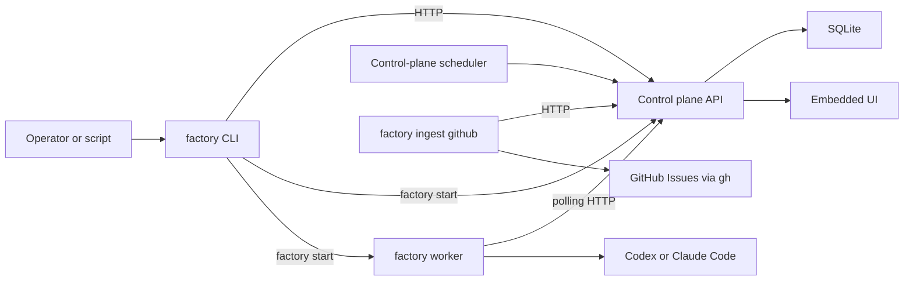

# Factory command-line interface

> **Status:** Proposed for review

## 1. Executive summary

Factory currently has two Go operator binaries, a shell launcher, and a Rust
`factory` command with different behavior. This makes the product hard to
explain and blocks a clean move from the Rust prototype. Factory will ship one
Go binary named `factory`. It will start the control plane, run a worker, submit
manual work, inspect resources, manage workflows, and manage schedules.
`factory run` will submit a normal control-plane task rather than launching an
agent inside the CLI process. The main downside is that even a one-off run
requires a running control plane and worker.

## 2. Context and scope

The implemented Go system has a control-plane binary named `factory-server`, a
data-plane binary named `factory-worker`, and `scripts/run-v2-local.sh` to run
one of each. The UI and API own task creation and history. The worker owns one
runtime identity and executes claimed tasks. These boundaries are defined in
the [V2 architecture](../v2-architecture/design.md).

The Rust prototype already owns the public name `factory`. Its `run` command
starts a polling daemon, evaluates schedules, or runs one configured workflow.
Its inspection commands read repository-local state directly. Those meanings do
not fit the Go control-plane and worker architecture.

This design defines the final Go command surface, input and output rules,
configuration, local process supervision, schedule-facing commands, the
GitHub-ingest process role, and the CLI part of the Rust retirement. It does not
implement the scheduler, workflow library, source ingest, or Rust archive.
Their APIs must exist before their CLI commands can ship.

## 3. System context



Finite commands such as `run`, `tasks list`, and `workflows apply` are API
clients. `server`, `worker`, and `ingest github` are long-running process roles.
`start` is a local foreground supervisor for server and local worker roles. The
CLI does not read the control-plane database and does not execute an agent for
a submitted task.

## 4. Proposed design

### How it works

An operator has a local Codex worker and Claude Code worker registered with the
control plane. They run:

```sh
factory run \
  --workflow code-review \
  --worker local-claude \
  --repository factory \
  "Review this merge request: https://git.example.com/team/factory/-/merge_requests/42"
```

The CLI checks the server, resolves the unique worker name and that worker's
repository key, resolves `code-review` to its current immutable revision, and
submits one task with a random request key. It prints the task ID, state, and UI
URL, then exits. The task appears in the UI and the assigned worker claims it.
Adding `--wait` makes the CLI poll the task until it reaches a terminal state.
Pressing Ctrl-C while waiting stops only the CLI wait. It does not cancel the
task.

The same job can be made repeatable by writing a schedule file and running:

```sh
factory schedules apply weekly-docs.toml
factory schedules run weekly-docs
```

The first command creates or updates a named schedule. The second asks the
control plane to create one task immediately using that schedule's current
settings. Normal due runs are created by the scheduler inside the control
plane, not by a permanent CLI process.

### Components and responsibilities

#### Root command

The root command owns parsing, help, version output, configuration precedence,
HTTP error presentation, and stable machine-readable output. It depends on
small command packages and the shared protocol types. It does not own database
queries, task scheduling, workflow composition, or agent execution.

#### API client commands

`run`, `status`, and resource commands own input loading, friendly-name
resolution, API calls, and display. They depend only on the HTTP API. They do
not open SQLite or inspect worker directories.

#### Server role

`factory server` owns the existing control-plane lifecycle and embedded UI.
The scheduler will run in this process so one SQLite owner creates due tasks.
The command does not start local workers.

#### Worker role

`factory worker` owns one existing worker identity, one runtime, its advertised
repositories, attempt supervision, and retained-worktree cleanup. It does not
schedule or route work. Five runtimes require five worker processes and five
worker configurations.

#### GitHub ingest role

`factory ingest github` owns the polling and durable episode behavior defined
in the [GitHub ingest design](../v2-github-ingest/design.md). It submits normal
tasks through the API and may run continuously or once. It does not execute an
agent, evaluate cron schedules, or run inside `factory start`.

#### Local supervisor

`factory start` owns foreground startup and shutdown of one server and one or
more selected local workers. It starts child copies of the current executable
as `factory server` and `factory worker`, preserving separate process
lifecycles. It does not daemonize, install a service, rebuild the UI, or run
`npm`.

### Decisions

#### One binary with explicit process roles

Factory will build one `factory` binary. `server` and `worker` remain separate
commands and processes. A single combined runtime was rejected because it would
blur the control-plane and data-plane failure boundaries. Keeping
`factory-server`, `factory-worker`, or `factory-ingest` as public binaries was
rejected because operators should learn one command. The trusted-local MVP
supports same-host server and workers. Remote VM and Kubernetes workers need a
later authenticated transport design.

#### `factory run` always submits a task

`factory run` is the command-line equivalent of Delegate task in the UI. It
always calls the control-plane API. Directly spawning Codex or Claude Code was
rejected because it would bypass durable history, assignment, workflows,
cancellation, and future schedules.

#### Context remains free text

Run input is free text supplied as one quoted argument, a file, or piped stdin.
There are no ticket, merge-request, or branch flags. Those references belong in
context and the selected workflow tells the agent how to handle them. This
matches the reusable-workflow design and avoids provider-specific CLI schemas.
It is the same context model defined in
[Reusable workflows for Factory V2](../v2-workflows/design.md).

#### Friendly names resolve before mutation

Commands accept stable IDs or friendly names. A name must resolve to exactly one
resource in the relevant scope. The CLI fails and prints candidates when a name
is missing or ambiguous. Guessing was rejected because assigning code work to
the wrong worker or repository is costly.

#### Schedules are control-plane resources

Schedules live in the control plane and are evaluated by its server process.
Each schedule refers to a worker and repository, plus an optional stable
workflow. At task creation time the control plane pins the workflow's current
immutable revision. A schedule without a workflow creates a blank task from its
context. A separate scheduler process was rejected for the SQLite MVP because
it adds another deployment and leader-election problem.

#### Resource files are the automation interface

`workflows apply` and `schedules apply` read files and create or update resources
by name. Large prompt text and cron settings do not need to be escaped into
shell flags. Interactive editing inside the CLI was rejected because the UI and
ordinary text editors already solve it.

#### Standard library parsing first

The Go implementation will use a small root dispatcher and `flag.FlagSet` for
each command. A CLI framework is not needed for this command tree yet. This
costs some hand-written help and validation but avoids adopting a runtime
framework solely for command parsing.

## 5. Invariants and requirements

### Invariants

1. Every manual, scheduled, UI, and ingested task uses the same task-creation
   service.
2. `factory run` never starts an agent process.
3. One worker process has one worker identity and one runtime.
4. Finite client commands never read or write the control-plane SQLite file.
5. A mutating command that targets an existing resource resolves every
   friendly name to exactly one stable ID before it sends the mutation.
6. A scheduled task records the exact workflow revision used for that task.
7. Retrying a task keeps its original context and workflow revision.
8. Ctrl-C during `run --wait` does not cancel remote work.
9. Human output and machine output never share stdout.
10. Normal binary startup never requires Node or rebuilds the embedded UI.
11. Windows is not a supported Factory platform.
12. The final release builds no public `factory-v2`, `factory-server`,
    `factory-worker`, or `factory-ingest` binary.

### Requirements

- `factory --help` lists local process, ingest, task, worker, workflow, and
  schedule commands with one-line examples.
- `factory version` prints the semantic version, Git commit, Go version, and
  target platform.
- `factory start` runs in the foreground, starts the server first, waits up to
  10 seconds for health, then starts every selected worker and waits up to 40
  seconds for registration.
- `factory start` accepts repeated `--worker-config` flags. With none, it uses
  `~/.factory/worker.toml`.
- Before starting any child, `factory start` verifies that each selected worker
  config's normalized `server` URL equals the HTTP endpoint derived from
  `--listen`. A mismatch names the config and both endpoints and exits 2.
- If any child of `factory start` exits unexpectedly, all remaining children
  are stopped and `start` exits nonzero.
- `factory server` preserves the current loopback-only listen rule and SQLite
  marker checks.
- `factory worker` preserves the current runtime checks, claim loop, attempt
  supervisor, shutdown, and retained-worktree policy.
- `factory run` accepts exactly one context source: positional text,
  `--file PATH`, or non-terminal stdin.
- `factory run --title` is optional. Without it, the CLI uses the first
  non-empty context line, shortened to 80 Unicode characters for display. The
  stored context is never shortened.
- `factory run` accepts `--workflow`, `--worker`, `--repository`,
  `--timeout`, `--request-key`, and `--wait`.
- Worker and repository selection uses an explicit flag, then the configured
  default, then the server's only valid choice. A missing or ambiguous
  configured default fails closed and prints candidates. Workflow omission
  means Blank task.
- A generated request key is a random UUID. An explicit request key enables
  safe replay by scripts.
- The CLI retries an uncertain task submission three times with delays of one,
  two, and four seconds, always using the same request key. If the outcome
  remains unknown, it prints that key so the operator can replay the command.
- Default `run` output contains the task ID, queued state, assigned worker,
  repository, and absolute UI URL.
- `run --wait` polls at two-second intervals and exits 0 only when the task
  succeeds. Failed, lost, or cancelled work exits 1. Ctrl-C exits 130 without
  cancelling the task.
- `status` checks server health and reports worker online, health, capacity,
  active task count, and the latest task counts by state.
- List commands default to 50 rows, accept `--limit` up to the API maximum, and
  expose the next cursor without automatically reading unbounded history.
- Applying the same unchanged workflow or schedule file is a no-op.
- Workflow and schedule apply files reject unknown fields.
- A schedule uses a five-field cron expression and an IANA timezone.
- A schedule may be disabled without changing queued or running tasks.
- `schedules run NAME` creates a new manual occurrence and prints its task ID.
- `schedules run` uses the same generated or explicit request-key and uncertain
  submission rules as `run`.
- No CLI command automatically opens a browser, prompts for login, or asks an
  interactive confirmation. Destructive commands require `--confirm`.

## 6. Interfaces and data

The final command tree is:

```text
factory start [--listen ADDRESS] [--database PATH]
              [--worker-config PATH ...]
factory server [--listen ADDRESS] [--database PATH]
factory worker [--config PATH]
factory worker identity [--config PATH]
factory worker cleanup [--config PATH] [--confirm] ATTEMPT_ID
factory ingest github [--config PATH] [--once]

factory run [--file PATH] [--title TITLE]
            [--workflow NAME_OR_ID] [--worker NAME_OR_ID]
            [--repository KEY_OR_ID] [--timeout DURATION]
            [--request-key KEY] [--wait] [CONTEXT]
factory status

factory tasks list [--state STATE] [--limit N] [--cursor CURSOR]
factory tasks show TASK_ID
factory tasks cancel [--confirm] TASK_ID
factory tasks retry TASK_ID
factory tasks delete [--confirm] TASK_ID

factory workers list [--limit N] [--cursor CURSOR]
factory workers show NAME_OR_ID

factory workflows list [--enabled BOOL] [--limit N] [--cursor CURSOR]
factory workflows show NAME_OR_ID
factory workflows apply FILE
factory workflows enable NAME_OR_ID
factory workflows disable NAME_OR_ID

factory schedules list [--enabled BOOL] [--limit N] [--cursor CURSOR]
factory schedules show NAME_OR_ID
factory schedules apply FILE
factory schedules enable NAME_OR_ID
factory schedules disable NAME_OR_ID
factory schedules run [--request-key KEY] NAME_OR_ID
factory schedules delete [--confirm] NAME_OR_ID

factory version
```

Global `--server URL` and `--json` flags apply to finite API client commands.
They must appear before the command. `--json` is rejected for long-running
process commands. Human data goes to stdout and diagnostics go to stderr. With
`--json`, stdout contains one JSON value and no headings or log lines. With
`--json --wait`, stdout contains only the final task detail.

Command flags precede positional arguments. `--` may separate flags from
context that starts with `-`. Context with spaces should normally be quoted.
`--file -` explicitly selects stdin. Supplying more than one context source is
a usage error.

The CLI configuration file is `~/.factory/config.toml`:

```toml
server = "http://127.0.0.1:7337"
default_worker = "local-codex"
default_repository = "factory"
```

Only finite API client commands read this file. Server and worker runtime
settings stay in their explicit flags and worker TOML files. Configuration
precedence is command flag, environment variable, config file, then built-in
default. The environment variables are `FACTORY_HOME`, `FACTORY_SERVER`,
`FACTORY_WORKER_CONFIG`, and `FACTORY_CONFIG`. `FACTORY_HOME` defaults to
`~/.factory`. Unknown config fields are errors.

A workflow apply file contains a stable name, optional summary, instructions,
and enabled state:

```toml
name = "code-review"
summary = "Review a merge request and report actionable findings."
instructions_file = "./prompts/code-review.md"
enabled = true
```

Relative file paths are resolved from the apply file's directory. The CLI sends
the resolved instructions to the API. The control plane stores immutable
workflow revisions as defined in the reusable-workflow design.

A schedule apply file contains:

```toml
name = "weekly-docs"
enabled = true
cron = "0 9 * * 1"
timezone = "Europe/London"
worker = "local-codex"
repository = "factory"
workflow = "docs-review"
title = "Weekly documentation review"
context = "Review the documentation for errors and open a pull request."
timeout = "2h"
```

The API stores resolved worker and repository IDs and, when supplied, a
workflow ID. Future task creation uses those IDs even if a display name
changes. A schedule update resolves names again and is rejected if a target is
missing or ambiguous.

The schedule API must expose bounded list and detail endpoints, create or
replace by client mutation key, enable or disable, delete, run now, and a
bounded occurrence history. Its internal schema and due-run recovery rules
require a scheduler design before implementation.

The existing worker-list API becomes cursor-paginated with the same default and
maximum page sizes as tasks. It also accepts an exact `name` filter and returns
at most two matches for CLI name resolution. This lets the CLI distinguish
missing, unique, and ambiguous names without downloading the fleet. Existing
clients may ignore the additive `next_cursor` field.

The task-list API accepts an exact `state` query parameter. The server applies
that filter before cursor pagination, so each page contains up to the requested
number of matching tasks and its next cursor continues the same filtered query.

### Naming and identity

Worker IDs remain derived from the worker's persisted identity and worker names
remain display names. Worker names are not assumed unique. Repository keys are
unique only within a worker. Workflow and schedule names are ASCII
case-insensitively unique in one control plane.

For a manual run, worker resolution happens first. An explicit value takes
precedence over `default_worker`; if neither exists, the server must return one
worker. Repository resolution then uses only repositories advertised by that
worker and follows the same explicit, configured, then unique-choice order. A
UUID always selects the exact resource. A friendly worker name must have one
match. A repository key must have one match within the selected worker. A
workflow or schedule name must have one enabled match where the action requires
enabled state.

Renaming a worker or workflow does not change stored task or schedule IDs.
Renaming a schedule changes its display name but not its stable random UUID.
If an apply file uses a new name, it creates a new resource. Renames therefore
use the UI or a later explicit rename command, not `apply`. Each manual
schedule occurrence has a client request key. The server returns the first task
when that key is replayed.

## 7. Failure behavior and lifecycle

Usage and configuration errors exit 2 without making an API request. Runtime,
network, API, and terminal task failures exit 1. Success exits 0. Interrupting
`run --wait` exits 130 after stopping only the local wait. API errors include
the server's stable error code and plain message. Transport errors name the
server URL and suggest `factory start` or `factory status`.

Finite API calls have a 10-second request timeout, except `run --wait`.
Submission retries reuse the same request key and never create a second task.
`run --wait` gives each poll a 10-second timeout and retries connection failures
with delays of 1, 2, 4, 8, then 10 seconds. It reports the loss of connection
once and recovers without restart. The task's own timeout remains owned by the
control plane and worker.

`factory start` validates every worker configuration before starting a child.
If all validation succeeds, it starts the server and selected workers in order.
On SIGINT or SIGTERM it asks workers to stop first, then the server, and allows
10 seconds for each phase. A second signal exits immediately. If server startup
fails, no worker starts. If one worker fails during startup, all processes stop.

Server and worker commands retain their existing durable recovery rules. A CLI
process crash cannot corrupt task state because the CLI does not own the
database. Task submission and schedule run-now requests are idempotent by
request key. Enable and disable are idempotent by target state.

Disabling a workflow prevents new manual or scheduled tasks that use it. A due
schedule whose worker record is missing, repository is no longer advertised,
or configured workflow is disabled records a failed occurrence and does not
create a task. An offline or unhealthy registered worker still receives a
queued task. A failed occurrence is evaluated again only at its next cron
instant. Existing queued and running tasks are unchanged.

## 8. Security, privacy, and operations

The MVP keeps the existing trusted-local boundary. The server accepts plain
HTTP only on loopback, has no OIDC, and trusts local callers. This release
therefore supports same-host workers and ingest. Remote control-plane access
requires a later authentication and TLS design. The CLI rejects server URLs
with credentials, query strings, or fragments.

Prompts, ticket URLs, repository identities, results, and event payloads may be
sensitive. The CLI does not log request or response bodies. Human `show`
commands print sensitive fields only when explicitly requested. JSON output is
the operator's responsibility to protect.

`~/.factory` remains the one Factory root and is created with user-only
permissions. Config files must not contain runtime tokens. Codex, Claude Code,
Git, and provider credentials remain in their normal external stores and
process environments.

Client list commands preserve server pagination bounds. `run --wait` makes at
most one task-detail request every two seconds while connected. `factory start`
does not rebuild binaries or UI assets. Building the operator binary requires
Go; running it requires Git and the selected agent runtime. Contributor-only UI
rebuilding requires Node.

## 9. Acceptance criteria

- One Go build produces one operator binary named `factory` with the documented
  command tree.
- `factory start` can run the embedded UI plus both a Codex worker and a Claude
  Code worker from two configuration files.
- A manual blank task and a workflow-backed task can be submitted from text, a
  file, and stdin.
- An ambiguous worker or repository name makes no mutation and prints the
  matching choices.
- `run --wait` returns the documented exit status for success, failure, loss,
  cancellation, network interruption, and Ctrl-C.
- Task, worker, and workflow commands show the same durable state as the UI.
- Workflow apply creates revision 1, repeats unchanged as a no-op, and creates
  a new revision after instructions change.
- Schedule apply, disable, enable, run-now, and delete work without a permanent
  CLI process.
- GitHub ingest runs continuously and once through `factory ingest github`
  without publishing another binary.
- One due schedule instant creates at most one task across control-plane
  restarts.
- Server, worker, and local startup need no Node installation.
- Existing Go V2 state below `~/.factory` opens without copying or resetting the
  database or worker identity.
- The Rust archive gate is documented and blocks removal until manual run,
  workflows, schedules, one ingest path, Codex, Claude Code, migration, and
  rollback have passed end-to-end tests.
- The final main branch contains no Rust runtime code and publishes no second
  Factory CLI.

## 10. Test approach

Parser table tests will cover every command, flag, context source, precedence
rule, usage failure, exit code, and help example. Golden tests will cover human
and JSON output with stdout and stderr captured separately.

HTTP client tests will use a local test server to prove name resolution,
pagination, request-key replay, API error display, wait polling, disconnect
backoff, and Ctrl-C behavior. They will assert that ambiguous input causes no
mutating request.

Process tests will start the real server with temporary state and fake worker
entry points. They will cover readiness bounds, multiple workers, child
failure, listen and worker-server mismatch, signal order, timeout, and no Node
invocation. Existing server and worker integration tests remain the proof for
leases, attempts, cleanup, and state recovery.

End-to-end tests will submit one blank task and one workflow task to disposable
Codex and Claude Code test repositories. Scheduler tests will control the clock,
cross due instants and restarts, and assert one task per schedule instant.
Migration tests will start from a copy of existing Go V2 state and verify task,
worker, attempt, and retained-worktree visibility.

Before Rust removal, a manual release checklist will run `factory start`,
`factory run`, `factory schedules run`, and one ingest episode against a
disposable repository, then stop and restart the system and inspect the same
history.

## 11. Risks and tradeoffs

- Reusing `factory run` with a new meaning can surprise Rust V1 users. The
  migration guide will show the exact command mapping and the Rust archive tag.
- A single binary contains code for both trust zones. Explicit commands and
  package boundaries keep the runtime processes separate, but the artifact is
  larger.
- Friendly names are convenient but may be ambiguous. Resolution fails closed
  and stable IDs remain accepted everywhere.
- A scheduler inside one SQLite control plane does not support active-active
  servers. The MVP supports one server process and defers distributed
  scheduling until the storage architecture changes.
- TOML apply files can drift from edits made in the UI. Apply reports whether
  it created, changed, or left the resource unchanged, and task history always
  records the pinned workflow revision.
- Polling for `run --wait` adds API traffic. The fixed two-second interval is
  bounded and avoids adding WebSockets or server-sent events.

## 12. Open questions

- The scheduler's missed-run and recovery policy needs its own design before
  schedule implementation. This does not block the root CLI, manual run, or
  inspection commands, but it blocks declaring schedule parity.
- The exact Rust archive date depends on the end-to-end gate, not a calendar
  date. This does not block implementation.

## 13. Out of scope

- OIDC, user accounts, roles, TLS termination, and a hosted multi-tenant
  control plane.
- Windows support.
- WebSockets, server-sent events, or streaming raw agent output through the
  CLI.
- A prompt template language, step graph, runtime plugin API, or client-side
  workflow composition.
- Creating or editing worker configuration interactively.
- Installing Codex, Claude Code, Git, or provider credentials.
- Daemon installation, launchd units, systemd units, and Kubernetes manifests.
- Remote workers and ingest processes outside the trusted control-plane host.
- Distributed scheduling or multiple active control-plane servers.
