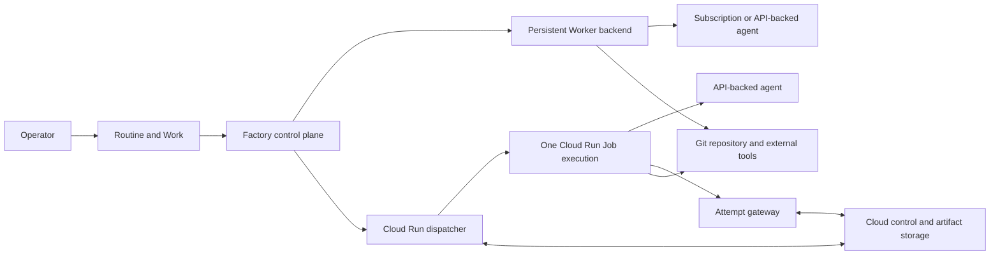

# Elastic Cloud Run agent backend

> **Status:** Proposed for review

## 1. Executive summary

Factory currently runs every coding agent through a persistent Worker on a
local machine or VM. That path is valuable because it can use authenticated
subscription CLIs, reuse repository caches, and retain failed worktrees, but an
operator must provide and maintain enough machines for peak demand.

This design adds Cloud Run Jobs as a second execution backend. Factory will
start one disposable container for one Work Target, run Pi, Codex, or Claude
Code with API-backed model access, ingest ordered events, preserve a recovery
artifact, and stop paying for compute when the Job exits. The existing control
plane remains the source of truth. Cloud Run provides managed compute, not a
second scheduler or product model.

The main downside is weaker local recovery. An ephemeral Job cannot retain an
inspectable worktree after it exits, so it must publish a durable, verified
artifact before Factory accepts completion. Cloud Run also isolates a process
from the operator's machine but does not make arbitrary repository code safe.

## 2. Context and scope

The current [architecture](../../ARCHITECTURE.md) separates durable
coordination from agent execution. A persistent Worker claims work, prepares a
worktree, owns a 30-second Attempt lease, starts one runtime process, sends
events, observes cancellation, and retains uncertain Git state. Local and VM
Workers use the same lifecycle contract.

The [Cloud Run experiment](https://github.com/owainlewis/factory/pull/275)
proved a narrower path against the Factory repository:

- Cloud Build produced a pinned, non-root Pi container.
- A Cloud Run Job checked out an exact commit and ran Pi from that directory.
- Pi used DeepSeek V4 Flash through OpenRouter in read-only and write modes.
- Structured output omitted model reasoning and reported model cost.
- Write mode produced an exact patch without pushing a branch.
- The final read-only execution completed in 55 seconds, including a 33-second
  start, with $0.00209 of model usage. At the current published default Cloud
  Run Jobs rates, its one-minute minimum would cost about $0.00132 before the
  free tier.

That experiment proves container execution, not the Factory lifecycle. It does
not prove durable dispatch, lease fencing, restart recovery, prompt
cancellation, private repository access, event ingestion, or artifact
retention. This design covers those boundaries for one Google Cloud project
and region. It does not replace persistent Workers or generalize execution to
every cloud provider.

## 3. System context



Factory owns Routines, Work, Target and Attempt identity, the frozen prompt and
commit, scheduling, capacity, retries, cancellation, events, results, cost
history, and terminal outcomes. The persistent Worker owns its cache,
worktrees, agent processes, and local cleanup. The Cloud Run adapter owns cloud
dispatch, execution reconciliation, authority publication, cancellation, and
artifact transport. Cloud Run owns disposable compute only.

Backend, runtime, and model are independent choices:

| Choice | Examples | Owner |
| --- | --- | --- |
| Execution backend | Persistent Worker, Cloud Run Job | Factory routing |
| Agent runtime | Pi, Codex, Claude Code | Backend capability |
| Provider and model | Subscription session, OpenRouter and DeepSeek | Execution profile |

DeepSeek V4 Flash is one tested model, not a Cloud Run backend type.

## 4. Proposed design

### How it works

An operator runs a Routine against one repository and supplies the configured
`Cloud Run Europe` profile as a manual run override. Factory creates ordinary
Work and Target records. A cloud repository input resolver turns the configured
source ref into a full Git commit SHA before the Target queues. Factory freezes
that commit, the complete prompt, runtime, provider and model selection,
repository identity, and execution-profile version on the cloud Target. Every
cloud Attempt and explicit retry for that Target reuses those inputs.

The embedded Cloud Run dispatcher creates an Attempt and a backend dispatch
record in one transaction. The record contains a random non-secret run ID and
starts in `dispatching`. Factory writes the immutable input and gateway
registration, then asks the gateway to create the initial short-lived authority
document using the gateway clock and an object-generation precondition. Factory
calls one immutable, versioned Cloud Run Job resource with the Attempt ID, run
ID, and a separate random 256-bit run capability as bounded overrides. The
capability is sensitive, excluded from logs, and visible only to identities
already allowed to inspect Cloud Run executions. The prompt, model credential,
and any cloud credential are not override values.

The Job service account has no access to the artifact bucket, Cloud Run
administration, or sibling Attempts. Its only data permission is access to the
dedicated, single-version model secret when the selected provider requires one.
It can mint an identity token whose audience is only the Attempt gateway. The
gateway requires that token and the random run capability, maps them to one
active Attempt prefix, and permits only the protocol operations and byte limits
defined in this document.
The gateway performs all Job-originated storage reads and conditional writes.
This prevents one profile's execution from reading or corrupting a sibling
execution. It does not prevent trusted repository code from tampering with its
own Attempt, which is part of the initial trusted-repository boundary.

The Job wrapper starts a five-minute monotonic pre-fence timer when its process
starts and exits without an agent if that timer expires. It records local
monotonic time immediately before requesting the Attempt and run-ID start fence.
If a lost API response causes Factory to launch a duplicate, only one execution
can create that fence; every duplicate exits without running an agent. The
successful response includes gateway server time. The wrapper anchors the
frozen Work duration to the earlier pre-request monotonic instant, so response
delay can shorten but never extend the deadline. The winning wrapper verifies
the input, checks out only the frozen commit, and starts the selected runtime in
the checkout. Checkout and agent execution share that deadline. After it
expires, the wrapper has at most 60 seconds to kill the process group and
publish bounded timeout evidence; it cannot restart the agent or perform
repository tool actions.

The dispatcher requests an authority refresh every ten seconds while it owns
the Attempt. The gateway performs the conditional write and computes
`valid_until` from its own server clock. The wrapper checks authority before
agent launch and at most every five seconds while the process runs. An expired,
cancelled, mismatched, or timed-out Attempt starts shutdown of the runtime
process group. This preserves
fail-closed lease behavior without making the local Factory API reachable from
the internet.
Cloud execution therefore depends on one continuously running Factory control
plane in the first release. Closing a laptop-hosted control plane deliberately
stops its Cloud Jobs within the authority window.

The wrapper uploads normalized event batches with stable sequence numbers.
Factory polls and ingests those batches idempotently into the existing Attempt
event history. Cloud Logging receives a sanitized diagnostic mirror but is not
the event database.

Before exit, the wrapper uploads a bounded result, Git status, checksummed
patch or Git recovery bundle, untracked-file archive when present, model cost,
and a final manifest. The manifest binds the Attempt ID, run ID, exact
commit, canonical input digest, image digest, runtime and model, Cloud
execution identity, and byte length and SHA-256 digest of every required
output. It is written last. Factory rejects an object or manifest whose storage
generation, prefix, identity, digest, or immutable input does not match the
dispatch record. Partial artifacts remain visible on failure.

Cancellation first records Factory's intent and revokes authority. The
dispatcher then calls the Cloud Run cancellation API and keeps reconciling
until Google reports a terminal execution. A result published after the
cancellation decision is retained for inspection but cannot turn the Attempt
into succeeded.

### Guided setup and operator experience

Persistent Workers remain available with no Google Cloud configuration. An
operator who adds a Cloud Run profile supplies a project, region, and billing
account, then asks Factory to validate or provision the managed resources. The
setup creates or verifies required APIs, Artifact Registry, immutable Job
versions, artifact storage, the Attempt gateway, separate dispatcher, gateway,
and Job service accounts, exact secret bindings, budget alerts, and the
dispatcher identity. It prints every permission before applying it and can run
in validation-only mode.

The setup screen reports image digest, region, available capacity, supported
runtimes and models, secret readiness, artifact retention, and the latest
validation. It never labels the backend as infrastructure-free or unlimited.
A disabled or unhealthy profile remains visible with an actionable reason and
cannot receive new Work.

Routine authoring keeps its current runtime field and gains an optional default
execution profile. A missing profile means the built-in `persistent-auto`
profile, so every existing Routine keeps its current behavior without a data
migration. A manual Run request may override the default with any compatible
profile without creating a new Routine generation. Scheduled Work uses the
Routine default. Work freezes the effective profile version, runtime, provider,
and model at admission. A retry cannot change backend, and Factory does not
automatically fail over between backends in the first release.

Work and Attempt detail show the selected backend, but lists and metrics
continue to use one product lifecycle across both backends.

### Delivery sequence

The work ships in six independently reviewable slices:

1. **Backend contract.** Add immutable execution-profile versions, a manual Run
   override, cloud repository input resolution, and a fake cloud backend behind
   the current Work and Attempt state machine. Existing Persistent Worker
   configuration and commit-resolution behavior remain compatible.
2. **Artifact protocol.** Define canonical input, authority, start fence,
   ordered event batches, recovery artifacts, checksums, size limits, retention,
   and the Attempt gateway against local test doubles.
3. **Durable dispatcher.** Add dispatch persistence, zero-retry launch,
   authority renewal, cancellation, bounded polling, restart reconciliation,
   quota backoff, and duplicate-start tests against a fake Cloud Run API.
4. **Managed runner.** Turn the experimental image into the trusted Job wrapper,
   pin its dependencies and image digest, and prove read-only, patch-producing,
   cancellation, lease-expiry, and corrupt-artifact cases in a real test project.
5. **Product setup.** Add profile configuration, validation, guided resource
   provisioning, health, cost evidence, Attempt diagnostics, and operator
   documentation.
6. **Repository publishing.** After the lifecycle is stable, add short-lived,
   repository-scoped credentials for private checkout and branch or pull-request
   publication. The first five slices require only durable patch recovery.

Each slice must preserve the invariants and pass independent review before the
next slice depends on it. The Cloud backend remains disabled by default until
the real-project acceptance suite passes.

### Components and responsibilities

The execution router owns backend selection from the effective profile frozen
in the immutable Work snapshot and compatible capacity. The Routine default or
manual Run override chooses that profile before admission. The router depends
on configured backend profiles. It does not interpret runtime output or call
cloud APIs, and it does not move an admitted Target to another backend.

The cloud repository input resolver owns mutable-ref resolution for Cloud Run.
It records the requested source ref, resolved full commit, resolver identity,
and resolution time on each cloud Work Target before that Target can queue. A
cloud retry never resolves the ref again. Persistent Workers keep the current
`resolve_per_attempt` behavior in the first release, including resolving the
base again on explicit retry. Work records the resolution policy so the
difference is visible rather than implied to be uniform.

One enabled Cloud Run profile projects into one stable synthetic Worker pool in
the existing routing model. The pool advertises configured capabilities,
health, and capacity, but it never enrolls, polls, or holds a remote Worker
credential. The dispatcher claims and supervises work internally on its behalf.
This preserves non-null Execution and Attempt worker attribution while making
the different recovery contract explicit in the Worker and Attempt views.

The persistent Worker backend is the current Worker manager and supervisor. It
owns subscription-backed CLI sessions, repository caches, worktrees, process
groups, and local recovery. It does not manage cloud resources.

The Cloud Run dispatcher is a durable control-plane component. It owns dispatch
records, Cloud Run API calls, Attempt lease renewal, authority refresh,
event ingestion, artifact verification, cancellation, and restart
reconciliation. It does not run an agent or make Cloud Run state authoritative.

The Attempt gateway is a narrow authenticated Cloud Run service. It maps one
Job identity plus one random run capability to one active Attempt and exposes only
input read, authority read, conditional start-fence creation, bounded event
append, and bounded output publication. Its service account, not the Job
service account, accesses the artifact bucket. It rejects unknown, expired,
terminal, mismatched, cross-prefix, conflicting, and oversized operations.

The Job wrapper is the trusted container entrypoint. It owns input validation,
the start fence, exact checkout, runtime supervision, authority checks, event
normalization, monotonic timeout enforcement, artifact publication, and exit
status. It does not choose work, retry an Attempt, or decide Factory's terminal
outcome.

The agent runtime owns model interaction and engineering tool use. It receives
one prepared checkout and a bounded prompt. It does not receive control-plane
credentials or authority to dispatch other Jobs.

The artifact store holds immutable input, authority, event, and output objects.
It is transport and recovery storage, not the source of Factory lifecycle
truth. Factory remains able to rebuild its view from SQLite and reconcile
nonterminal cloud dispatches.

### Decisions

#### Two backends, one product contract

Persistent Workers and Cloud Run Jobs produce the same Work, Target, Attempt,
event, result, cancellation, and retry experience. We reject a separate
"cloud task" product because execution location must not split Routine history
or metrics.

#### Backend choice freezes on Work

An existing Routine defaults to `persistent-auto`. A Routine may save another
default, and a manual Run may override it without editing the Routine. The
effective profile version freezes on Work admission and every Target and retry
uses it. We reject automatic cross-backend failover because the credential,
commit-resolution, and recovery contracts differ and a retry may repeat
external effects.

#### Backend, runtime, and model stay separate

An execution profile combines compatible settings without making them one
identity. We reject `deepseek_cloud` or similar backend names because Pi can
use DeepSeek locally and a Cloud Run image can support other API-backed models.

#### Outbound-only control

The first integration uses outbound Google APIs and cloud storage. We reject a
public callback into Factory because the operator API is loopback-only and the
current product has no tenant authentication boundary. A later hosted Factory
deployment may replace polling with an authenticated private callback or queue
without changing Attempt identity.

#### Factory owns retries

Cloud Run task retries are zero. Every operator retry creates a new Factory
Attempt, run ID, run capability, and cloud execution while reusing the original
frozen Work input. We reject native task retries because an agent may already
have made external side effects and Factory must preserve one visible retry
history.

#### Durable artifact replaces retained worktree

Persistent Workers keep the current retained-worktree contract. Cloud Jobs
publish a recovery artifact because their filesystem is ephemeral. We reject
success based only on exit code or logs because either can be present without
recoverable Git output.

#### Cloud Logging is a mirror

Structured Cloud logs remain useful for live operator inspection and platform
diagnosis. Ordered event objects and the verified final manifest drive Factory
state. We reject parsing Cloud Logging as the event protocol because delivery,
ordering, retention, and redaction are controlled outside Factory.

#### Trusted repositories first

The first release supports repositories and prompts trusted by the Factory
operator. Cloud Run supplies disposable container isolation, not a promise that
hostile code cannot read injected credentials, use the Job service account, or
send network traffic. Arbitrary untrusted code requires a separate threat model
and stronger controls.

#### Immutable Job versions

Cloud Run Run overrides cannot change an image or service identity. Every
execution-profile edit that affects the image digest, service account, mounted
secret version, resources, timeout, or wrapper configuration creates a new
immutable profile version and a distinct versioned Job resource. Work freezes
that version before dispatch. Referenced versions cannot be deleted. An
explicit retry uses the same version; if it is unavailable, Factory blocks the
retry instead of silently running different code.

## 5. Invariants and requirements

### Invariants

- `INV-1`: Factory is the sole authority for Work, Attempt, retry,
  cancellation, and terminal state.
- `INV-2`: Every cloud Work Target freezes one full commit SHA, prompt, runtime,
  provider, model, and execution-profile version before its first dispatch;
  every cloud retry reuses them.
- `INV-3`: At most one agent process can pass the start fence for one Attempt
  and run ID.
- `INV-4`: Authority expiry starts process-group shutdown immediately and the
  wrapper sends SIGKILL no later than ten seconds after expiry.
- `INV-5`: Cloud Run task retries remain zero; Factory creates every retry.
- `INV-6`: Event ingestion is ordered and idempotent by Attempt, run ID,
  sequence, and event ID.
- `INV-7`: Factory accepts successful completion only after verifying the final
  manifest and every required artifact.
- `INV-8`: Cancellation committed before terminal success cannot become
  succeeded because of prior artifact ingestion or a late cloud result.
- `INV-9`: A control-plane restart can identify, reconcile, and either resume
  supervision or cancel every nonterminal cloud execution.
- `INV-10`: The Job receives no operator API credential or broad cloud
  administration role.
- `INV-11`: Cloud and persistent backends use the same user-facing Routine,
  Work, Target, result, retry, and cancellation concepts.
- `INV-12`: Cloud execution never weakens the loopback-only operator API.
- `INV-13`: A Job identity and run capability can access only its own Attempt
  protocol and cannot read or mutate a sibling Attempt.
- `INV-14`: The wrapper starts process-group shutdown at the frozen Work
  deadline and sends SIGKILL no later than ten seconds afterward, independent
  of the longer profile or Cloud Run Job timeout.

### Requirements

- One backend profile has a stable ID and immutable versions. Each version has
  a Google Cloud project and region, Job resource, image digest, service
  account, dedicated model-secret resource, artifact gateway, capacity limit,
  trust tier, and
  supported runtime and provider capabilities.
- A Routine stores an optional default backend profile. A manual Run may supply
  a compatible override. The admitted Work snapshot records the effective
  profile version, runtime, provider, model, timeout, resource class, and commit
  resolution policy. Editing a Routine or profile does not change existing
  Work.
- Dispatch stores the Attempt ID, non-secret run ID, run-capability digest,
  envelope-encrypted run-capability ciphertext, state, immutable profile
  version, every observed Cloud operation and execution name, timestamps,
  error, and reconciliation deadline.
- The Job input uses the full commit SHA. Branch names and mutable tags are
  rejected.
- Before every Run call, the dispatcher reads the Job and verifies its resource
  name, template digest, image digest, service account, model-secret resource
  and version, task count of one, and native retry count of zero against the
  frozen profile version. Drift blocks dispatch. The wrapper repeats the
  verifiable checks and binds the effective values into its final manifest.
- Dispatch and reconciliation respect the profile capacity and Google Cloud
  API, CPU, memory, and execution quotas. Quota pressure leaves work queued or
  blocked with an actionable reason; it does not create extra executions.
- Dispatch retries transient pre-launch failures after one second with jitter,
  doubles to at most 30 seconds, and stops after the five-minute dispatch
  deadline. The dispatcher polls running execution state at most five seconds
  apart and event objects at most two seconds apart.
- The wrapper checks authority at most five seconds apart. Authority remains
  valid for no more than 30 seconds without a dispatcher refresh.
- The immutable input includes `timeout_seconds`. The gateway start-fence
  response supplies trusted server time. The wrapper anchors the frozen duration
  to the monotonic instant recorded before the request, producing a conservative
  deadline shared by checkout and agent execution. At the deadline it applies
  the ten-second process-group kill rule, records a timeout outcome, and permits
  at most 60 seconds for bounded failure-evidence upload with no live agent. A
  wrapper has at most five minutes from process start to acquire its fence. The
  versioned Cloud Run Job timeout is at least five minutes plus the maximum Work
  timeout plus 70 seconds and is a platform safety limit, not the Work timeout.
- Event and completion sizes reuse the existing Attempt limits. Artifact size
  defaults to 64 MiB and has a 512 MiB maximum. Completion is rejected when the
  configured bound is exceeded.
- Cloud execution status, model cost, compute duration, image digest, and
  console log URL appear in Attempt detail.
- Persistent Workers remain the default backend and require no Google Cloud
  configuration.

## 6. Interfaces and data

### Backend profile

The first proposed profile fields are:

```text
id
name
kind = cloud_run_job
project
region
artifact_bucket
gateway_url
max_concurrent
trust_tier = trusted_repository
capabilities[] = runtime + provider + model selectors
enabled
```

Each immutable profile version records `job`, `image_digest`,
`job_service_account`, resource limits, timeout, wrapper configuration, and a
dedicated model-secret resource with one enabled pinned version. Cloud
credentials belong to the Factory process environment or host identity, not
this record. Secret values belong in Secret Manager and are referenced by the
versioned Job configuration.

The dispatcher creates
`attempts/<attempt-id>/gateway-registration.json` before launch. The immutable
registration stores the expected Job service-account principal, SHA-256 digest
of the run capability, non-secret run ID, exact Attempt prefix, input digest,
protocol version, and absolute expiry. The Job sends the raw capability only to
the gateway. The gateway hashes it, uses its own bucket identity to load the
registration and authority, and never exposes list or arbitrary object
operations. Authority revocation closes an otherwise valid registration
immediately. The Job sends the capability only over TLS in an authenticated
request body. The Job and gateway redact request bodies and authorization data,
never place the capability in a URL, header echoed by infrastructure, metric,
trace, error, or log. The wrapper retains the capability only for the Job
lifetime and clears its copy on shutdown. The gateway discards its request copy
after each operation.

### Naming and identity

A backend profile receives one random stable ID when it is created. Its
synthetic Worker ID is `cloud-run-<profile-id>` and never changes when the
display name, image, region settings, or capabilities change. Deleting and
recreating a profile creates a new identity. Existing Work continues to point
at the frozen old profile and synthetic Worker record.

The synthetic Worker cannot authenticate to the Worker HTTP API and cannot be
claimed by an external process. The dispatcher uses an internal store
transaction to create its Attempt and lease. Attempt and run ID identify the
dispatch protocol; the Google operation name, execution name, and image digest
are immutable external observations after they become known.

### Dispatch record

```text
attempt_id
backend_profile_id
run_id
run_capability_digest
run_capability_ciphertext
state
cloud_operation_name
cloud_execution_name
image_digest
input_object
authority_object
artifact_prefix
last_reconciled_at
reconciliation_deadline
error
```

The singular names above are normalized into child observations in storage:
one dispatch can have several operation and execution records. Each record
stores its provider name, first and last observation, create time, effective
override digest, state, and duplicate disposition. The winning execution name
is set only from the create-only start fence. All other matching executions
are retained as duplicate evidence and cancelled.

`attempt_id` is the Factory identity. `run_id` is random, non-secret, and
immutable for one dispatch. It is safe for object names, events, manifests,
logs, and diagnostic URLs. Factory envelope-encrypts the separate raw run
capability before committing the dispatch. The encryption key comes from the
host keyring or process environment and is never stored in SQLite. The raw
value exists transiently in dispatcher, Job wrapper, TLS request, and gateway
memory. Cloud Run retains the raw active execution override as provider-managed
metadata for its documented execution-retention period, so permission to
inspect executions is restricted to the dispatcher and operators who may
inspect model credentials. Factory never stores raw plaintext: SQLite stores
only `run_capability_ciphertext`, and the artifact store keeps only
`run_capability_digest`. A restart decrypts the ciphertext to retry or reconcile
the same dispatch. A missing or invalid encryption key blocks new cloud Work,
revokes authority, and fails active dispatches closed rather than minting a new
capability. Cloud operation and execution names are observations returned by
Google and never replace Factory identity. Missing names keep the record in
reconciliation; they do not authorize a second agent to pass the start fence.

### Object layout

```text
attempts/<attempt-id>/gateway-registration.json
attempts/<attempt-id>/<run-id>/
  input.json
  authority.json
  started.json
  events/<first-sequence>-<last-sequence>.json
  output/result.json
  output/git-status.txt
  output/changes.patch
  output/untracked.tar
  output/manifest.json
```

Inputs are immutable. Authority is the only mutable object and uses generation
preconditions. Event and output objects are create-only. The final manifest
carries the complete provenance and checksum binding defined in section 4 and
is published last.

### Dispatch states

The internal dispatch states are `dispatching`, `starting`, `running`,
`cancel_requested`, `reconciling`, and `terminal`. They map onto the existing
Attempt states and remain internal. A transient Google API failure moves a
record to `reconciling`; it does not invent a second Attempt or user-facing
lifecycle.

### Normative state machine

Factory is the only state-machine writer. GCS objects and Cloud Run status are
evidence that permit one Factory transition; they never transition Work by
themselves.

| Factory dispatch state | Required evidence | Allowed next states |
| --- | --- | --- |
| `dispatching` | Committed Attempt, run ID, immutable input | `starting`, `cancel_requested`, `terminal` |
| `starting` | Accepted Run operation or matching start fence | `running`, `reconciling`, `cancel_requested`, `terminal` |
| `running` | Matching start fence and valid authority generation | `reconciling`, `cancel_requested`, `terminal` |
| `reconciling` | Incomplete or conflicting cloud observation | `starting`, `running`, `cancel_requested`, `terminal` |
| `cancel_requested` | Durable cancellation time and revoked authority | `terminal` |
| `terminal` | One stored Factory outcome | none |

Before every external side effect, the dispatcher commits the intended state
and immutable run ID. A crash before the Run call leaves `dispatching` and may
safely retry the same run ID and capability. A crash after Google accepts the
call but before its response leaves `dispatching`. Reconciliation pages every
execution of the frozen Job version created since the recorded dispatch start,
inspects its effective environment overrides, and persists every execution
carrying the exact Attempt ID and run ID before another Run call is allowed.
Another call may still create a duplicate container. Every container must
create the exact `started.json` object with
`ifGenerationMatch=0` before checkout, model calls, Git writes, or external tool
use. A fence winner whose Attempt, run ID, input digest, or authority is stale
exits nonzero. A fence loser exits zero without running the agent.

Cloud Run execution names are provider-assigned and cannot be deterministic.
The Factory Attempt and run ID provide deterministic dispatch identity.
Factory stores every operation or execution name observed for that run ID
immutably. The `started.json` winner names its `CLOUD_RUN_EXECUTION`; additional
names are duplicate evidence and are cancelled. They never replace the winning
identity. The prototype must prove that the v2 execution-list response exposes
the effective overrides needed for this search. If it does not, durable launch
is blocked until the design supplies another discoverable correlation key.

Artifact ingestion and verification do not decide the cancellation race. The
successful-completion transaction loads the verified manifest evidence, checks
that no cancellation is committed, and writes the terminal success atomically.
The cancellation transaction checks that no terminal outcome is committed and
atomically records `cancellation_requested_at`. SQLite serialization makes one
of those transactions the first durable Factory decision. Once cancellation is
committed, no later cloud success can change the outcome. Terminal completion
is idempotent and the stored outcome always wins.

### Authority lease protocol

The dispatcher is the sole authority decision-maker, and the gateway is the
sole physical authority-object writer. `authority.json` contains the Attempt
ID, run ID, run-capability digest, monotonically increasing revision, input
digest, `valid_until`, cancellation flag, and previous object generation. An
authenticated refresh request contains the expected generation and desired
cancellation state, but no caller-supplied time. The gateway computes
`valid_until` as 30 seconds after its own server time and writes with GCS
`ifGenerationMatch`. A precondition failure moves the dispatch to
`reconciling`, stops refresh, and revokes the Attempt because another writer or
stale state exists.

Every refresh and authority-read response returns the gateway server time,
`valid_until`, revision, and object generation from one operation. The wrapper
records local monotonic time immediately before every gateway request and sets
the returned `valid_until - server_time` duration against that earlier instant.
Network delay can shorten but never extend authority. Neither the Factory clock
nor the wrapper wall clock can extend validity. It fetches authority at most
five seconds apart and verifies the revision and generation never move
backwards. A read error is not authority. The wrapper may continue only until
the last verified monotonic deadline; there is no grace period after that
instant. Before checkout, agent start, every external publish action exposed by
the wrapper, and final manifest upload, it requires current matching authority.
On expiry or cancellation it sends SIGTERM to the process group immediately,
waits ten seconds, sends SIGKILL, uploads only bounded failure evidence while
the gateway still authorizes it, and exits nonzero.

Factory asks the gateway to refresh authority only while the same Attempt lease
and dispatch record remain active. The gateway performs every initial,
refresh, and revocation authority-object write using its clock and generation
precondition. A server shutdown, dispatcher crash, SQLite ownership loss, GCS
generation conflict, or inability to prove state stops refresh. The first-release
availability contract is explicit: a continuously available Factory controller
is required for a continuously running Cloud Job.

After Factory commits explicit cancellation, it asks the gateway to revoke
authority with one conditional write. A healthy wrapper observes that
revocation within five seconds and kills a process that ignores SIGTERM within
a further ten seconds.
The product bound is 15 seconds after successful authority revocation, with a
five-second allowance for dispatcher scheduling. If the controller disappears
without revoking authority, the last 30-second authority window plus the
ten-second kill grace bounds process survival to 40 seconds. Cloud Run may take
longer to report the execution terminal, so Factory tracks that platform
reconciliation separately with a two-minute deadline.

## 7. Failure behavior and lifecycle

If input upload fails, the Attempt remains preparing and dispatch retries after
one second with jitter, doubling to at most 30 seconds until its five-minute
dispatch deadline. No Cloud Job starts. Reaching the deadline fails the Attempt
with an actionable storage or permission error.

If the Run API accepts a request but its response is lost, Factory keeps the
same run ID and capability and enumerates matching executions as specified in
section 6. It persists and supervises the complete matching set. A repeated API
call may create another container, but only the execution that creates
`started.json` can launch the agent. Other executions exit successfully without
agent side effects, are recorded as duplicates, and are cancelled if they
remain active.

If container startup exceeds 30 seconds, the dispatcher continues renewing the
Factory lease and cloud authority while the execution is starting. The Job
checks authority before starting the runtime.

If the frozen Work timeout expires during checkout or agent execution, the
wrapper sends SIGTERM immediately and SIGKILL after ten seconds. It emits a
timeout event and may publish bounded failure evidence for at most 60 seconds,
then exits nonzero. Factory records the same timed-out failure semantics as the
persistent backend. The profile-wide Cloud Run Job timeout remains only a final
platform kill switch.

If event upload or ingestion fails, the wrapper retries bounded, immutable
batches. Factory accepts a repeated batch only when its identity and bytes
match. A conflicting batch fails the Attempt.

If the agent, wrapper, or container crashes, Cloud Run does not retry it. The
dispatcher retains partial artifacts, records the exit evidence, and fails the
Attempt. An operator can create an explicit retry.

If Factory loses Google API access temporarily, it keeps the dispatch in
reconciling and continues authority only while it can still prove ownership and
remain within the 30-second bound. Once authority expires, the wrapper stops the
agent. Factory cancels the cloud execution when access returns and fails the
Attempt rather than reviving it.

If Factory restarts, it loads every nonterminal dispatch before admitting more
cloud work. It verifies profile identity, authority generation, start fence,
Cloud Run execution state, and artifacts. It resumes supervision only when the
same Attempt still owns valid authority. Otherwise it revokes authority,
cancels the execution, and records a failed or cancelled outcome.

If cancellation races with completion, the first durable Factory decision
wins. Manifest upload, ingestion, or verification alone does not win. A
terminal-success transaction committed before cancellation succeeds. A durable
cancellation request committed first produces cancelled and retains any late
artifact.

Disabling a backend profile stops new dispatches. Existing executions continue
under their frozen profile unless the operator explicitly cancels them. A
profile cannot be deleted while nonterminal or retained cloud Attempts refer to
it.

Server shutdown stops new dispatch, revokes authority for active Jobs, requests
Cloud Run cancellation, and waits for up to 30 seconds. On restart, Factory
reconciles every nonterminal cloud dispatch before admitting new cloud work. If
an execution still cannot be reconciled within two minutes, its expired
authority keeps the agent stopped and Factory records a
`cloud_reconciliation_timeout` failure with the external execution identity for
operator cleanup.

## 8. Security, privacy, and operations

The initial trust boundary is one trusted Factory operator, trusted repository
configuration, trusted Routine instructions, and untrusted external context
embedded inside that prompt. The Job may execute repository code. That code can
read credentials available to the agent process, request tokens for permissions
granted to the Job service account, and use permitted network egress.

Each trust tier uses dedicated dispatcher, gateway, and Job service accounts
and preferably a separate Google Cloud project. The dispatcher can run the
versioned Job and manage its executions. The gateway can access only the
artifact bucket. The Job can invoke only the gateway and read its dedicated
model-secret resource, which has one enabled pinned version. It receives no
artifact-store permission, Cloud Run administration, project editor, or
Factory control-plane credential.
Repository credentials are short-lived and scoped to one repository when
private checkout or publishing is added.

Prompt text is stored in the encrypted artifact store rather than Cloud Run
environment overrides. Identifiers placed in execution metadata are not
secrets. Model keys are mounted from dedicated, single-version Secret Manager
resources.
Sanitized logs exclude prompts, secret values, raw model reasoning, and
unbounded patches.

Cloud Run Jobs use disposable second-generation containers with namespace and
privilege restrictions. They are not gVisor sandboxes. The product must call
this managed isolation, not safe execution of hostile code. Egress restriction,
per-repository credentials, quota isolation, and a stronger sandbox remain
required before accepting arbitrary repositories. See Google's
[container runtime contract](https://docs.cloud.google.com/run/docs/container-contract).

As measured on 2026-08-12, one 1 vCPU and 2 GiB Job costs about $0.00132
per billable minute at the published default Jobs rates before the free tier.
Jobs have a one-minute minimum, then bill in 100 ms increments. The
published free tier is 240,000 vCPU-seconds and 450,000 GiB-seconds per billing
account each month, equivalent to about 62.5 hours at that resource shape before
other Cloud Run usage. Actual cost also includes model tokens, image builds and
storage, logs, artifacts, Secret Manager, and network transfer. Region prices
and quotas vary. Recheck the official [Cloud Run pricing](https://cloud.google.com/run/pricing)
before using these figures for a budget.

Cloud execution is elastic, not infinite. The dispatcher enforces a configured
capacity below project and regional quotas and rate limits. It reports quota,
billing, permission, image, secret, and artifact failures separately. Cost and
usage alerts belong in the guided setup before a profile can be enabled. See
the current [Cloud Run quotas](https://docs.cloud.google.com/run/quotas) when
choosing profile capacity.

Completed artifact prefixes use a configured retention period. Factory keeps
the final manifest and digest after object expiry so history remains explicit
about whether recovery bytes are still available. Cloud Run execution and
Cloud Logging retention are diagnostic and are never the only retained record.

## 9. Acceptance criteria

- `AC-1`: One unchanged Routine can run through its persistent default or a
  compatible Cloud Run manual override and produces the same user-facing Work
  lifecycle. Existing Routines need no migration and remain persistent by
  default.
- `AC-2`: A cloud Attempt runs the frozen full commit and rejects a mutable or
  mismatched Git reference.
- `AC-3`: A lost launch response or duplicate execution starts at most one
  agent process for the Attempt and run ID.
- `AC-4`: After Factory commits cancellation, it revokes authority within five
  seconds; a healthy wrapper stops the agent within 15 more seconds, requests
  Cloud Run cancellation, and reaches a stable cancelled outcome. Controller
  loss starts shutdown by 30 seconds and kills the process by 40 seconds.
- `AC-5`: Factory restart reconciles every nonterminal execution before it
  admits new cloud work.
- `AC-6`: Native Cloud Run retries are zero and only an explicit Factory retry
  creates another Attempt.
- `AC-7`: Events remain ordered, bounded, and duplicate-safe across delayed or
  repeated object ingestion.
- `AC-8`: Success requires a verified final manifest and recovery artifact;
  missing, conflicting, corrupt, or oversized artifacts fail the Attempt.
- `AC-9`: The Job receives only the configured least-privilege identity and no
  operator API credential, durable cloud key, or secret prompt metadata.
- `AC-10`: Attempt detail shows backend, execution identity, image digest,
  timing, model cost, artifact availability, and diagnostic log link.
- `AC-11`: Persistent Worker behavior and configuration, including
  resolve-per-Attempt commit selection, remain compatible when no Cloud Run
  profile exists.
- `AC-12`: Documentation and setup describe Cloud Run as managed, elastic,
  quota-bound isolation rather than free infrastructure or a hostile-code
  sandbox.
- `AC-13`: Two concurrent Attempts using one profile cannot read, overwrite,
  fence, publish, or cancel each other's protocol data.
- `AC-14`: A cloud Attempt that reaches its frozen Work timeout starts agent
  shutdown immediately, kills the process group within ten seconds, publishes
  no success, and cannot continue until the profile-wide Job timeout.

## 10. Test approach

State-machine tests will admit the same Routine once through its persistent
default and once through a Cloud Run manual override. They will prove
`INV-1`, `INV-5`, `INV-11`, `AC-1`, `AC-6`, and `AC-11`. Cloud-specific input
tests will prove `INV-2` and `AC-2`, including exact-commit reuse on retry.

Dispatcher tests will inject lost responses, duplicate executions, delayed
startup, API outages, stale generations, restart with the encrypted capability,
missing or invalid encryption keys, Factory clocks ahead of and behind the
gateway, delayed gateway responses, and quota failures to prove `INV-3`,
`INV-4`, `INV-9`, `AC-3`, `AC-4`, and `AC-5`. Delay tests anchor timers to the
pre-request monotonic instant and prove response transit cannot extend Work or
authority deadlines.

Protocol tests will reorder, repeat, corrupt, truncate, and oversize event and
artifact objects to prove `INV-6`, `INV-7`, `INV-8`, `AC-7`, and `AC-8`.
They will also force both SQLite transaction orderings after manifest
verification to prove that cancellation and terminal success cannot both win.

Security tests will inspect the deployed Job configuration, IAM policy, input
metadata, gateway request logs and traces, structured logs, and container
environment to prove `INV-10`, `INV-12`, `INV-13`, `AC-9`, `AC-12`, and
`AC-13`. They will verify that raw capabilities never appear in Factory
artifacts or telemetry, that Cloud Run execution inspection is restricted to
the intended identities, and that repository code cannot use the Job identity
to run or cancel Cloud Run resources or access a sibling Attempt through the
gateway or storage API. The real-project prototype must measure how long Cloud
Run retains completed execution overrides and feed that value into the profile
retention and operator warning.

Wrapper tests will expire the frozen Work timeout during checkout and agent
execution, expire the five-minute pre-fence window, delay start-fence responses,
make the process ignore SIGTERM, and delay artifact upload to prove `INV-14`
and `AC-14` independently from the profile-wide Job timeout.

A gated real-project integration test will build an immutable image, run one
read-only and one patch-producing Attempt, cancel one long-running Attempt,
restart the dispatcher during one Attempt, and verify the final UI/API evidence
required by `AC-4`, `AC-5`, and `AC-10`.

## 11. Risks and tradeoffs

- Cold starts and repeated checkout make short Jobs slower than warm Workers.
  Keep persistent Workers as the default and record backend timing separately.
- API model usage can cost more than an existing subscription. Show model and
  compute cost separately and allow per-profile budgets.
- A control-plane outage can leave cloud compute briefly alive. The external
  authority document bounds that window and the wrapper fails closed.
- Ephemeral recovery is weaker than a retained worktree. Require a verified
  artifact and show its expiry prominently.
- The Job identity and mounted model credential are visible to code in its Job.
  Separate trust tiers, pin the exact secret version, isolate artifact access
  behind the per-Attempt gateway, and start with trusted repositories.
- The Attempt gateway adds a managed service, cold-start latency, and request
  cost. It is required to prevent a shared Job identity from reaching sibling
  artifacts. Keep its API narrow and its deployment reproducible.
- Polling storage adds latency and API cost. Keep bounded intervals and preserve
  room for a private callback or queue in hosted deployments.
- Google Cloud concepts could leak into the product. Keep them in backend
  profile setup and Attempt diagnostics, not Routine authoring vocabulary.

## 12. Open questions

- Should the first release support private repositories and branch publishing?
  This does not block the dispatcher and lifecycle work. The recommended first
  slice is public or otherwise pre-authorized read-only checkout plus durable
  patch artifacts, followed by short-lived repository-scoped GitHub App tokens.
- Should a hosted Factory deployment replace storage polling with a private
  callback or queue? This does not block the local-first design because the
  event and artifact identities remain the same.
- Should another managed job provider implement the same backend contract?
  This does not block Cloud Run. Extract a provider interface only after a
  second implementation proves the shared boundary.

## 13. Out of scope

- Replacing SQLite orchestration with Temporal or another durable workflow
  engine.
- Removing or deprecating local and VM Workers.
- Running arbitrary untrusted repositories safely.
- Automatic provider selection based only on price.
- Native Cloud Run task fan-out for one Work Target.
- GPU agents, interactive terminals, or long-lived cloud development
  workspaces.
- A general multi-cloud job abstraction before a second provider exists.
