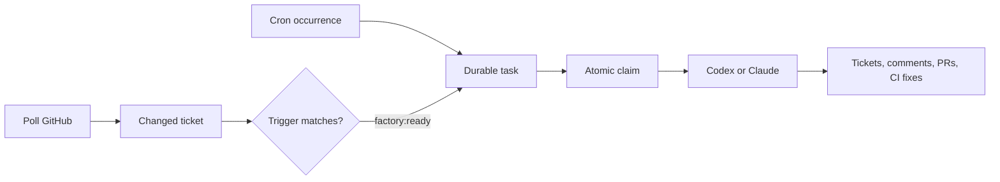

# Factory v1

**Status:** Draft
**Author:** Owain Lewis  **Date:** 2026-07-18

## Summary

Factory is a local-first daemon that turns scheduled prompts and ready tickets into supervised agent runs. A workflow is a versioned Markdown prompt with a small frontmatter trigger. Factory polls configured GitHub repositories, creates durable tasks for due schedules or tickets labelled `factory:ready`, atomically claims those tasks, and delegates the complete workflow to a selected agent runtime such as Codex or Claude Code. Agents own GitHub CLI operations, ticket updates, implementation, pull requests, and CI repair. Factory owns polling, deduplication, claims, concurrency, timeouts, process supervision, recovery, and run history. V1 is a single Rust binary using SQLite, GitHub polling, cron and label triggers, and local subscription-authenticated agent CLIs.

## Goals

- Make prompts and skills the unit of workflow rather than hard-coded development pipelines.
- Support scheduled discovery work and real-time ticket implementation through one task runner.
- Let humans and agents create and improve tickets in the systems they already use.
- Delegate long, adaptive workflows to capable agents while making their execution reliable.
- Bring any compatible local agent runtime, starting with Codex and Claude Code.
- Run locally across several trusted repositories and move later to an always-on machine without changing the workflow model.
- Keep configuration small, legible, and version-controlled.

## Non-goals

- A custom agent loop, model API, tool system, or skill runtime.
- A deterministic software-development state machine.
- A general DAG engine or visual automation builder.
- Automatic merge in v1.
- Webhooks, distributed workers, containers, untrusted repositories, Linear, GitLab, or Bitbucket in v1.
- Replacing GitHub Issues, pull requests, reviews, or CI.
- A web control room in v1.

## Constraints

- V1 runs one daemon on a trusted local machine and polls GitHub through the authenticated `gh` CLI.
- V1 supports Unix-like operating systems only. Its process-tree guarantees rely
  on Unix process groups and wait-without-reaping semantics.
- Agent runtimes keep ownership of their authentication, tools, skills, MCP servers, and permissions.
- Workflows may run for hours and adapt while watching CI. Timeouts must supervise stalled or runaway work without decomposing it into deterministic steps.
- Agents may mutate tickets and repositories. V1 therefore manages only trusted repositories and relies on explicit runtime permissions.
- A worktree is filesystem isolation, not a security boundary.
- GitHub is the first source, but core task and runtime state must not contain GitHub-only identifiers or assumptions.

## Proposed design

### Product boundary

Factory coordinates persistent work. Push remains a personal assistant gateway for conversations and scheduled personal runbooks.

```text
Push     = message or personal schedule -> agent -> reply to a person
Factory  = source state or schedule -> claimed task -> agent -> changed world
```

The products may later integrate. Push can request a Factory workflow or notify a person that a run needs attention, but neither product owns the other's state.

### Core model

Factory has six concepts:

```text
Source    external system being observed, initially a GitHub repository
Workflow  Markdown prompt describing an outcome
Trigger   rule that creates work, initially cron or ticket label
Task      durable queued invocation of a workflow
Run       one supervised agent execution attempt
Effect    ticket, comment, branch, pull request, or other agent mutation
```

Polling is a detection mechanism, not a trigger. A poll discovers source changes. A label or cron occurrence decides that a workflow should run.



Factory stores only broad execution states:

```text
queued -> running -> succeeded | failed | cancelled
```

GitHub stores the human-visible development state through issue content, comments, linked pull requests, checks, reviews, and two optional labels:

```text
factory:ready         implementation is authorised and sufficiently defined
factory:needs-review  a human must inspect a question, decision, or green PR
```

The labels are mutually exclusive. They are a small human protocol, not a complete workflow state machine.

### Ticket-centred factory

Implementable work becomes a ticket. Tickets may be created manually or by agents running scheduled discovery workflows. Humans and agents may then refine the same ticket.

```text
Human-created ticket -----------------------> triage
Scheduled code or documentation review -> ticket -> triage
                                                    |
                                      needs review <-+-> ready
                                                           |
                                                           v
                                             agent produces green PR
                                                           |
                                                           v
                                                   human reviews merge
```

Discovery, triage, and implementation remain prompts:

- A discovery workflow reviews a repository and creates evidenced tickets.
- A triage workflow improves an existing ticket, asks focused questions, or applies `factory:ready`.
- An implementation workflow takes a ready ticket through an isolated branch, tests, pull request, CI repair, and handoff for human merge.

Agents can create follow-up tickets, but prompts must require duplicate search, evidence, lineage, and a bounded number of new tickets. Agent-created tickets enter the same queue as human-created tickets.

### Workflow files

Each workflow is one Markdown file. Its filename is its identifier. Frontmatter answers only when it runs, which runtime executes it, and how long it may run.

```text
.factory/
  workflows/
    find-bugs.md
    find-doc-drift.md
    triage-ticket.md
    implement-ready-ticket.md
```

A scheduled discovery workflow:

```markdown
+++
schedule = "0 9 * * 1"
timezone = "Europe/London"
runtime = "codex"
timeout = "2h"
+++

# Review the repository for bugs

Review recent code for real, reproducible bugs. Search existing issues before
creating anything. For each verified finding, create one focused GitHub issue
with evidence, expected behaviour, acceptance criteria, and verification.
Apply `factory:needs-review`. Do not implement fixes during this workflow.
Create no ticket when no qualifying bug can be proved.
```

A label-triggered implementation workflow:

```markdown
+++
label = "factory:ready"
runtime = "codex"
timeout = "4h"
+++

# Take the ticket to a green pull request

Take ownership of the supplied ticket. Remove `factory:ready`, update the
ticket, create an isolated worktree and ticket-numbered branch, implement and
verify the change, open a draft pull request, watch CI, and repair failures
when practical. If requirements are unclear, apply `factory:needs-review`,
ask focused questions, and stop. When the pull request is green, apply
`factory:needs-review`, post the evidence, and leave the merge to a human.
```

V1 permits exactly one trigger per file: either `schedule` or `label`. Runtime and timeout inherit global defaults when absent. A future version can add explicit trigger types without introducing a general expression language.

### Configuration

Machine-specific configuration lives at `~/.factory/config.toml`:

```toml
repositories = [
  "/Users/owainlewis/Code/github/owainlewis/push",
  "/Users/owainlewis/Code/github/owainlewis/slate.do",
]

poll_every = "30s"
default_runtime = "codex"
default_timeout = "2h"
maximum_timeout = "8h"
max_concurrent_runs = 2
workspace_root = "/Users/owainlewis/Code/.factory-worktrees"
```

Repository identity is inferred from its Git remote. Workflow configuration stays beside its prompt. Authentication comes from `gh`, Codex, Claude Code, Git, and the selected runtime rather than being copied into Factory configuration.

Factory validates configured repositories, workflow frontmatter, cron schedules, prompt presence, runtime availability, authentication, and writable data paths before starting. It does not silently create or change GitHub labels in v1; setup documentation describes the two conventional labels.

### Polling and task creation

One source poller scans each configured repository for changed open issues and matching labels. SQLite stores a source cursor and the last observed revision of each item. A unique task key prevents duplicate work:

```text
scheduled task = repository + workflow + scheduled instant
ticket task    = repository + workflow + ticket ID + triggering revision
```

For `factory:ready`, a ticket remains eligible until a worker claims it. The database transaction that changes a task from `queued` to `running` is the claim. The agent then rereads current GitHub state and removes the label. If the source changed before the agent began, the agent reconciles the current ticket rather than trusting a stale snapshot.

New or changed tickets may be passed to a configured triage workflow even without a label. V1 may defer automatic triage until the implementation loop is proven; scheduled triage can cover the same use case without changing the model.

### Agent execution

Factory delegates a meaningful workflow to one long-running agent process. It does not hard-code checkout, planning, Git operations, ticket writing, implementation, tests, pull-request creation, or CI repair.

An execution request contains:

```text
workflow prompt
target repository and source item
resolved working directory
runtime and timeout
previous successful run or inspected commit when relevant
existing runtime session ID when resuming
Factory conventions and broad safety policy
```

The agent owns `gh` and other development tools. Prompt templates give ticket updates a consistent shape while retaining the agent's ability to explain discoveries and decisions.

Factory owns the reliability boundary:

- atomic claims and concurrency limits;
- process launch, cancellation, exit status, and bounded logs;
- heartbeat, idle, and maximum execution timeouts;
- session ID, process ID, repository, ticket, and workspace records;
- retry and recovery limits;
- scheduled-occurrence deduplication and source cursors;
- run history and final outcome;
- cleanup after terminal completion.

The default implementation workflow remains active while CI runs so the agent can interpret failures and adapt in context. Human review may take hours or days, so a green pull request ends the run. Later ticket or review activity can create a new task that resumes the stored session when available. GitHub, Git, the prompt, and the run record remain enough to recover when a runtime session is lost.

On an unexpected exit, Factory may resume the same agent or start a recovery run with current ticket, worktree, branch, pull request, CI, and previous-run context. Recovery asks the agent to reconcile real state rather than replaying deterministic steps.

### Runtime adapters

Agent runtimes are replaceable CLI adapters with a narrow contract:

```text
input:  prompt, workdir, optional session ID, timeout, environment policy
output: final response, optional session ID, exit status
control: health check, stream activity, cancel
```

V1 implements Codex completely and Claude Code second to prove portability. Runtime adapters use the user's existing supported CLI authentication. Agent tools, skills, MCP servers, model selection, and permissions remain runtime-owned.

### Local operation and CLI

The daemon runs as `factory run`, initially in a terminal and later under `launchd` or `systemd`. A small CLI exposes operational state:

```text
factory validate
factory workflows
factory workflow run <workflow-id> --repository <path>
factory tasks
factory runs [workflow]
factory inspect <run-id>
factory cancel <run-id>
```

SQLite lives under the Factory data directory. Workflows run against trusted repositories. An implementation agent may create its own worktree under the configured workspace root; Factory records the path reported by the agent or discovered from Git after the run.

The manual workflow command validates the selected repository and workflow,
checks the configured runtime and authentication, streams runtime activity, and
reports bounded execution metadata. Ctrl-C and the resolved workflow timeout
cancel the runtime process group.

### V1 implementation language

V1 is implemented in Rust. The problem is an always-on local daemon dominated by polling, timers, subprocess supervision, cancellation, bounded concurrency, SQLite, filesystem safety, and durable recovery. Rust and Tokio fit those requirements and have already been exercised in Push for the same operational class of work. A single static binary is easy to install under `launchd` or `systemd`.

Factory should not depend directly on Push or extract a shared library before both boundaries are stable. It may reuse proven patterns for agent adapters, shutdown, SQLite migrations, and process handling. Shared code should be extracted only after the two projects independently demonstrate an identical narrow contract.

## Alternatives and tradeoffs

### Extend Push

Push already schedules prompts and delegates to replaceable agents, but its central abstraction is one personal assistant, conversations, and reply delivery. Factory needs multiple repositories, source cursors, ticket claims, workflow discovery, and external effects. Combining them would weaken both product boundaries.

### GitHub Actions

Actions provide excellent GitHub events and disposable runners, but require per-repository workflow installation, encourage GitHub coupling, keep weak durable orchestration state, and usually move local subscription-authenticated execution toward API-key billing. Factory keeps Actions for repository CI and may later accept an Action as an optional wakeup signal.

### Go

Go would produce a small daemon quickly and is strong for network services and subprocesses. Rust wins for v1 because the closest proven implementation patterns already exist in Push, the desired artifact is a local systems binary, and stronger compile-time modelling helps protect task, process, and shutdown state. The cost is slower iteration and more code around simple application logic.

### Hard-coded pipeline stages

A deterministic triage, implement, verify, and repair state machine appears reliable but encodes procedures that agents handle more flexibly. Factory instead hard-codes policies and supervision while workflows remain prompts. Deterministic gates may be added later for irreversible actions such as automatic merge or production deployment.

### Full label state machine

Labels for every stage duplicate information already visible in issues, PRs, checks, and reviews. V1 keeps only `factory:ready` and `factory:needs-review`. More labels require evidence that they improve filtering or coordination.

## Risks

- **Broad agent authority:** Restrict v1 to trusted repositories and explicit runtime permissions. Require human merge.
- **Duplicate work:** Use unique task keys, atomic SQLite claims, and agent reconciliation of current source state.
- **Runaway ticket creation:** Bound findings in prompts, require evidence and duplicate search, and later add global creation budgets if needed.
- **Long or stalled agents:** Use heartbeats, idle detection, maximum deadlines, cancellation, and recovery without imposing short fixed runs.
- **Machine exhaustion:** Limit concurrent runs and retain bounded logs. Add disk and worktree cleanup policy after observing real usage.
- **Prompt injection through tickets:** Treat ticket content as untrusted input, keep Factory policy in higher-priority instructions, and use scoped credentials.
- **Provider coupling:** Keep source and runtime identifiers out of the core task model. Prove one additional runtime before adding another source.
- **Workflow sprawl:** Keep one outcome per prompt, infer IDs from filenames, and put triggers beside prompts.

## Rollout

1. Build configuration loading, workflow validation, SQLite task/run storage, and manual workflow execution.
2. Add cron evaluation and run one scheduled repository-review prompt locally.
3. Add GitHub polling and `factory:ready` task creation for one trusted repository.
4. Implement the Codex adapter and run one ticket through to a human-merged pull request.
5. Add supervision, cancellation, restart recovery, run inspection, and bounded concurrency.
6. Add Claude Code to prove the runtime boundary.
7. Manage several repositories, then run the unchanged daemon under an operating-system service.
8. Add automatic triage, PR-feedback wakeups, webhooks, other ticket providers, remote workers, and stronger isolation only after v1 is reliable.

Backout means stopping the daemon. Tickets, comments, branches, worktrees, and pull requests remain ordinary artifacts that a human can inspect or finish.

## Open questions

- Should automatic triage run for every new or changed issue in v1, or remain a scheduled workflow until implementation is proven?
- Should an implementation agent create its worktree, or should Factory prepare an empty isolated worktree while leaving the remaining Git workflow to the agent?
- What heartbeat and maximum timeout defaults work for real Codex and Claude runs?
- What exact structured activity signal can both initial runtime adapters expose without constraining their native output?
- Should workflow files live in each target repository, one central Factory repository, or support both with explicit precedence?

## Decision
