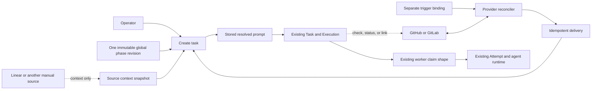

# Global reusable phases for Factory

> **Status:** Proposed for review

## 1. Executive summary

Factory currently sends one free-text description to one worker. Teams must
therefore repeat instructions for planning, building, reviewing, and validating
on every run. Requiring each repository team to install CI files or remember to
request review manually will not succeed at fleet scale. Factory will add
phases: global, named, versioned agent prompts managed by the control plane. A
phase can be selected manually and can have zero or more separate trigger
bindings. A centrally defined `Review` phase can therefore run for merge
requests across managed repositories without checked-in Factory configuration.

To create a manual run, an operator selects exactly one immutable phase
revision, one repository, one worker, and source context. An automatic trigger
selects those inputs using its central binding. In both cases the control plane
stores an exact prompt snapshot and uses the existing Task, Execution, Attempt,
lease, event, and recovery contracts.

A run is a task-creation action, not a new persistent entity. GitHub, Linear, or
another source remains authoritative for issue state. Factory records only the
execution of the submitted context. The main cost is duplicated prompt data:
Factory retains both the reusable phase revision and the resolved prompt on
each task so queued work and retries cannot change later. Trusted adapter
processes, polling, and provider delivery recovery also add operational load.

## 2. Context and scope

The current [Factory architecture](../../ARCHITECTURE.md) creates one Task and
one Execution from a title, description, repository, worker, and timeout. A
worker claims the Execution, creates Attempts under leases, and passes the task
description to Codex or Claude Code. Factory owns this execution history, but
it does not own the lifecycle of the issue or request that motivated the task.

The proposed [reusable workflows design](../workflows/design.md) describes
named, versioned prompts with task snapshots. This design supersedes that
proposal and replaces its reusable-workflow terminology with **phase**. A phase
is one generic prompt, not a workflow, procedure graph, or pipeline. Planning,
building, reviewing, and validating are examples of ordinary phases. They do
not receive distinct executor types, execution states, or transition rules.

The workflow proposal is not implemented, so there is no workflow data to
migrate. If this design is approved, new work must implement phases rather than
introduce a second workflow resource. Other proposed documents that refer to a
workflow ID or workflow revision ID must be updated to refer to a phase ID or
phase revision ID before implementation. Their useful pinning rule remains the
same.

The practical motivating automation target is code review. A workplace may have no
AI review infrastructure, and adoption will fail if every team must add a CI
workflow or invoke an agent by hand. One global `Review` phase should apply to
the managed repository fleet. A merge request becomes eligible when it is open
and its current head commit has no delivery for that phase. A new head commit is
a new eligible occurrence even when the merge-request ID is unchanged.

Technical design review is a second high-value use case. An operator defines
one global `Technical design review` phase that checks a specification for
clear scope, architecture fit, failure behavior, security, operational impact,
acceptance criteria, and testability. The phase can run manually from a Jira
reference or automatically when a trusted Jira adapter emits a matching item.
The adapter does not copy the Jira description into Factory. The agent fetches
the current specification and comments from Jira at execution time, revalidates
the configured state and labels, and publishes review evidence back to Jira
when the phase prompt asks it to. Jira remains authoritative for the
specification, review discussion, and lifecycle state.

This design fixes both issue and merge-request fingerprint contracts. The first
implementation slice ships a versioned trusted-command adapter protocol and
uses a centrally installed GitHub issue adapter that may call `gh`. Fleet-wide
Review becomes available when a merge-request adapter emits head commits
through the same protocol, without changing phase, trigger, task, or worker
schemas.

This design changes the control plane, API, browser UI, and server operations.
It adds a global phase library, task source snapshots, trusted provider
adapters, trigger bindings, source reconciliation, and bounded delivery
recovery. It does not change runtime selection, scheduling order, leases,
attempt states, worktrees, cancellation, explicit execution retries, or
cleanup. Triggering creates ordinary tasks; it does not add a pipeline.

**Opinion [high]:** Approve the phase model and the trusted-command polling
boundary for the local-first MVP. The repository contracts support prompt
snapshots and generic execution, while the supplied product constraints rule
out repository setup and inbound webhooks. **This changes if:** Factory gains
authenticated reachable ingress, or provider credentials and adapter code can
no longer be trusted inside the local control-plane OS account.

## 3. System context



The control plane owns phase identity, immutable revisions, availability,
prompt composition, task snapshots, trigger configuration, reconciliation
health, idempotent delivery, and recovery. The phase prompt and provider
trigger configuration are separate records. The worker receives one resolved
prompt in the existing claim field and does not read either record.

GitHub, GitLab, Linear, and other providers remain authoritative for work-item
identity, open or closed state, labels, merge-request head revision, and review
evidence. Trusted adapters read the fields needed to decide eligibility, and a
phase agent may write review evidence with its live provider tools.
Factory retains only bounded observations and delivery records needed to avoid
duplicate tasks and recover uncertain writes. It does not copy issue assignee,
approval, or transition history into a durable work-item model.

The persistent relationships become:

```text
Phase 1 --- * PhaseRevision 1 --- * Task 1 --- 1 Execution
  |
  `--- * TriggerBinding 1 --- * TriggerDelivery 0..1 --- 1 Task
                                             Execution 1 --- * Attempt
```

There is no Run table, PhaseExecution table, pipeline record, or phase state
machine. “Run” means creating and observing the existing Task and Execution.
A TriggerDelivery is an idempotency and recovery record for one source
occurrence, not a work item or an execution state.

## 4. Proposed design

### How it works

An operator creates a phase named `Build` with a prompt that tells an agent to
inspect repository instructions, implement the requested change, verify it,
review the diff, and report evidence. Saving creates revision 1.

The operator opens New run and selects:

- phase `Build`, revision 1;
- a worker;
- one repository advertised by that worker;
- source context, such as free text, a GitHub issue snapshot, or a Linear issue
  snapshot;
- the existing title and timeout values.

The browser submits the immutable `phase_revision_id`, not the mutable current
phase pointer. In the existing task-creation transaction, the control plane
checks that the revision exists and its phase is enabled. It then stores source
provenance, source content, phase snapshots, and the exact resolved prompt
before creating the normal queued Execution.

For a nonblank phase, composition is the following exact UTF-8 text:

```text
Phase prompt:

<phase prompt bytes>

Source context:

<source context bytes>
```

Factory performs no interpolation, Markdown rendering, URL expansion, or
provider fetch during composition. The stored source context and phase prompt
preserve their bytes. The fixed labels and line feeds are part of the versioned
composition contract.

The worker claim remains compatible with current workers:
`claim.task.description` contains the stored resolved prompt. The worker adds
its existing safety preamble, task title, and repository identity, then starts
the configured generic agent runtime. The worker does not know that `Build` is
a building phase and does not branch on phase name or revision.

Task detail shows the phase name and revision used, source provenance, original
context, and resolved prompt. A link may open the external work item, but
Factory does not show or mutate a copied lifecycle state. Retry returns the same
Execution to the queue and reuses the same task snapshot.

The MVP automatic path uses a GitHub issue binding. The binding selects a
centrally installed absolute adapter executable, literal arguments, bounded
JSON trigger configuration, the managed repositories in one organization, and
one normalized revalidation condition, plus generic worker routing. The
executable may use `gh issue list` and local `gh`
authentication. At a poll tick, it reads only repository identity, stable issue
ID and number, URL, title, state, and predicate-relevant labels. It does not
request or emit the issue body.

For each matching issue, the adapter refetches the fields needed to confirm
eligibility and returns a minimal source reference. The stable MVP fingerprint
is:

```text
sha256(trigger_binding_id | provider_namespace |
       source_kind | external_item_id)
```

If no TriggerDelivery exists for that fingerprint, the reconciler creates a
delivery, pins the phase’s current
revision, routes it to an eligible worker, and creates a normal task with a
deterministic request key. The generated source context contains only the
provider, repository and issue reference, URL, and title, followed by a fixed
predicate summary such as `state is open; labels include factory:ready`. It then
instructs the agent to fetch the live issue, revalidate those exact conditions,
and stop without mutation if they no longer hold. This is a task snapshot of the
condition that authorized the run, not phase prompt content or mirrored issue
state. The phase prompt remains reusable and contains no trigger configuration.

Repeated polls are idempotent forever for the same trigger and issue. Removing
and reapplying a label does not create another automatic run. The operator uses
the existing Execution retry, creates a manual run, or deliberately creates a
new trigger identity when another automation episode is wanted. Factory adds no
separate ingest database or issue-match state machine.

Jira technical design review follows the same issue path. A manual run selects
the phase, managed repository, worker, and Jira URL or key. An automatic Jira
binding may match a normalized state and labels such as `In Review` and
`design-review-ready`. Its trusted adapter reads a binding-selected,
provider-owned repository reference from a Jira development link or dedicated
custom field. The value must identify exactly one repository in Factory's
current managed fleet. The binding stores the Jira field ID or link relation,
not a project-to-repository mapping or repository array. If the reference is
missing or ambiguous, the adapter does not emit that candidate and the item
remains available for manual review. Factory rejects any emitted repository
identity that is not in the live managed fleet.

The generated prompt contains the phase instructions, Jira reference, title,
and revalidation condition, but not the design body. The agent reads the live
design with its Jira credentials and leaves the review in Jira. This adds no
Jira-specific task state or phase type.

The same architecture supports the later fleet-wide `Review` trigger. Its
fingerprint must be:

```text
sha256(trigger_binding_id | provider_namespace |
       source_kind | external_item_id |
       current_head_commit)
```

The head commit makes new code eligible again without using merge-request
lifecycle state in Factory. Updating a phase revision alone does not rerun an
already delivered issue or merge-request head.

Manual runs use the same phase and task path but intentionally bypass automatic
trigger deduplication. This preserves an operator’s ability to request another
review. They do not alter the automatic occurrence fingerprint.

### Components and responsibilities

#### Control-plane phase store

The phase store owns stable phase IDs, immutable revision IDs, current revision
pointers, globally unique names, enabled state, mutation idempotency, and
limits. It depends on SQLite. It does not own repository overrides, source
credentials, agent capabilities, execution states, or work-item states.

#### Task creation service

The existing task service owns validation, prompt composition, source and phase
snapshots, worker and repository validation, and atomic creation of one Task and
one Execution. For triggered work it also links the task to the prepared
delivery in the same transaction. It depends on the phase store and existing
scheduler data. It does not fetch source content, sequence phases, or decide
what should happen after the Execution finishes.

#### Trigger binding store

The trigger store owns bindings, enabled state, predicates, fleet scope,
trusted adapter command configuration, routing policy, poll-target health,
occurrence fingerprints, and delivery recovery. It depends on SQLite and phase
identity. It does not store a phase prompt, provider credential, mirrored
work-item state, or new execution state machine.

#### Provider reconciler

The reconciler owns startup and periodic target scheduling, idempotent task
submission, and delivery recovery. At each tick it loads enabled bindings and
currently managed repositories, intersects each binding’s central scope, and
expands independent `(trigger binding, repository)` poll targets or one
fleet-wide target according to the binding. It depends on the adapter command
runner, trigger store, task creation, and existing worker and repository
registrations. It does not parse provider payloads, paginate provider APIs,
trust a webhook payload as current state, or perform agent work.

#### Adapter command runner

The runner owns direct process execution, protocol input, stdout and stderr
bounds, timeouts, exit handling, complete-output buffering, and normalized
record validation. It executes one trusted absolute path with literal arguments
and never invokes a shell. The adapter process owns provider authentication,
queries, arrays, pagination, and filtering. Credentials stay in `gh`, `acli`, a
custom Jira client, a Linear adapter environment, or another trusted adapter
environment and never enter Factory storage.

#### Worker router

The router first resolves an enabled repository in the control-plane managed
fleet. It then selects one current cattle worker that accepts managed
repositories and advertises live source access matching the binding's immutable
provider namespace, hostname, and scope. A legacy worker that already
advertises the checkout remains eligible during migration. Routing uses the
generic least-loaded rule. It does not infer provider access from adapter
output, inspect the phase name, or create a phase-specific worker pool. The
chosen worker and repository are frozen on the delivery and normal Execution.

#### Browser UI

The UI owns phase management, immutable phase selection, source-context entry,
trigger-binding management, adapter health display, and recent-run display.
It presents triggers within phase detail for product clarity but calls separate
trigger APIs and does not copy trigger fields into phase revisions. It depends
on control-plane APIs. It does not compose prompts, infer external issue status,
or make phase-dependent execution choices.

#### Source adapters

Provider querying and parsing stays behind a versioned external-command
protocol. Factory sends one JSON object on stdin:

```json
{
  "protocol_version": 1,
  "operation": "poll",
  "trigger": {
    "id": "trigger-uuid",
    "version": 3,
    "provider_namespace": "github:github.com",
    "config": {},
    "revalidation": {
      "state_equals": "open",
      "labels_all": ["factory:ready"]
    }
  },
  "repository": {
    "identity": "github.com/example/repository"
  },
  "limits": {
    "max_records": 1000,
    "max_stdout_bytes": 8388608
  }
}
```

The trigger config is bounded to 64 KiB and is opaque to Factory after basic
JSON validation. `repository` is present for a per-managed-repository binding
and absent for a fleet-wide binding whose records supply repository identity.
Protocol version 1 has no secret field.

The adapter emits UTF-8 NDJSON, one candidate object per line:

```json
{
  "provider": "github:github.com",
  "source_kind": "issue",
  "external_item_id": "I_kwDO...",
  "url": "https://github.com/example/repository/issues/123",
  "title": "Checkout fails",
  "state": "open",
  "labels": ["factory:ready"],
  "repository_identity": "github.com/example/repository",
  "source_revision": ""
}
```

`provider` is a stable provider namespace, not a display name. It identifies
the provider installation or tenant that owns the external ID, such as
`github:github.com`, `jira:site-id`, or `linear:workspace-id`.
`external_item_id` must be stable and unique within that namespace and source
kind. If a provider exposes only repository-scoped item IDs, the adapter
constructs this opaque value from the provider's immutable repository ID and
immutable item ID using an unambiguous encoding. It must not use a mutable
repository name or issue number alone.
`source_revision` is omitted or empty for one-run-per-item issues and is the
full head commit for merge-request review. Labels are the
predicate-relevant labels the agent must revalidate, not an archived provider
payload. The protocol has no description, body, raw payload, provider cursor,
check, review, or provider pagination field.

Every candidate's `provider` must exactly match the binding's immutable
`provider_namespace`. Worker access is not inferred from this candidate value.
The binding separately declares the provider, hostname, and scope that an
eligible worker must advertise.

For a per-repository target, `repository_identity` may be omitted and Factory
uses the input target; an emitted different identity fails the poll. Fleet-wide
records must provide a currently managed identity. Candidate identity is the
provider namespace, source kind, and external item ID. Repository identity is a
separate routing field and never participates directly in source identity or
the eligibility fingerprint. The opaque external item ID already includes an
immutable provider repository ID when the provider's item ID is
repository-scoped. This prevents a repository rename or transfer from creating
a second occurrence for the same immutable provider item. Two records with the
same source identity conflict when title, URL, state, labels, routing repository,
or revision differs; byte-equivalent records collapse.

Protocol version 1 supports one normalized automatic revalidation condition:
exact normalized state equality plus zero or more required labels. Factory
checks exact state equality and set inclusion against each candidate after the
trusted adapter normalizes provider values. The generated agent context repeats
the same condition and requires a live refetch before mutation. An adapter may
use a richer provider query to reduce its scan, but hidden adapter-only filters
cannot authorize automatic work in version 1. A future condition needs a new
reviewed protocol version rather than opaque prompt text.

Factory buffers all stdout until the process exits successfully, then parses
and validates every record before creating any delivery. Exit code 0 means the
poll is complete. Nonzero exit, timeout, malformed JSON, unknown protocol data,
missing identity, conflicting duplicates, more than 1,000 records, or more than
8 MiB stdout fails the whole poll target and creates no runs. Byte-identical
duplicate identities collapse to one record. Stderr is diagnostic only and is
truncated at 64 KiB.

The adapter owns provider arrays and every page needed for completeness. For
GitHub it may call `gh issue list` or `gh pr list` with JSON output and local CLI
authentication. A Jira Cloud adapter may use `acli jira workitem search`, REST
JQL search, or a trusted custom Jira CLI. The official CLI form is
`acli jira workitem search --jql ... --json`, but Jira installations, versions,
sites, and custom environments vary. A Linear adapter uses GraphQL with its own
API key or OAuth environment and cursor pagination. Factory assumes no universal
Jira installation and no official general Linear polling CLI.

Protocol version 1 supports only a poll target whose complete matching result
fits within 1,000 records, 8 MiB, and 2 minutes. An adapter that cannot return
the complete target inside those Factory budgets must exit nonzero, preferably
with a stable `target_too_large` diagnostic. The UI marks that target unhealthy
until the operator narrows central adapter configuration or splits the
automation into additional bindings. Factory deliberately has no partial
cursor in this version because partial output could create an incomplete set of
runs.

Optional built-in adapters may implement the same stdin and NDJSON protocol
inside the binary later. Phase, trigger, candidate, task, and worker contracts
do not change. Unsupported providers can still submit manual source context
through the task API.

#### Worker

The worker continues to own runtime execution, worktree isolation, attempt
events, leases, process supervision, and cleanup. It depends on the resolved
prompt in the claim. It does not fetch, cache, select, or interpret phases and
does not update source lifecycle state except when the generic agent prompt
explicitly asks the agent to use available tools.

Worker registration gains an optional additive `source_access` list containing
provider, hostname, and centrally configured organization scopes. The MVP
worker advertises `github` access only after a startup probe proves `gh` is
installed, authenticated for the hostname, and can read each scope. Old workers
omit the field and remain valid for manual tasks, but the trigger router does
not assign them work that requires live source revalidation. The capability
carries no token and is not phase-specific.

Worker registration also carries a generic managed-repository acquisition
capability. A selected worker clones or fetches the frozen central repository
before starting the unchanged agent contract. This capability is runtime
infrastructure, not phase or repository configuration.

### Decisions

#### A phase is a prompt, not an execution type

All phases use the same generic task and worker path. Adding phase-specific
executors or states was rejected because a name such as `Review` describes
prompt policy, not a different control-plane lifecycle. The cost is that prompt
instructions are not deterministic enforcement.

#### Every new run selects exactly one phase

The API stores one non-null phase revision on every task. Multiple phases per
run and no-phase runs were rejected because both make prompt identity unclear
and create pressure for hidden sequencing. Compatibility is preserved through
the built-in `Blank task` phase, whose only revision has an empty prompt.

#### Blank task is a reserved global phase

`Blank task` revision 1 is created by migration, cannot be renamed, edited,
disabled, or deleted, and composes to the source context byte for byte with no
labels. Existing clients that omit `phase_revision_id` select this revision.
This preserves the current 64 KiB free-text task behavior while satisfying the
one-phase rule. The special composition is the only semantic difference between
the blank phase and an operator-managed phase.

#### Revisions pin content, not behavior

Editing a phase name or prompt creates a new immutable revision and advances a
current pointer. A run may pin any existing revision of an enabled phase. This
supports deterministic retries and lets a future pipeline definition reference
an immutable phase revision without changing this schema. Resolving at claim
time was rejected because queued work could change after submission.

#### Phases are global

There is one phase library for the whole control plane. Phase records have no
repository ID, repository join table, or repository override. Repository-owned
instructions remain in each repository and a generic phase may tell the agent
to read them. Per-repository phase configuration was rejected because it would
fragment identity and prevent a revision from meaning the same thing across
managed repositories.

#### Trigger bindings are separate from phase revisions

A phase has zero or more trigger bindings by stable phase ID. A binding stores
an adapter command, opaque trigger configuration, fleet scope, cadence, and
routing, but never copies the phase prompt. New eligible occurrences pin the
phase’s current revision when their delivery is created. Embedding adapters in
phase revisions was rejected because it would duplicate the `Review` prompt for
manual, issue, and merge-request use and would make command or cadence changes
create false prompt revisions. The UI may still present bindings inside phase
detail.

#### Predicate, transport, and reconciliation are separate

The trigger predicate is the external condition that makes a phase eligible.
The observation transport only tells Factory that state may need checking. The
reconciler always invokes the trusted adapter to fetch authoritative live
provider state and apply provider-specific querying. Factory then validates the
complete normalized output against the binding's small protocol-level
revalidation condition before creating idempotent runs. This separation makes
evaluation transport-neutral and gives polling and any future webhook the same
behavior without teaching Factory GitHub, Jira, or Linear field shapes.

#### Polling is the first observation transport

The current product is local-first and accepts only loopback HTTP. Requiring
webhooks now would also require authenticated reachable ingress or a managed
relay, signature-secret management, delivery handling, and new hosted
infrastructure. The first implementation therefore polls providers through
trusted centrally configured adapter commands. The MVP protocol works with a
GitHub adapter backed by `gh`; Jira and Linear adapters can own their different
official or custom transports. A per-repository binding expands across the
current managed fleet. A fleet-wide binding runs once and must emit a managed
repository identity for routing. The default cadence is 60 seconds,
configurable from 30 seconds to 1 hour with jitter. The adapter owns provider
pagination and rate-limit handling; this design assumes no provider page or
rate limits.

A future webhook is only a wake-up hint. Factory must validate its transport
and signature, enqueue the affected identity, refetch live provider state, and
run the same evaluator. It must never create a task directly from webhook
payload. Periodic polling remains enabled so stale, duplicated, delayed,
out-of-order, or missed events converge. Webhooks become preferable only when
Factory has authenticated reachable ingress or a managed relay.

#### Review freshness is the merge-request head

The later merge-request review trigger uses binding identity, provider
namespace, merge-request ID, and the current head commit. The
merge-request ID alone was rejected because it would suppress review after new
commits. Phase revision is not part of source freshness. A completed, failed,
cancelled, queued, or running delivery for one exact fingerprint suppresses
another automatic task. Failure recovery uses the existing Execution retry.
Pushing a new head creates new eligibility.

#### Issue triggers use one automatic run per trigger and item

The MVP does not try to infer a portable label-match episode. A matching issue
gets one automatic run for a binding and immutable provider item. Label removal,
reapplication, and a phase edit do not rerun it. An operator uses explicit
Execution retry, a manual run, or a new trigger identity when needed.

The hard future product choice is whether other sources run once ever, once per
matching episode, or once per source revision. This design chooses once ever for
the MVP issue trigger and once per source revision only where merge-request head
freshness inherently requires it. It defers a generic episode contract.

#### Poll targets are independent and bounded

At each tick the engine derives targets from bindings and the current managed
fleet, not from a configured repository array. It processes observations
sequentially within each target and runs at most four poll targets concurrently
by default. The bound is configurable from 1 to 16. One target’s timeout,
malformed provider response, or pagination failure records an error only for
that target and is never treated as an empty result. Other targets continue.

Only one poll for a target may run at once, and ticks never create overlapping
work for it. One target runs one adapter process bounded to 2 minutes, 1,000
candidate records, 8 MiB stdout, and 64 KiB stderr. These are Factory process
budgets, not provider limits. The adapter must finish its own pagination inside
that invocation or exit nonzero. Factory exposes no partial-success cursor and
never infers absence from a failed process.

The MVP supports only targets whose complete result fits those bounds. A target
that is consistently too large remains unhealthy rather than producing partial
work. The operator must narrow the centrally stored query or split it across
new trigger bindings. This is a Factory scope limit and makes no claim about a
provider's API limits.

The scheduler orders due targets by next-attempt time, then oldest last-started
time, binding ID, and repository ID. A completed or failed target returns
behind other already-due targets. With responsive adapters, a target starts within
`ceil(due targets / concurrency) * 2 minutes`; the UI reports actual lateness
when adapter backoff breaks that bound. Poll cadence is the desired interval
between complete scans, not a promise that an unbounded fleet finishes every 60
seconds.

#### Provider evidence is visible truth, delivery state is recovery data

Provider state remains authoritative for whether an item is open, its labels,
its current head, and any review comment, check, or status. Protocol version 1
is read-only polling and does not create provider evidence. A phase may instruct
the agent to publish review evidence using its live provider tools and
credentials. Factory retains the task link, execution history, and deterministic
delivery fingerprint but does not infer provider lifecycle from agent text.

A later reviewed protocol version may add typed provider-evidence operations
with explicit idempotency and uncertain-write recovery. Until then, Factory
claims exactly-once task creation, not exactly-once provider comments or checks.

#### Managed fleet scope uses the control-plane repository catalog

A repository belongs to a binding’s fleet when its normalized provider identity
is enabled in the central managed-repository catalog and is inside the
binding’s organization or group scope. No checked-in file or per-repository
worker configuration opts it in. Optional central include and exclude patterns
may narrow a binding, but they live on the binding. The router chooses a
healthy, online worker with matching provider access and managed-repository
capability by lowest `(active + queued) / capacity`, breaking ties by worker ID,
and freezes that assignment. If none is eligible, delivery waits for routing
rather than creating an unclaimable task.

#### Source metadata is provenance, not a work item

A task may snapshot a provider name, external reference, URL, and content.
These fields explain what was submitted but contain no source status or Factory
workflow state. A richer mirrored issue model was rejected because GitHub or
Linear must remain authoritative and synchronization failures would create
conflicting lifecycle truth.

#### The server composes the prompt

All callers submit a phase revision and context; the server creates the exact
resolved prompt. Browser-side, adapter-side, and worker-side composition were
rejected because they could produce different bytes and would require
phase-aware workers.

#### No automatic continuation follows completion

A successful or failed run becomes terminal under the current Execution rules.
Factory does not select another phase, create a successor task, or transition an
external work item because of that completion. It may update the check or status
that reports this run. A later provider observation can independently make a
new source occurrence eligible, such as a new merge-request head. A future
pipeline may reference revision IDs, but pipeline sequencing and lifecycle
require a separate design.

## 5. Invariants and requirements

### Invariants

1. Every task references exactly one immutable phase revision.
2. A phase revision’s name and prompt never change after creation.
3. One task creates one Execution and executes one selected phase.
4. A task’s source context and resolved prompt never change after creation.
5. Blank phase composition equals source context byte for byte.
6. A retry reuses the task’s phase revision, source context, and resolved
   prompt.
7. The control plane is the only component that composes phase and context.
8. Workers receive the resolved prompt through the existing task description
   field and never read phase storage.
9. A phase revision is global and has no repository-specific configuration.
10. Phase names and prompts never select an executor, runtime, or execution
    state.
11. Factory stores no durable external work-item or pipeline lifecycle state.
12. Editing or disabling a phase never changes queued, running, or terminal
    tasks.
13. Completing a run never starts another run automatically.
14. Planning, building, reviewing, and validating use the same Task,
    Execution, and Attempt contracts.
15. A phase prompt and its trigger bindings are separate persistent resources.
16. A phase may have zero or more bindings, and every binding invokes the same
    generic task-creation service as a manual run.
17. Trigger predicates are independent of observation transport.
18. A webhook payload never creates a task without an authoritative provider
    refetch and normal predicate evaluation.
19. One trigger occurrence creates at most one task despite process crashes,
    duplicate observations, or lost API responses.
20. Merge-request eligibility changes when its current head commit changes.
21. Trigger reconciliation never requires a checked-in file or per-repository
    Factory configuration.
22. Provider work-item and review lifecycle state remains authoritative outside
    Factory.
23. Provider query shapes, pagination, provider-specific filtering,
    credentials, and raw parsing never cross the versioned command-protocol
    boundary. Only the small normalized revalidation condition crosses it.
24. One poll target failure never acts as an empty result and never blocks an
    unrelated target.
25. A poll creates no delivery until its adapter exits 0 and every buffered
    candidate validates.
26. Factory executes only the binding’s verified absolute executable with
    literal arguments and never through a shell.
27. Trigger candidates and triggered task snapshots contain no provider issue
    body or description.
28. An external item ID is provider-wide stable within its namespace and source
    kind. If the provider ID is repository-scoped, it includes the immutable
    provider repository ID, never only a mutable repository locator.

### Requirements

- A phase name is required, trimmed, limited to 100 Unicode characters, and
  globally unique under ASCII case-insensitive comparison.
- An operator-managed phase prompt is required and limited to 48 KiB of UTF-8.
  The reserved blank prompt is the only empty prompt.
- Source context is required and limited to 64 KiB of UTF-8.
- The resolved prompt is limited to the existing 64 KiB task-description
  contract. Nonblank context may therefore need to be smaller than 64 KiB.
- Source provider namespace is optional, limited to 255 printable ASCII
  characters, and must be stable for the provider installation or tenant.
  Source reference is optional and limited to 512 Unicode characters. Source
  URL is optional and limited to 2,048 UTF-8 bytes. Source revision is optional
  and limited to 255 ASCII characters; triggered merge-request work stores the
  full provider head commit.
- Source metadata is displayed as provenance only. Triggered tasks may snapshot
  the observed state and predicate-relevant labels for agent revalidation, but
  Factory stores no authoritative assignee, approval, transition history, or
  provider lifecycle.
- A phase library contains at most 100 operator-managed phase identities and
  each contains at most 100 revisions. The reserved blank phase does not count
  against the identity limit.
- Phase and revision lists use opaque cursor pagination with 50 results by
  default and 200 at most.
- Editing a name or prompt creates a revision. Enabling and disabling changes
  library availability without rewriting a revision.
- The current revision pointer is a selection convenience only. Task creation
  always accepts an explicit immutable revision ID after compatibility
  handling.
- Any existing revision of an enabled phase may be selected. Disabling blocks
  all its revisions for new tasks.
- A phase has at most 20 nonarchived trigger bindings, and the control plane
  has at most 500 enabled bindings. These are Factory resource budgets, not
  provider API limits. Archiving a settled disabled binding frees its slot and
  is irreversible.
- The MVP adapter supports GitHub issue state and label matching. The same
  adapter boundary supports later GitHub pull-request and GitLab merge-request
  open-state and head-freshness triggers without schema changes.
- A binding references one trusted absolute executable, at most 100 literal
  arguments of at most 4 KiB each, protocol version 1, immutable provider
  namespace, immutable worker source-access requirement, source kind, at most
  64 KiB adapter JSON, one normalized revalidation condition, and a central
  fleet scope.
- Protocol version 1 revalidation contains exactly one normalized state
  equality and zero or more required labels. The adapter normalizes provider
  values; Factory checks exact state equality and required-label set inclusion
  against buffered candidates and repeats the condition in the agent prompt.
  Opaque adapter-only filters cannot authorize automatic work.
- A later merge-request predicate requires an open item and deduplicates its
  binding against the immutable provider item and full current head commit.
- The MVP issue fingerprint permits one automatic run per provider item and
  binding. Label removal, label reapplication, and phase edits do not create
  another automatic run.
- The GitHub issue adapter polls and stores no body or description. Triggered
  source context contains only reference, URL, title, a minimal required-state
  and required-label summary, and a fixed instruction to fetch live state and
  stop without mutation unless the same predicate still matches.
- A Jira technical-design-review run uses the same minimal issue candidate.
  Manual creation supplies its managed repository explicitly. Automatic
  creation reads a provider-owned development link or one binding-selected Jira
  custom field containing exactly one normalized repository locator. Factory
  validates that locator against the live managed fleet. The binding stores no
  project-to-repository map or repository array. The agent fetches the live
  specification and comments, revalidates state and labels, and keeps review
  evidence in Jira.
- Trigger polling defaults to 60 seconds, accepts 30 seconds through 1 hour,
  applies jitter, and retries failed adapter processes with bounded backoff.
- Each tick expands enabled bindings and current managed repositories into
  independent poll targets for per-repository mode. Fleet-wide mode creates one
  target whose records must route to current managed repository identities. No
  mode stores a configured repository array. Factory runs 1 to 16 targets
  concurrently with a default of 4.
- One target has at most one in-flight scan. A scheduling slice stops at 2
  minutes, 1,000 candidates, 8 MiB stdout, or 64 KiB stderr. Any limit failure
  rejects the buffered poll and creates no delivery.
- Version 1 supports only targets whose complete matching result fits that
  process budget. An oversized target remains unhealthy until its central query
  is narrowed or split into new bindings; version 1 has no partial cursor.
- Each candidate is at most 16 KiB and has bounded provider, kind, external ID,
  URL, title, state, labels, repository identity, and optional revision fields.
  Unknown fields and full descriptions or bodies are rejected.
- An adapter must make `external_item_id` provider-wide stable. For
  repository-scoped APIs it encodes the provider's immutable repository ID and
  item ID, while `repository_identity` remains the current managed-fleet
  routing locator.
- Due targets use oldest-started ordering. A target’s testable start bound under
  responsive providers is `ceil(due targets / concurrency) * 2 minutes`;
  adapter backoff is reported separately as target lateness.
- Factory executes the adapter’s absolute path with literal arguments, no
  `sh -c` or shell pipeline. The trusted adapter owns provider authentication,
  parsing, arrays, filtering, and pagination.
- Trigger routing requires a current worker `source_access` capability exactly
  matching the binding's provider namespace, provider, and hostname and
  containing its organization, group, or site scope, plus generic
  managed-repository acquisition capability. Workers derive both from host
  capabilities, not repository configuration, and advertise no secret.
- Startup reconciliation runs before the trigger manager reports healthy. It
  recovers incomplete deliveries first, then performs one live scan for every
  enabled poll target. Workers may continue existing executions during that
  scan. Trigger health is separate from the server’s task API health.
- Periodic full reconciliation remains required if webhook wake-up is added.
- A binding may narrow fleet scope with central include and exclude patterns.
  It cannot require repository files, repository-local secrets, or a
  repository-to-phase join.
- Trigger-created tasks store the binding, delivery, provider item, and source
  revision snapshots. Manually created tasks leave trigger identity empty.
- Delivery submission uses a deterministic task request key derived from the
  stable eligibility fingerprint. Retrying an uncertain POST returns the
  original task.
- Automatic delivery retries recover routing, task submission, and provider
  refetch. A failed or cancelled agent Execution is retried only by the existing
  explicit Execution retry action.
- Disabling a phase or binding stops polling and new occurrence creation when
  the disable transaction commits. Unsubmitted deliveries pause until
  re-enabled. Existing tasks and explicit retries continue.
- The phase detail UI shows bindings and recent manual and triggered runs.
  Binding detail shows last successful reconciliation, next poll, current
  health, pending deliveries, and recent stable errors without copying provider
  lifecycle state.
- Workers validate configured source-access scopes at startup and every five
  minutes. A failed refresh removes the capability from the next registration.
  Existing workers with no capability remain compatible with manual tasks.
- The current FIFO claim order, worker capacity of 1 to 4, task timeout, lease,
  event, result, retained-worktree, and page limits remain unchanged.
- Phase prompts, source context, and resolved prompts must not be written to
  normal application logs.

## 6. Interfaces and data

### Phase API

The control plane adds:

```text
GET  /api/v1/phases?enabled=BOOL&limit=N&cursor=C
POST /api/v1/phases
GET  /api/v1/phases/{phase_id}
GET  /api/v1/phases/{phase_id}/revisions?limit=N&cursor=C
POST /api/v1/phases/{phase_id}/revisions
PUT  /api/v1/phases/{phase_id}/enabled
```

Creating a phase accepts:

```json
{
  "request_key": "e3f257f6-bb5d-47cd-b903-8966c4bd36d8",
  "name": "Build",
  "prompt": "Read repository instructions, implement the requested change..."
}
```

Creating a revision accepts a new `request_key`, the complete new `name` and
`prompt`, and `expected_current_revision_id`. A matching expected revision
prevents concurrent edits from silently overwriting one another. Exact
request-key replay returns the first stored result. Reusing a key with different
input returns `request_key_conflict`.

The phase detail response returns stable phase identity, enabled state, current
revision ID, and current revision. Revision list responses include immutable
revision ID, display revision number, name, prompt digest, and creation time.
The full prompt is returned only by phase or revision detail, not list
responses.

There is no hard-delete endpoint. Disable is reversible and preserves revision
references. The reserved blank phase rejects edit and disable operations with
`system_phase_immutable`.

### Trigger API

Trigger bindings have separate endpoints even though the UI nests them under a
phase:

```text
GET  /api/v1/phases/{phase_id}/triggers?limit=N&cursor=C
POST /api/v1/phases/{phase_id}/triggers
GET  /api/v1/phase-triggers/{trigger_id}
PUT  /api/v1/phase-triggers/{trigger_id}
PUT  /api/v1/phase-triggers/{trigger_id}/enabled
POST /api/v1/phase-triggers/{trigger_id}/archive
GET  /api/v1/phase-triggers/{trigger_id}/deliveries?limit=N&cursor=C
GET  /api/v1/phases/{phase_id}/runs?origin=manual|trigger&limit=N&cursor=C
```

An MVP GitHub issue binding references one trusted central command:

```json
{
  "request_key": "02c72730-fcc4-4f37-bf57-2fca88489f46",
  "name": "Refine ready issues",
  "adapter_protocol_version": 1,
  "adapter_executable": "/Users/example/.factory/adapters/github-issues",
  "adapter_args": ["--hostname", "github.com"],
  "provider_namespace": "github:github.com",
  "source_access_requirement": {
    "provider": "github",
    "hostname": "github.com",
    "scopes": ["example"]
  },
  "source_kind": "issue",
  "repository_scope": {
    "mode": "per_managed_repository",
    "include": ["*"],
    "exclude": []
  },
  "adapter_config": {
    "state": "open",
    "labels_all": ["factory:ready"]
  },
  "revalidation": {
    "state_equals": "open",
    "labels_all": ["factory:ready"]
  },
  "routing": {
    "strategy": "least_loaded_eligible"
  },
  "poll_interval_seconds": 60,
  "enabled": true
}
```

A later merge-request binding uses `source_kind: "merge_request"` and an
adapter-owned open-state query that emits `source_revision`. A fleet-wide mode
runs one adapter target and requires every candidate to emit a managed
`repository_identity`; per-managed-repository mode derives targets from worker
advertisements and passes one repository per invocation. Neither mode stores a
configured repository array.

A Jira design-review binding uses a namespace such as `jira:site-id`, requires
worker access to the exact Jira hostname and site scope, and names one
provider-owned repository-reference source in opaque adapter config. The source
is either a Jira development-link relation or one dedicated custom-field ID
whose value is a normalized repository locator. It is not a central
project-to-repository lookup table. The adapter omits items with zero or
multiple locators and may report their count on bounded stderr. Factory rejects
an emitted locator that does not match exactly one current managed repository.

Trigger updates require a mutation request key and `expected_version`. They
may change name, executable, literal arguments, adapter config, revalidation
condition, central include or exclude patterns, cadence, routing, and enabled
state, then increment the binding version. Parent phase, protocol version,
source kind, and scope mode are immutable. Changing one requires a new binding
identity. Provider namespace and source-access requirement are also immutable
because they define source identity and routing authority. Repository identity
is routing only. Updating a binding does not create a phase revision or rerun
an already delivered item.

Archiving is the trigger retention boundary. It requires the binding to be
disabled, every linked task to be terminal, no unsubmitted delivery, and no
active adapter process. In one transaction it marks the binding permanently
archived, removes its poll targets and delivery ledger, and clears task
delivery foreign keys while keeping task trigger snapshots. An archived binding
cannot be enabled or edited and does not count against the 20-binding phase
limit. A new binding ID deliberately creates a new one-run-per-item namespace.

Binding responses show configured predicate and scope, enabled state, last
successful full reconciliation, last error code, next eligible poll time,
pending delivery count, and recent task links. They do not return provider
tokens or cached issue state. Delivery list responses show occurrence
fingerprint, provider identity, source revision, pinned phase revision, task ID,
and recovery status.

### Browser UI

The Phases view lists global phases with current revision, enabled state,
trigger count, and latest run. Phase detail has three sections backed by
separate resources:

- Prompt shows the current name and prompt, revision history, and edit action.
- Triggers shows each binding’s adapter basename, source kind, configuration
  summary, fleet scope, cadence, enabled state, health, next poll, and
  pending-delivery count.
- Recent runs combines manual and triggered tasks and shows origin, repository,
  source reference, pinned phase revision, worker, execution state, and provider
  source link.

New run remains the manual path and requires phase, worker, repository, and
context. The trigger editor accepts a trusted absolute executable, literal
arguments, bounded adapter JSON, and central scope. It does not show a
per-repository checklist or generate a repository file. An adapter or provider
failure appears on the affected binding and repository target without replacing
provider lifecycle state.

### Worker API

Worker registration adds one optional field:

```json
{
  "source_access": [
    {
      "provider_namespace": "github:github.com",
      "provider": "github",
      "hostname": "github.com",
      "scopes": ["example"]
    }
  ]
}
```

Each entry is a recent successful read-access probe, not a credential. The
control plane validates a bounded provider namespace, lowercase provider and
hostname values, plus at most 20 provider scopes per worker. A trigger requires
an exact namespace, provider, hostname, and containing scope match. Old
registrations without the field decode as an empty list. Claims, attempts,
leases, events, and completions are unchanged.

The worker’s host-level configuration does not name repositories or phases. For
the MVP, the worker automatically invokes the existing authenticated `gh`
profile and advertises GitHub access plus managed acquisition while that probe
succeeds. Failure makes triggered work ineligible for that worker but does not
make the runtime itself unhealthy for manual tasks.

A Jira probe must exercise the same centrally configured Jira credential path
that the agent will use. It verifies authenticated identity and performs one
bounded read against the configured hostname and stable site ID, using `acli`,
a custom Jira CLI, or an HTTP client. A successful probe advertises
`provider_namespace: jira:<site-id>`, provider `jira`, the exact hostname, and
the site ID scope. The five-minute refresh removes that entry after auth, site,
or read-access failure. Posting review evidence remains an agent action and may
fail normally if the host credential lacks write permission; it is not inferred
from successful polling credentials.

### Task API

`POST /api/v1/tasks` keeps the current route and fields and adds an explicit
phase revision plus source context:

```json
{
  "request_key": "4a11cc72-2bb7-4f5e-92d6-e1d2087f6d94",
  "title": "Refine issue 123",
  "phase_revision_id": "9ec13fe1-4f41-49e2-94c9-5bb4b7f3c807",
  "source_context": {
    "provider": "github:github.com",
    "reference": "owner/repository#123",
    "url": "https://github.com/owner/repository/issues/123",
    "revision": "",
    "content": "GitHub o/r#123\nTitle: Checkout\nNeed: open,factory:ready\nRefetch; stop if stale."
  },
  "worker_id": "3f441724-98c3-43ac-97f7-f87c92cbb9a8",
  "repository_id": "b3195042-65f3-47b8-80e2-a5d09db33a31",
  "timeout_seconds": 7200
}
```

Free text uses empty provider, reference, and URL fields. Existing clients may
continue to send `description` instead of `source_context`. The server treats
that value as free-text source content and selects the reserved blank revision
when `phase_revision_id` is omitted. Supplying both `description` and
`source_context` returns `ambiguous_source_context`.

The existing request-key behavior remains authoritative. An exact replay
returns the original task before revalidating mutable worker, repository, or
phase availability. A request that failed validation created no task and may be
corrected and retried with the same key.

Task detail adds:

- selected phase ID and revision ID;
- phase name and display revision number snapshots;
- source provider, reference, URL, revision, and original content;
- `resolved_prompt`.

Triggered task detail also returns origin `trigger`, trigger binding ID and name,
delivery ID, and occurrence fingerprint. Manual task detail returns origin
`manual` and no trigger identity. These are provenance, not another execution
status.

For compatibility, the stored `tasks.description` column and
`claim.task.description` field hold the resolved prompt. New browser code uses
the separate source-content field when showing the operator’s input. Current
workers therefore need no phase-specific code or coordinated rollout.

### Persistence

`phases` stores:

- stable phase ID;
- ASCII-folded unique current name key;
- current revision ID;
- enabled flag;
- optional reserved system key;
- created and updated timestamps.

`phase_revisions` stores:

- stable revision ID and parent phase ID;
- monotonically increasing display revision number;
- immutable name and prompt;
- SHA-256 prompt digest;
- creation timestamp;
- mutation request key and input digest.

`phase_trigger_bindings` stores, separately from revision content:

- stable binding ID, parent phase ID, name, version, and enabled flag;
- nullable irreversible archived timestamp;
- protocol version, immutable provider namespace and worker source-access
  requirement, absolute executable, literal argument array, and source kind
  plus the validated executable digest;
- per-managed-repository or fleet-wide scope plus central include or exclude
  patterns;
- bounded opaque adapter configuration JSON;
- normalized protocol-level revalidation state and required-label condition;
- generic routing policy and poll interval;
- aggregate last successful full-scan time and bounded health summary derived
  from its poll targets;
- created and updated timestamps plus mutation request keys.

`trigger_poll_targets` stores only bounded reconciliation facts:

- binding ID and nullable Factory repository ID for fleet-wide mode;
- last successfully reconciled time;
- next attempt time and bounded last error metadata.

Poll-target rows are transport caches and health records. They do not store
issue title, body, assignee, full label set, open or closed history, approvals,
or a provider-state machine. Eligibility facts live only in immutable
deliveries.

`trigger_deliveries` stores:

- stable delivery ID and unique eligibility fingerprint;
- initiating binding and phase IDs plus pinned phase revision ID;
- provider namespace, source kind, external item ID, URL, title, state,
  predicate-relevant labels, and source-revision snapshots;
- repository routing identity as a separate mutable routing/provenance snapshot;
- selected Factory repository and worker IDs;
- deterministic task request key and nullable created task ID;
- generic recovery status limited to `pending_route`, `pending_submit`, and
  `submitted`;
- retry time, bounded error code, and timestamps.

These statuses describe transport recovery, not phase execution or provider
work-item lifecycle. Once a task exists, its Execution and Attempts remain the
only execution status. A unique index on eligibility fingerprint and a unique
task request key enforce one automatic task per occurrence.

The task foreign key uses `ON DELETE SET NULL`. Deleting eligible terminal task
history under the existing rules removes its prompt, attempts, and events but
keeps the minimal delivery fingerprint and request key so the next poll cannot
recreate the same automatic run. The deletion also clears the delivery’s URL,
title, state, labels, and bounded error text; only identity hashes, binding,
request key, and timestamps remain. The UI shows that delivery’s task as
deleted.

`tasks` gains:

- non-null phase revision ID;
- phase name and revision-number snapshots;
- source provider, reference, URL, revision, and content;
- origin `manual` or `trigger`;
- nullable trigger binding and delivery IDs plus trigger-name snapshot;
- the existing description as the exact resolved prompt.

`workers` gains bounded `source_access_json`, replaced on each registration.
It stores only provider, hostname, scopes, and probe time. It is routing
capability metadata, not a credential or repository-phase mapping.

The phase revision foreign key prevents removal of a referenced revision. The
task snapshots preserve readable history without relying on the phase’s current
name. The resolved prompt is stored even though it duplicates phase and context
text because it is the exact worker input and is the retry boundary.

No phase ID is stored on WorkerRepository. A binding’s fleet scope is evaluated
against existing Repository and WorkerRepository advertisements rather than
persisted as repository-phase membership. No phase, trigger, delivery, or task
row contains `next_phase`, predecessor, successor, approval, gate, pipeline, or
authoritative external issue-state fields.

### Naming and identity

The server generates random UUIDs for operator-managed phase IDs and every
revision ID. Failure to obtain a valid ID aborts the transaction and returns a
temporary server error. A phase ID survives rename. A revision number starts at
1 and increments atomically, but it is display data and is never accepted as
API identity without its phase ID.

Names are trimmed. Factory maps ASCII `A` through `Z` to lowercase for the
unique name key and leaves all other UTF-8 bytes unchanged. It does not apply
Unicode normalization or general Unicode case folding. A blank, duplicate, or
overlong name is rejected before mutation.

The reserved blank phase and revision use fixed, documented IDs installed by
the migration. Their fixed identity is safe because IDs are scoped to one
control plane and the values are reserved from generated IDs. Existing tasks
are attributed to this revision during migration.

Source provider, reference, and URL are descriptive snapshots, not identity for
task idempotency. The task request key remains the durable deduplication key.
If an issue is renamed, transferred, edited, closed, or deleted after task
creation, the stored source fields do not change. A source adapter may create a
later task with a new request key.

The server generates UUIDs for trigger bindings and deliveries. Adapters must
emit a stable provider namespace, provider-wide stable external item IDs, and
canonical repository routing identities, not mutable titles. For a
repository-scoped provider API, the external item ID is an opaque composite of
the immutable provider repository ID and immutable item ID.

A later merge-request occurrence fingerprint is the SHA-256 digest of a
length-delimited encoding of binding ID, provider namespace, source kind,
immutable merge-request ID, and full head commit. The MVP issue occurrence
fingerprint uses binding ID, provider namespace, source kind, and immutable
issue ID. Length delimiting prevents ambiguous concatenation. The deterministic
task request key is `trigger:<base64url fingerprint>`, which is within the
existing request-key limit.

The mutable repository locator is stored separately for routing and task
provenance and never participates directly in the fingerprint. The provider's
immutable repository ID does participate inside `external_item_id` when source
IDs are repository-scoped. Renaming or transferring a repository therefore
changes where a later delivery routes but does not manufacture a new occurrence
for the same provider item. Changing a merge-request number does not change
identity; changing its head changes the occurrence. Editing or renaming a phase
does not create new automatic eligibility. Editing a binding in place does not
change its ID or existing fingerprints; a newly created binding has new
automatic fingerprints. Factory derives these bytes from validated protocol
fields.

### Migration and compatibility

One embedded SQLite migration creates phase, revision, binding, poll-target, and
delivery tables, then installs the reserved `Blank task` phase and revision with
fixed IDs. It rebuilds or extends `tasks` so every existing row references that
blank revision, copies the old description into source content, marks origin
`manual`, and leaves the existing description unchanged as resolved prompt.
It adds an empty source-access value to existing workers. Existing IDs, request
keys, timestamps, Execution rows, Attempts, events, and states are preserved.

The proposed reusable-workflow tables do not exist and are not created. There
is no workflow-to-phase data migration. If an experimental build created
unpublished workflow tables, that build requires a separate explicit migration
and is not silently guessed here.

New task columns are non-null after backfill. Trigger linkage is nullable only
for manual work. The migration creates no binding, so upgrading starts no
provider polling until an operator installs a trusted adapter and explicitly
creates and enables a binding.

The claim projection continues to put the resolved prompt in
`task.description`. Current Codex and Claude Code workers therefore run manual
blank and phased tasks without an upgrade. Triggered routing requires an
updated worker registration that advertises `source_access`; an old worker
remains registered and manual-compatible but is ineligible for triggered work.
Existing task API clients map to the blank phase. An older server cannot accept
the new phase or trigger API, and an older binary must not open the migrated
database; normal schema-version checks must reject that downgrade.

## 7. Failure behavior and lifecycle

Phase creation and revision creation are atomic. Validation, ID generation, or
database failure leaves no partial phase and does not move the current revision
pointer. Concurrent revisions require `expected_current_revision_id`; one
transaction succeeds and the other receives `phase_revision_conflict`.

Task creation validates the selected revision, enabled phase, source fields,
resolved size, worker, repository, and timeout in the existing creation
transaction. It returns stable errors including
`phase_revision_not_found`, `phase_disabled`, `source_context_too_large`, and
`resolved_prompt_too_large`. No Task or Execution is created on failure.

Trigger creation and update are atomic and use expected versions. Invalid
protocol versions, nonabsolute or unsafe executables, invalid arguments or
adapter JSON, invalid fleet scopes, stale versions, or database failures leave
the previous binding unchanged.

Immediately before delivery insertion, one SQLite transaction rechecks that the
phase and binding are enabled, the candidate source kind matches the binding,
the candidate matches the normalized revalidation condition, and the binding
version equals the version sent to the adapter. It then pins the current phase
revision. A disable or edit that committed after polling causes
`stale_trigger_observation`; the complete buffered result creates no delivery
or task, and the next poll evaluates the new state. Otherwise the transaction
inserts every new delivery from that successful poll atomically, treating
existing fingerprints as idempotent. Task, Execution, and delivery linkage are
later created atomically in SQLite once a route is available. The same binding
and revalidation checks run again before submission. The deterministic task
request key is defense in depth for replay and future process separation.

Disabling a phase takes effect for new manual tasks and new trigger occurrences
when its transaction commits. Disabling a binding stops its new observations.
A task-creation transaction that committed first remains valid. Queued,
preparing, running, and terminal executions keep their stored prompt. Explicit
retry also remains valid because it does not create a new task.

A delivery without a task remains pending and is not routed or submitted while
its phase or binding is disabled. Existing tasks continue unchanged.
Re-enabling performs a full reconciliation before normal cadence. An unchanged
merge-request head or already delivered issue remains deduplicated.

Reaching a phase, revision, or byte limit rejects only the new mutation with a
stable limit error. Existing phases, queued tasks, claims, and retries continue.
The server never prunes revisions automatically.

At startup, schema migration and phase integrity checks complete before the
HTTP listener starts. If the blank phase is missing, a revision is mutable, a
task lacks a valid phase revision, or the current pointer is invalid, startup
fails with an operator-facing error rather than guessing. Each enabled
binding’s executable path, ownership, permissions, protocol version, arguments,
and JSON size are validated without running it before reconciliation starts.

The task API may become healthy while a provider is unavailable, but the
trigger subsystem reports separate health. It first resumes pending task
submissions using stored keys, then schedules one authoritative complete adapter
run for every enabled poll target.

A poll target is `reconciling` until its first complete scan, `healthy` after a
complete scan within its cadence plus scheduling bound, and `backing_off` after
a provider failure. A binding is `healthy` only when all its targets are
healthy, `degraded` when any target is backing off, `reconciling` while any
target has no complete scan, and `disabled` when the binding or phase is
disabled. The trigger-manager summary is the worst enabled binding state.
These values appear in the trigger API and UI but do not change `/healthz`, stop
manual task creation, or stop existing workers.

A poll target is complete only when its adapter exits 0 and the entire buffered
NDJSON validates. Timeout, nonzero exit, malformed output, conflicting
identities, or a record or byte limit discards the whole buffer and creates no
delivery. It affects only that target and is never treated as an empty result.
Other targets continue, and the next successful poll repairs missed
eligibility. Webhook hints, if later added, enqueue an early adapter run but
never replace periodic polling.

Every adapter process has a 2-minute timeout. On timeout, nonzero exit, signal,
or invalid output, Factory keeps observations and deliveries unchanged and
records bounded stderr. It retries with exponential backoff and jitter starting
at 5 seconds and capped at 15 minutes. A successful complete poll resets the
backoff. Provider-specific rate-limit behavior remains inside the adapter.

When no healthy online worker can acquire an enabled matching managed
repository with the required source access, the delivery remains
`pending_route`. Registration changes wake routing, and the periodic reconciler
also retries it. A route is attempted within 10 seconds of an eligible
registration while the server is running. Once assigned, worker loss follows
the existing lease and explicit retry model; triggers do not reschedule the task
to a different worker.

Before any pending delivery creates its task, a new complete poll for its target
must contain the same source identity and revision. Adapter failure leaves the
delivery pending under target backoff. A successful poll that omits it deletes
the unsubmitted delivery because no run occurred; a later match may recreate
the same fingerprint. A match refreshes title, state, labels, and source URL,
then the final binding-version and enabled checks run in the task transaction.
Delayed routing or re-enable therefore cannot submit from stale observed state.

Agent failure, cancellation, timeout, or lease loss does not create another
automatic task for the same fingerprint. The operator uses the existing
Execution retry, which keeps the pinned phase revision, head commit, and task.
A new merge-request head has a different fingerprint and is eligible even while
an older-head task is queued or running. The old task is not cancelled
automatically.

Control-plane shutdown follows the current ten-second HTTP drain and SQLite
close behavior. A phase edit that committed before shutdown remains current; an
uncommitted edit is rolled back. The trigger manager stops starting polls,
sends termination to active adapter processes, kills any still running before
the existing ten-second shutdown deadline, and persists next retry times before
SQLite closes. Workers already running or holding a claim continue under
existing lease and server-loss behavior.

Phase changes are database-managed, not file configuration, so there is no
config reload lifecycle. Browser lists refresh on their normal polling cycle.
Selection is pinned by revision ID, so a stale list cannot silently select a
newer prompt.

Once a task is committed, later GitHub, GitLab, Jira, or Linear failures do not
corrupt it because the source snapshot and prompt are local. Whether an agent
should reread live source data is phase policy. The reconciler retries provider
reads, but Factory does not infer provider outcomes from agent text.

Several simultaneous failures do not create a new recovery path. Lease expiry,
worker loss, cancellation, retry, and retained-worktree behavior remain as
documented in `ARCHITECTURE.md`. A phase-management outage cannot stop an
already claimed task because the worker needs only its snapshot. If SQLite and
a provider fail together, Factory preserves its last committed delivery ledger
and makes no new eligibility decisions until both are readable.

## 8. Security, privacy, and operations

Factory keeps its current one-user, loopback-only trust boundary. There is no
authentication or separate phase-editor role. Any trusted local caller able to
use the operator API can read phase prompts and create runs; phase mutations use
the existing same-origin JSON protections. Remote or multi-user use requires a
separate authentication, authorization, audit, and transport design.

Adapter executables are trusted code execution inside the local control-plane
trust boundary. A binding accepts only an absolute path to a regular executable
owned by the server OS user and not writable by group or others. The resolved
path must be outside every managed repository, worktree, and worker data
directory. Factory records its SHA-256 digest and verifies path, ownership,
mode, and digest before each run. Updating a script requires an expected-version
binding update.

Factory executes the path directly with literal arguments and no shell. The
adapter inherits the server’s explicitly allowed environment, so it may access
the same local credentials and secrets as the control plane. It must therefore
be installed and reviewed as trusted host code. Secrets must not appear in
literal arguments, adapter config, stdout, stderr, task context, logs, or
browser responses.

Provider credentials remain owned by the adapter environment. A GitHub adapter
may use local `gh` authentication, Jira adapters may use `acli`, REST
credentials, or a custom CLI environment, and a Linear adapter may use an API
key or OAuth environment. Factory stores none of those provider credentials.

Phase prompts are trusted operator instructions. Source content and provenance
are untrusted input, even when an adapter obtained them from GitHub, Jira, or
Linear.
The fixed worker safety preamble remains before the resolved prompt, and phase
content precedes the clearly labeled source context. Delimiters reduce
accidental ambiguity but do not prevent prompt injection. A phase that grants
tools or credentials must instruct the agent to revalidate live authority
before destructive external actions.

Keeping a Jira design body out of the candidate and task snapshot reduces
control-plane retention, but the worker's agent runtime still reads that body
to perform the review. Its model provider, tool logs, and retention policy must
therefore be approved for the specification's sensitivity. The Jira credential
should permit only the reads and review-evidence writes required by the phase.

The generic engine never fetches a source URL. Trusted adapters own their
network destinations and transport. The UI
renders source values as text and makes only `https` URLs clickable, using safe
external-link attributes. This prevents stored source data from becoming an
arbitrary SSRF path or an unsafe browser URL.

The MVP exposes no webhook endpoint. A future endpoint requires authenticated
reachable ingress or a managed relay, provider signature verification, replay
protection, secret rotation, and request limits. Even then, its payload can
only schedule an adapter refetch.

Phase prompts, source snapshots, and resolved prompts may contain private code,
ticket text, or operational policy. They remain in SQLite and task detail
responses, are excluded from normal logs and metrics, and follow existing
explicit task-history deletion behavior. Deleting a terminal task removes its
task snapshot under current deletion rules but does not remove the shared phase
revision.

The shared resource budgets are 100 operator-managed phases, 100 revisions per
phase, a 48 KiB phase prompt, a 64 KiB source context, a 64 KiB resolved prompt,
20 nonarchived bindings per phase, 500 enabled bindings, 1 to 16 concurrent poll
targets, and paginated reads of at most 200 records. The database may retain at
most 10,000 operator phase revisions under these limits. At any hard limit,
Factory stops the creating mutation, reports the affected binding unhealthy
where applicable, and preserves existing data.

Delivery fingerprints grow one for one with triggered tasks and have no unsafe
automatic eviction. Metrics and the UI warn at 100,000 retained deliveries.
Archiving a settled disabled binding is the explicit reclaim path. If the
database or filesystem is full, normal SQLite writes fail and no task or
delivery is partly created. Scheduler fairness is unchanged: triggered tasks
enter the same queue and the worker still claims eligible executions FIFO by
creation time.

Phase usage adds one indexed revision lookup and bounded prompt composition to
task creation. Claims do not join phase tables because the resolved prompt is
already on the task. Triggering adds the bounded polling manager, outbound
adapter processes, and delivery rows. It adds no inbound listener, webhook
relay, repository CI job, worker-side poller, or phase-specific runtime.

## 9. Acceptance criteria

- An operator can create, list, inspect, edit, enable, and disable global phases
  in the browser UI.
- Editing a phase name or prompt creates a new immutable numbered revision and
  preserves every earlier revision.
- New run requires one phase selection, one worker, one advertised repository,
  and nonblank source content.
- `Blank task` is selected by default for the legacy UI path and produces the
  exact current free-text prompt bytes.
- Existing API clients that omit `phase_revision_id` and send `description`
  create blank-phase tasks with current behavior.
- A nonblank phase task stores and displays its selected revision, source
  provenance, original context, and exact resolved prompt.
- GitHub and Linear context can be represented without storing or updating
  their lifecycle state.
- An operator can run a global technical-design-review phase manually from a
  Jira reference. A trusted Jira trigger can run the same phase automatically
  when it emits a matching item with one unambiguous managed repository.
- A Jira design-review task contains only the reference, URL, title, and
  normalized revalidation condition from polling. Its prompt requires the agent
  to fetch the live design and comments before reviewing, and Factory stores no
  copied Jira description or review lifecycle.
- A Jira automatic candidate routes only from one provider-owned development
  link or configured Jira field whose value matches the current managed fleet.
  Missing, ambiguous, or unmanaged values create no task, and no central
  project-to-repository array is introduced.
- A Jira-triggered task routes only to a worker whose recent source-access probe
  matches the binding's Jira namespace, hostname, and site ID. Adapter polling
  credentials alone never establish worker access.
- Planning, building, reviewing, and validating phases all use the existing
  generic Task, Execution, Attempt, lease, event, retry, and cancellation
  contracts.
- Current Codex and Claude Code workers receive manual resolved prompts through
  `claim.task.description` with no phase-aware worker branch. Triggered routing
  requires the additive `source_access` registration capability.
- Editing, renaming, or disabling a phase after task creation cannot change a
  queued claim, active attempt, terminal history, or explicit retry.
- Any existing revision of an enabled phase can be pinned by ID, including by a
  future caller that is not the browser UI.
- Invalid, missing, disabled, conflicting, or oversized phase operations return
  stable errors and leave no partial task, execution, phase, or revision.
- A phase can have zero or more trigger bindings, and phase revision rows
  contain no provider predicate, credential, fleet, polling, or routing fields.
- One central GitHub issue binding expands across currently managed repositories
  in its organization without repository files or a configured repository
  array.
- Trigger routing selects only an enabled central repository and a worker with
  managed-repository acquisition plus fresh provider, hostname, and
  organization source access. A legacy worker that advertises the exact
  checkout remains compatible during migration.
- A trusted GitHub adapter may use existing `gh` authentication, owns provider
  parsing and pagination, and emits no issue body, description, or raw payload.
- Factory passes versioned bounded JSON on stdin, executes the absolute adapter
  path with literal arguments and no shell, and accepts only bounded normalized
  NDJSON after exit code 0.
- The v1 binding stores a normalized state-and-required-label revalidation
  condition separately from opaque adapter query configuration. Factory rejects
  a candidate that does not match it and gives the same condition to the agent
  for live revalidation.
- Nonzero exit, timeout, malformed or conflicting output, or a byte or record
  limit failure discards the whole buffered poll and creates no run.
- A target whose complete result cannot fit 1,000 records, 8 MiB, and 2 minutes
  is outside the v1 supported scope, remains unhealthy, and requires a narrower
  central query or additional binding. No partial page creates work.
- A matching issue task contains the selected phase prompt plus issue reference,
  URL, title, and a direct instruction to fetch and revalidate live state and
  labels before acting.
- Repeated polls, process restarts, and lost task-create results produce one task
  for the same trigger, provider namespace, source kind, and issue identity.
- A provider with repository-scoped item IDs contributes its immutable
  repository ID inside that issue identity. Changing the mutable repository
  locator does not create another occurrence.
- Deleting that terminal task preserves a scrubbed fingerprint tombstone, and a
  later poll does not recreate it.
- Removing and reapplying a label or editing the phase does not create another
  automatic issue run. Explicit Execution retry and manual run remain
  available; a new trigger identity creates new eligibility.
- A later merge-request review binding can deduplicate by trigger, provider
  namespace, source kind, merge-request identity, and current head commit
  without schema or worker changes.
- One poll-target failure leaves that target unhealthy, does not act like an
  empty result, and does not stop unrelated repository targets.
- A phase or binding disable or edit that commits during polling makes the old
  observation stale; the final transaction creates no delivery or task from it.
- Startup delivery recovery and full reconciliation complete before each
  reachable binding reports healthy. Provider outages preserve committed
  delivery and task state.
- Disabling a phase or binding stops new automatic tasks, pauses unsubmitted
  deliveries, and leaves existing tasks and explicit retries intact.
- A settled disabled binding can be archived to reclaim its poll and delivery
  rows while existing task snapshots remain readable; an archived binding can
  never poll again.
- Phase detail shows separately stored triggers and recent manual and triggered
  runs, including source reference, pinned revision, and task.
- The MVP exposes no webhook endpoint. A future webhook path must refetch and
  use the same adapter evaluator before task creation, while periodic polling
  remains active.
- A completed run creates no successor task and no phase transition.
- No repository-phase mapping, provider work-item state, pipeline sequencing,
  `next_phase`, DAG, approval gate, automatic transition, or chained execution
  is present in API, persistence, scheduler, or UI.
- Existing tasks are migrated to the reserved blank revision without changing
  their description, claim payload, state, attempts, or timestamps.

## 10. Test approach

Store and migration tests will prove immutable revision creation, global name
normalization, reserved blank identity, current-pointer updates, request-key
replay, concurrent edit conflicts, enable and disable behavior, hard limits,
and complete rollback on each validation or database failure. Migration
fixtures will cover empty databases and databases containing queued, active,
terminal, and retried tasks.

Prompt table tests will assert exact UTF-8 bytes for blank and nonblank
composition, line endings, multibyte limits, empty prompts, delimiter-like
source text, and every boundary at 48 KiB and 64 KiB. Property tests will prove
that the stored resolved prompt equals the claim description for every accepted
input.

HTTP tests will cover phase pagination and detail, stale expected revisions,
stable error bodies, legacy and new task request shapes, ambiguous dual context,
old-revision selection, disabled selection, and task request-key replay after a
phase is renamed or disabled.

Trigger store tests will cover separate binding persistence, expected-version
updates, global limits, enable and disable, target-health isolation, unique
fingerprints, deterministic request keys, delivery crash points, pending
routing, disable and edit races at final insertion, archive preconditions, and
delivery reclamation.

Adapter-runner tests will execute fake trusted commands and cover exact stdin
versioning, literal arguments, no shell, environment handling, executable
ownership and digest changes, timeout, signal shutdown, exit codes, stdout and
stderr caps, record limits, malformed lines, missing fields, unknown fields,
identical duplicates, conflicting identities, and all-or-nothing buffering.
Protocol fixtures will cover GitHub, Jira, Linear, issue, and merge-request
records without descriptions or raw payloads. Condition tests will cover state
normalization, required-label set inclusion, a candidate that fails
revalidation, and rejection of an opaque condition not represented by protocol
version 1.

Polling tests will expand changing bindings and the central managed-repository
fleet into independent targets, enforce the concurrency bound, process
observations one at a time, and prove that a failed target cannot end
eligibility or block another target. Fake clocks will prove the 60-second
default cadence, jitter range, capped adapter backoff, startup
ordering, one-in-flight target rule, two-minute process timeout,
oldest-started fairness bound, shutdown deadlines, and early wake-up without
task creation. An oversized-target fixture will prove that no candidate from a
complete result above the process budget creates work and that the target stays
unhealthy until a narrower successful scan.

End-to-end trigger tests will observe one matching GitHub issue repeatedly,
crash before and after task creation, restart, remove and reapply its label, and
prove that exactly one automatic task exists. They will verify the minimal
source prompt, live-state revalidation instruction, pinned phase revision,
generic worker claim, explicit retry, manual rerun, disable behavior, and
all-or-nothing poll failure.

Jira design-review tests will create one manual task from a Jira reference and
one automatic candidate with a managed repository. They will prove that both
use the same phase revision and generic task contract, that neither prompt or
delivery contains the Jira description, and that the agent is instructed to
fetch the live specification, revalidate state and labels, and publish evidence
in Jira. Routing fixtures will cover one development link, one dedicated custom
field, missing and multiple locators, an unmanaged locator, no central mapping
array, and a repository entering or leaving the live fleet. Only one exact live
fleet match may create a task.

Fingerprint contract tests will prove that the MVP issue key changes only with
trigger, provider namespace, source kind, or issue identity, while the later
merge-request key also changes with head commit. Repository rename or transfer,
phase edits, title changes, and routing-worker changes must not change either
occurrence key. Fixtures with repository-scoped provider IDs will prove that
two repositories using the same local item number remain distinct because the
opaque external item ID includes the immutable provider repository ID.

State-machine regression tests will run the same selected phase through
success, failure, cancellation, lease loss, and explicit retry. They will prove
that no new execution state exists, retry preserves the original revision and
prompt, and completion creates no task.

Worker integration tests will run one phased task on Codex and one on Claude
Code and compare the received prompt bytes. A compatibility fixture using the
current worker claim decoder will prove that the unchanged description field is
sufficient. Registration tests will cover bounded source-access probes,
five-minute refresh, credential loss, secret exclusion, triggered routing, and
old-worker manual compatibility. Jira fixtures will prove exact namespace,
hostname, and site-scope matching, same-credential-path read probing, removal
after probe failure, and rejection when only the polling adapter has Jira
access.

React tests will cover phase management, revision pinning during concurrent UI
refresh, the default blank selection, worker and repository selection, free
text and external provenance entry, trigger management, central fleet scope,
adapter health, disabled trigger handling, recent runs, safe source links,
and task-detail snapshots. Browser tests will prove revision pinning for queued
manual work and one automatic GitHub issue task across repeated UI polling.

Static schema and API contract tests will reject forbidden repository-phase
joins, pipeline fields, phase-specific states, and phase-specific worker
dispatch. Existing repository checks in `CONTRIBUTING.md` must continue to pass.

## 11. Risks and tradeoffs

- Prompt phases guide an agent but cannot enforce that every instruction ran.
  Existing test evidence, code review, permissions, and external branch rules
  remain the enforcement tools.
- A global phase may not suit every repository. The mitigation is to keep
  repository-specific policy in repository instructions and keep phase prompts
  generic.
- Context and resolved prompt storage duplicates data. The duplication is
  intentional so the operator input and exact execution bytes are both
  auditable.
- Source snapshots can be stale before execution. A phase that needs freshness
  must tell the agent to reread the referenced item and recheck authority.
- A malicious source can attempt prompt injection. Clear ordering, the worker
  safety preamble, least-privilege tools, and live authority checks reduce but
  do not remove this risk.
- Hard phase and revision limits may eventually block edits. The server reports
  the exact limit and preserves old references; archival or a higher reviewed
  limit requires a later design.
- Keeping all immutable revisions prevents automatic storage reclamation. The
  bounded library makes this cost predictable and preserves future pipeline
  references.
- Polling is less immediate than a webhook and consumes provider API budget.
  Bounded concurrency, jitter, per-target backoff, and visible health make that
  cost explicit while preserving the local-first deployment.
- Adapter credentials may have fleet-wide read access. Use the narrowest
  provider scopes, protect the server OS account, and keep tokens out of SQLite
  and agent prompts. Agent-side write credentials remain a separate host
  responsibility.
- A worker’s `gh` access can expire after its startup probe. Its next capability
  refresh removes eligibility; a task already assigned may still fail normally
  and expose the lost host access.
- One-run-per-issue is easy to reason about but will not automatically repeat
  after label reapplication. Manual rerun or a new trigger identity is the
  deliberate MVP escape hatch.

## 12. Open questions

- For each future source type, should eligibility mean once ever, once per
  matching episode, or once per source revision? This does not block the MVP:
  GitHub issues run once per trigger and item, and later merge-request review
  runs once per trigger, item, and head commit. It blocks adding another
  automatic source until that source chooses one explicit fingerprint contract.
- No other question blocks task breakdown. Approval of this document chooses
  phase as the replacement term and model for the unimplemented
  reusable-workflow proposal.

## 13. Out of scope

- Pipeline definitions, sequencing, `next_phase`, DAGs, approval gates,
  automatic transitions, and chained execution.
- Running more than one phase in a task.
- Phase-specific executor types, worker capabilities, runtimes, task states,
  execution states, or attempt states.
- Per-repository phase configuration, overrides, allowlists, or synchronization.
- A durable Factory work-item, ticket, pull-request, or pipeline lifecycle
  model.
- Inbound webhooks, public ingress, a relay, or webhook-only reconciliation.
- GitLab and merge-request adapter implementation in the first GitHub
  issue-trigger slice. Their protocol and head fingerprint are defined here so
  they do not require a new phase model.
- Issue matching episodes, label-reapplication automation, or a separate ingest
  state database.
- Issue bodies, provider descriptions, raw payload retention, or a broad
  normalized provider object.
- In-process provider plugins, downloaded untrusted adapters, inline shell
  snippets, and a general plugin marketplace.
- Prompt variables, templates, interpolation, conditional logic, tools,
  commands, or executable phase steps.
- Deterministic enforcement that an agent completed the phase prompt.
- Hosted authentication, tenant isolation, remote workers, or role-based phase
  administration.
- Automatic phase pruning, export, import, and cross-control-plane replication.
