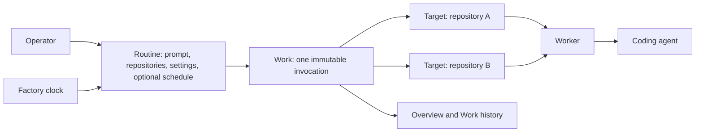

# Routines and Work

> **Status:** Accepted for implementation

## 1. Executive summary

Factory currently asks an operator to understand Definitions, Runbooks,
Automations, Runs, Jobs, and Tasks before they can run one prompt. The same
split appears in the database and API. The Overview then exposes this internal
model through an eight-card metrics grid and global Definition, repository,
and Worker filters.

This design reduces the product to two operating concepts. A **Routine** is a
saved prompt, its repository scope, execution settings, and an optional
schedule. **Work** is one immutable invocation of that Routine. Work contains
one Target for each snapshotted repository, but Target is shown as detail
inside Work rather than as another top-level product.

The browser navigation becomes Overview, Work, Routines, Workers, and
Repositories. Overview becomes a small status page for active Work, items that
need attention, recent outcomes, upcoming Routines, and Worker availability.
The main downside is a deliberate reduction in scope: provider-driven GitHub
issue, pull-request, and webhook triggers leave the first Routines model. They
can return later as another way to start the same Work, after manual and
scheduled Routines are stable.

## 2. Context and scope

The current [architecture](../../ARCHITECTURE.md) has reliable execution
machinery. It provides repository isolation, Worker capacity, leases, retries,
events, cancellation, and cleanup. That machinery stays.

The current authoring model is duplicated. A Definition stores one saved
prompt and execution settings. A Workflow, called a Runbook in the browser,
stores another saved prompt form. An Automation adds a trigger and repository
scope. A Run fans a Definition out to Jobs. A Job creates a Task, which owns
the actual Execution. These boundaries record implementation history rather
than user intent.

This design changes the product, HTTP API, browser routes, and SQLite schema.
It covers manual and scheduled execution across one or more managed
repositories. It also defines the data migration and the simplified Overview.
It does not change the agent process, worktree safety, Worker authentication,
or Attempt event contract except where an old Task or Job identifier must be
replaced by a Work Target identifier.

## 3. System context



The control plane owns Routines, schedule admission, Work and Target state,
repository selection, Worker assignment, and lifecycle history. A Worker owns
repository preparation, the isolated worktree, the agent process, and cleanup.
The coding agent owns the engineering actions it performs with its available
tools. A managed Repository remains infrastructure and never becomes a second
Routine or Work identity.

## 4. Proposed design

### How it works

An operator creates a Routine called `Weekly bug scan`. They enter one prompt,
select the coding-agent runtime, select three managed repositories, and keep
the default concurrency limit. They can save it with scheduling off, or add
one cron schedule and timezone.

Pressing **Run now** snapshots the Routine generation and its ordered
repository set into one Work record. Factory creates one Target per repository
and admits those Targets up to the Routine concurrency limit. Each Target is
assigned independently, runs in its own worktree, and reaches its own outcome.
The Work page shows aggregate progress and expands to repository-level state,
logs, results, retry, cancellation, and cleanup.

When the Routine becomes due, the scheduler creates the same Work and Targets
from the same snapshot path. Scheduled Target prompt resolution appends the
frozen occurrence time, cron, timezone, and scheduled-occurrence instruction,
preserving the current `ResolveDefinitionSchedulePrompt` behavior. Manual and
scheduled admission otherwise differ only in Work source and scheduled time.
Editing the Routine later increments its generation but never changes existing
Work. Migrated provider-driven history uses a third, read-only
`provider_history` source so Factory preserves provenance without restoring
provider admission.

Overview shows four small facts: active Work, Work needing attention, Work
completed in the last 24 hours, and Workers online. It then shows at most ten
recent Work records and five upcoming scheduled Routines. A recent Work row
shows Routine name, source, target progress, aggregate state, start time, and
duration. It does not show a repository filter or one row per repository.
Repository detail appears after opening the Work.

Active means at least one Target is nonterminal. Needs attention means active
Work has a Blocked Target, or Work reached Failed or Partial in the last 24
hours. Completed counts Work that became terminal in the same rolling window.
These are fixed operational definitions, not user-selectable reporting
cohorts.

### Components and responsibilities

The Routine service owns prompt configuration, repository scope, schedule,
generation control, validation, and archive state. It depends on the managed
Repository catalog. It does not assign Workers or start agent processes.

The admission service owns manual request idempotency and schedule due-time
idempotency. It creates one Work and all of its Targets in one transaction. It
does not resolve Target outcomes or retry agent side effects.

The Work service owns aggregate state, Target state, cancellation, per-Target
retry, history, and list queries. It depends on the existing execution and
Attempt machinery. It does not mutate the Routine snapshot after admission.

The scheduler owns due-time calculation and recovery after restart. It depends
on Routine schedule fields and the admission service. A Routine stores the
next cron occurrence separately from any pending occurrence and its retry
cursor, so retry backoff never replaces the scheduled instant used for
idempotency. The scheduler does not create a second Automation, Occurrence, or
Run lifecycle.

The Overview API owns one bounded operational projection. It depends on Work,
Routine, and Worker queries. It does not expose cohort analytics or accept
global Definition, repository, or Worker filters.

The Worker continues to own runtime discovery, repository preparation,
process supervision, event delivery, cancellation, and cleanup. It receives a
Work Target and a resolved prompt. It does not read Routine configuration.

### Decisions

#### Routine is the only authoring model

A Routine replaces Definition, Workflow, Runbook, and Automation. It stores
the prompt, repositories, execution defaults, and optional schedule together.
We reject a reusable prompt that must be wrapped in another resource before it
can run because that is the duplication causing the current UX.

#### Work is the only execution model

One manual or scheduled invocation is Work. Its repository children are Work
Targets. We reject Run, Job, and Task as parallel product and database names.
Execution and Attempt remain internal lifecycle records because they describe
retries and process history, not another user action.

#### One fixed repository scope

Run now and scheduled admission use the Routine's configured repository set.
Run now does not accept a temporary repository override or extra prompt text.
This keeps both paths identical and makes history reproducible. An operator
creates or edits a Routine when they want different behavior.

#### One optional schedule

A Routine has scheduling off or one cron expression with one IANA timezone.
We reject multiple triggers in the first model because they would require
independent health, due cursors, and controls. A second cadence can be a second
Routine with an explicit name.

#### No parameter schema in the first model

The prompt is the complete instruction. We reject Definition inputs and
per-invocation parameters in this change because they recreate an authoring
layer and make manual Work differ from scheduled Work. Full snapshots preserve
room to add typed variables later if repeated use cases justify them.

#### Overview is operational, not analytical

Overview answers what is active, what needs attention, what finished, what is
next, and whether Workers are available. We reject success-rate, throughput,
queue-time, cycle-time, cohort windows, formula disclosures, and three global
filters on this page. Detailed filtering and future analytics belong in Work
or a dedicated report.

#### Pre-launch schema replacement

The migration creates the final Routine and Work names and removes the old
authoring and execution tables after validation. We reject permanent aliases,
compatibility views, and dual writes because the product is pre-launch and the
stated goal is to avoid naming debt.

## 5. Invariants and requirements

### Invariants

- `INV-1`: A Work record contains an immutable Routine snapshot and source.
- `INV-2`: A Work Target belongs to exactly one Work and one snapshotted
  repository.
- `INV-3`: One Work contains at most one Target for a repository.
- `INV-4`: Manual and scheduled admission call the same transactional creation
  path.
- `INV-5`: One Routine generation and scheduled instant create at most one
  Work.
- `INV-6`: Editing or archiving a Routine never changes existing Work.
- `INV-7`: A Work is terminal only when every Target is terminal.
- `INV-8`: Retrying one Target does not replay successful sibling Targets.
- `INV-9`: Disabling a schedule stops future admission but does not cancel
  active Work.
- `INV-10`: Workers receive only the resolved Work Target snapshot, never
  mutable Routine state.
- `INV-11`: The database, API, UI, logs, and metrics use Routine, Work, Target,
  Worker, and Repository consistently.
- `INV-12`: No migrated Work loses its Attempt events, result, failure, or
  retained-worktree state.
- `INV-13`: A pending scheduled occurrence keeps its original due instant
  until admission succeeds, regardless of retry backoff or later cron due
  times.
- `INV-14`: Migrated provider-driven Work retains its provider kind and
  external occurrence identity but cannot be replayed as a live provider
  trigger.

### Requirements

- A Routine can be saved as a draft with zero repositories, but Run now and
  schedule enablement require at least one enabled managed Repository.
- Routine names are unique after case folding and whitespace normalization.
- A Routine edit uses an expected generation and returns a conflict on stale
  writes.
- Run now defaults to all configured repositories and has no repository picker.
- A Routine has one runtime, allowed tool set, timeout, and concurrency limit.
- Enabling a schedule validates the fully resolved scheduled prompt, including
  occurrence metadata, against the 64 KiB resolved-prompt limit. A manual-only
  Routine may use the full base-prompt limit.
- Work supports the existing table, list, and kanban views over the same API
  records. The selected view remains in the URL.
- A Work detail page shows aggregate progress before Target detail.
- A partial terminal outcome is visible as `Partial`, not `Succeeded` or
  `Failed` for the whole Work.
- Overview has no reporting-window control, formula disclosure, or global
  Definition, repository, or Worker filters.
- Routine, Work, Target, Worker, and Repository collection APIs remain bounded
  and cursor-paginated where history can grow.

## 6. Interfaces and data

The operator API becomes:

```text
GET    /api/v1/routines
POST   /api/v1/routines
GET    /api/v1/routines/{routine_id}
PUT    /api/v1/routines/{routine_id}
PUT    /api/v1/routines/{routine_id}/archived
POST   /api/v1/routines/{routine_id}/run
POST   /api/v1/routines/{routine_id}/discard-occurrence

GET    /api/v1/work
GET    /api/v1/work/{work_id}
POST   /api/v1/work/{work_id}/cancel
POST   /api/v1/work/{work_id}/targets/{target_id}/retry
POST   /api/v1/work/{work_id}/targets/{target_id}/cancel

GET    /api/v1/overview
```

`discard-occurrence` requires the exact pending UTC instant as
`pending_due_at`; that instant is its idempotency token.

Routine responses contain stable identity, name, prompt, runtime, allowed
tools, timeout, concurrency limit, generation, archive state, ordered
repositories, optional schedule, next due time, and timestamps. The list omits
the full prompt and includes repository count, last Work state, and next due
time. Migration-only history containers are excluded from Routine collection
responses and cannot be opened, edited, scheduled, copied, or run.

Work collection responses contain stable identity, Routine ID and name, source
`manual`, `schedule`, or read-only `provider_history`, optional scheduled time,
aggregate state, Target counts, admission time, update time, and terminal time.
They omit prompts, tool lists, repository identities, and provider snapshots.
Work detail adds the complete immutable Routine snapshot, optional historical
provider snapshot, ordered Target details, and Attempt summaries. New Work can
use only `manual` or `schedule`; `provider_history` is migration-only. The
Routine foreign key may be nullable only after a future hard-delete feature;
V1 archives Routines instead.

Target state is one of Blocked, Queued, Preparing, Running, Succeeded, Failed,
or Cancelled. Work state is derived with this ordered, mutually exclusive
precedence:

1. When no Target is nonterminal: Succeeded when all succeeded, Cancelled when
   all were cancelled, Failed when none succeeded and at least one failed, and
   Partial for every other terminal mix.
2. Otherwise, Running when any Target is Preparing or Running, or when any
   terminal and nonterminal Targets coexist.
3. Otherwise, Blocked when every nonterminal Target is Blocked.
4. Otherwise, Queued when at least one nonterminal Target is Queued.

A separate `needs_attention` field is true whenever active Work has a Blocked
Target. The discard-occurrence mutation requires a blocked pending occurrence
or a durably paused pending occurrence on a disabled Routine. It is idempotent
for the same frozen occurrence token, clears only its pending and retry fields,
records the discarded due instant for audit, and recalculates the first cron
instant strictly after the current time. A stale token conflicts so an operator
cannot discard a newer occurrence accidentally.

The final SQLite model uses these primary tables:

```text
routines
routine_repositories
work
work_targets
executions
attempts
attempt_events
workers
repositories
worker_repositories
```

`routines` stores schedule fields directly: `schedule_enabled`, `cron`,
`timezone`, `next_due_at`, `pending_due_at`, `schedule_retry_at`,
`schedule_retry_count`, `pending_snapshot_json`, `schedule_health_status`,
`schedule_health_code`, and `schedule_health_message`. `next_due_at` is the next
unclaimed cron occurrence; `pending_due_at` is the original occurrence
currently awaiting successful admission; `schedule_retry_at` is only its
backoff cursor. `pending_snapshot_json` freezes the prompt, repositories,
runtime, tools, timeout, concurrency, generation, and schedule identity used by
that occurrence, so later Routine edits and migrated retries cannot change it.
`routines.migration_only` identifies a fixed set of archived history containers
created only during conversion. They satisfy historical Work foreign keys but
are never authoring resources.
`routine_repositories` stores an explicit position and unique Routine and
Repository pair. `work` stores the Routine snapshot as validated JSON.
`work_targets` stores the repository ID and canonical identity snapshot,
resolved prompt, state, block reason, assigned Worker, timestamps, result, and
failure.

The migration performs these steps while writes are frozen. Every migrated
operator-authored Routine receives `<name> · definition N` or `<name> ·
schedule N`. The globally unique number is allocated deterministically by
source kind and legacy ID. The migration report records every renamed Routine,
so valid cross-model name collisions never block the frozen migration.

1. Back up the SQLite file and validate foreign keys.
2. Convert every Definition to a Routine. Fold its default input JSON into the
   prompt with the same `protocol.ResolveDefinitionPrompt` representation used
   by current admission. Before conversion, calculate the final UTF-8 byte
   length and block every Definition whose folded prompt exceeds the Routine
   64 KiB limit. Report its Definition ID, base prompt size, input size, and
   folded size so the operator can shorten it. A Definition with no known scope
   becomes a draft Routine with no repositories.
3. Merge a Definition-backed schedule into its Routine only when it is that
   Definition's sole schedule, the Routine does not already own a schedule, and
   its resolved prompt, repository scope, runtime, allowed tools, timeout, and
   concurrency all equal the migrated Routine. Every additional cadence and
   every schedule with different parameters or execution settings becomes a
   separately named Routine whose configuration contains those resolved
   values. Record every split in the migration report.
4. Convert each legacy schedule's unadmitted scheduled occurrence
   into the pending fields on its mapped Routine. Copy `scheduled_at` to
   `pending_due_at`, copy `retry_at` to `schedule_retry_at`, initialize
   `schedule_retry_count` to zero because the legacy schema did not store a
   count, and copy its frozen Definition, parameter, repository, runtime, tool,
   timeout, concurrency, and schedule identity into `pending_snapshot_json`.
   Derive `next_due_at` from the first cron instant after the pending
   occurrence. A failed occurrence with no `retry_at` becomes a blocked pending
   occurrence with its diagnostic intact; it remains visible and explicitly
   discardable rather than becoming an unreachable retry. If one legacy
   schedule has more than one unadmitted pending
   occurrence, or a frozen snapshot is incomplete, block migration and report
   every occurrence ID rather than dropping or relabelling it. Also block and
   report every unadmitted schedule `run_now` occurrence whose `scheduled_at`
   is null and `run_request_key` is set; it cannot be represented by scheduled
   pending fields and has no admitted Work to convert.
   A schedule trigger whose `definition_id` is null and whose Automation still
   points at a Workflow represents an unfinished prior product-model upgrade.
   Block migration and report its Automation and Workflow IDs. The operator
   must complete that existing upgrade before this migration can safely resolve
   and freeze its prompt. Never drop or silently disable that cadence.
5. Convert Runs to Work and Jobs plus linked Tasks to Work Targets. Copy the
   resolved prompt and all lifecycle links. Preserve `webhook` and other
   provider Run provenance as a `provider_history` source with its immutable
   provider kind and occurrence snapshot.
6. Convert every remaining reconstructable Task before dropping legacy tables.
   Create at most three deterministic, archived, migration-only history
   containers for workflow, direct-manual, and provider Task history. Point
   each converted Work at the matching container, but keep its exact prompt,
   repositories, runtime, tools, timeout, concurrency, legacy source identity,
   and provider occurrence solely in the immutable Work snapshot. Tasks linked
   through disabled provider occurrences use `provider_history`; other Tasks
   use manual Work. Copy every Execution, Attempt, event, result, failure, and
   retained-worktree link. Never create one Routine per historical Task.
7. Before creating Routines, preflight the post-split operator Routine count:
   one Routine for each Definition plus one for each schedule that cannot merge
   under step 3. Block migration and report the source and proposed split IDs
   when that exact count would exceed 500. Also block completion if any
   remaining Task cannot be reconstructed exactly,
   active legacy executions, enabled provider-driven Automations, unfinished
   Workflow-backed schedule triggers, deleted-Task occurrence tombstones,
   taskless provider occurrences, oversized folded prompts, ambiguous
   snapshots, orphan lifecycle rows, or foreign-key violations remain. A
   `task_deleted` occurrence has deliberately discarded its prompt and
   lifecycle rows, so it cannot become truthful Work. A provider occurrence
   that never admitted a Task or Run likewise has audit identity and diagnostics
   but no truthful Work lifecycle. Report every blocked occurrence, retained
   Task ID snapshot, external identity, and diagnostic instead of silently
   dropping or relabelling that audit identity.
8. Validate counts, identifiers, terminal outcomes, Attempt events, and
   retained-worktree links.
9. Drop Definition, Workflow, Automation, Occurrence, Run, Job, and Task
   tables, indexes, triggers, and mutation ledgers. Rename no legacy table into
   a compatibility alias.
10. Commit the migration and retain the backup path in the completion report.

Provider-driven Automation configuration is not silently converted into a
schedule. An enabled provider Automation blocks migration. A disabled one is
listed in the report with the Routine prompt and repository that can be
recreated manually. Its historical occurrence and Task executions still
migrate to read-only `provider_history` Work when their snapshots are complete.

The old `/definitions`, `/workflows`, `/automations`, `/runs`, `/jobs`, and
`/tasks` routes and API endpoints are removed in the same release. Because the
product is pre-launch, the server does not carry permanent redirect or payload
aliases. The release notes and migration preview are the compatibility
contract.

### Naming and identity

Routine, Work, and Target IDs are random stable IDs created by the control
plane. Routine names use a normalized unique key. A rename changes only the
current Routine generation; historical Work keeps the old name in its
snapshot.

Manual Work idempotency uses the caller request key. Scheduled Work uses a
deterministic key derived from Routine ID, Routine generation, and the original
`pending_due_at` UTC instant. Target identity is unique by Work ID and
Repository ID. A Repository rename or remote change after admission does not
rewrite the stored canonical identity snapshot.

## 7. Failure behavior and lifecycle

Creating Work is atomic. If any Target cannot be written, no Work or sibling
Target is visible. A lost response is recovered through the request key and
returns the original Work.

If a configured Repository is disabled or missing when admission starts, the
request fails before Work creation and names every invalid target. If a
Repository becomes unavailable after admission, its Target becomes Blocked
with a reason while siblings continue. Worker capacity also produces Blocked,
not failure or silent skipping.

The scheduler calculates `next_due_at` when a Routine is saved or enabled. When
that instant becomes due, one transaction moves it to `pending_due_at` and
advances `next_due_at` to the following cron occurrence. Admission always uses
the immutable `pending_due_at` in its deterministic key. Transient failures
such as a database busy error advance `schedule_retry_at` from one minute up to
fifteen minutes while `pending_due_at` remains unchanged. Permanent snapshot or
dependency failures, including a missing or disabled Repository, set schedule
health to Blocked and stop automatic retries. The Routines UI exposes the exact
failure and an explicit **Discard occurrence** action; discarding clears the
frozen pending fields only after operator confirmation.

Successful admission or explicit discard clears the pending and retry fields,
then recalculates `next_due_at` as the first cron instant strictly after the
current time. Factory therefore skips cron instants missed during downtime or
retry rather than admitting a backlog. After a process crash the scheduler
resumes pending retries first, then scans overdue Routines in bounded batches.

Editing a Routine while Work is active affects only later Work. Disabling its
schedule leaves active Work unchanged. If an occurrence is already pending,
disable or archive keeps its due instant and frozen snapshot as a durable paused
occurrence. Recovery never admits pending Work while the schedule is disabled
or the Routine is archived. Re-enabling resumes that exact occurrence before
calculating later cadence; the operator may instead use **Discard occurrence**
while it is paused. Archiving disables the schedule and blocks Run now, but
keeps history. Shutdown stops new admission, returns
unclaimed Targets to a claimable state, asks active Worker processes to stop,
and relies on existing leases for crash recovery.

Cancelling a Work requests cancellation for every nonterminal Target. A race
with completion preserves the first valid terminal outcome. Retrying creates a
new Attempt under the same Target and shows the existing warning that agent
side effects may repeat.

If migration validation fails, the transaction rolls back and the old database
remains untouched. Factory reports the exact blocking records and backup path.
It never starts with a partly converted schema.

## 8. Security, privacy, and operations

The trust boundary stays the same. Routine prompts and execution settings are
trusted operator input. Repository identities come only from the managed
catalog. A schedule cannot introduce an arbitrary clone URL. Browser mutations
keep the existing origin and JSON checks. Remote Worker routes keep TLS,
credential hashing, and resource ownership checks.

Routine prompts, resolved Target prompts, agent output, and events may contain
sensitive source or operator data. List APIs omit full prompts. Detail APIs are
available only on the operator listener. Logs must use IDs and sizes rather
than prompt bodies.

Existing limits remain unless renamed. Operator-authored Routines are capped at
500; the fixed migration-only history containers do not count toward that cap.
Repository scope is capped at 100 per Routine, prompt size at 64 KiB, timeout
at 8 hours, and concurrency at 1 to 100 with default 10. Overview returns at
most ten recent Work rows and five upcoming Routines. Scheduler recovery
handles at most 100 due Routines per transaction so startup cannot monopolize
SQLite.

## 9. Acceptance criteria

- `AC-1`: Primary navigation contains Overview, Work, Routines, Workers, and
  Repositories only.
- `AC-2`: An operator can create one Routine with a prompt and N repositories,
  then Run now without creating another resource.
- `AC-3`: Enabling a schedule on that Routine creates the same Work and Target
  shape as Run now.
- `AC-4`: Work table, list, and kanban views show the same records and open one
  Work detail page.
- `AC-5`: Work detail shows aggregate progress and independent state for every
  repository Target.
- `AC-6`: Retrying one failed Target does not replay a successful sibling.
- `AC-7`: Editing a Routine leaves an existing Work snapshot byte-for-byte
  unchanged.
- `AC-8`: Overview has four status facts with the specified fixed definitions,
  recent Work, upcoming Routines, and no global filters or formula panel.
- `AC-9`: The final database contains no Definition, Workflow, Automation,
  Occurrence, Run, Job, or Task tables, columns, indexes, triggers, or
  foreign-key names.
- `AC-10`: The public API and emitted operator text contain no Definition,
  Runbook, Automation, Run, Job, or Task resource names.
- `AC-11`: A migration either preserves all compatible history and completes
  atomically or leaves the original database unchanged with actionable
  blockers.
- `AC-12`: Linux, macOS arm64, macOS amd64, browser, migration, boundary,
  security, and release checks pass on the converted model.

## 10. Test approach

Store tests prove `INV-1` through `INV-9` with manual and scheduled admission,
Routine edits, duplicate requests, partial outcomes, cancellation, and
per-Target retry. Snapshot byte comparisons prove `AC-7`.

Migration fixtures cover an empty database, Definitions without scope and with
default inputs, schedules with parameter overrides, cross-model name
collisions, several schedules for one Definition, schedules with differing
concurrency, one pending schedule retry with a frozen snapshot, blocking
multiple pending retries, a blocking unadmitted schedule `run_now` request, and
zero-initialized migrated retry counts, single-repository schedules,
multi-repository schedules, completed and active Work, legacy Workflow Tasks,
more than 500 reconstructable direct-description Tasks, bounded migration-only
history containers, webhook Runs, provider-linked Tasks, disabled provider
Automations, blocking enabled provider Automations, retained worktrees, and
corrupt foreign keys. Schema inspection proves `AC-9`; count, provenance, and
lifecycle comparisons prove `INV-12`, `INV-13`, `INV-14`, and `AC-11`.

HTTP tests reject old routes and prove the Routine, Work, Target, and Overview
payloads. A vocabulary check scans the final schema, public Go types, JSON
fields, active operator documentation, browser copy, and generated assets for
the removed resource names. Historical migrations and superseded design
records are explicitly excluded. This proves `INV-11` and `AC-10`.

React tests cover Routine creation, schedule controls, Run now, all three Work
views, aggregate and Target detail, empty states, and the reduced Overview.
Playwright runs the same Routine manually and from a schedule across two
repositories and verifies independent Target outcomes. The existing Worker
race, process cleanup, release reproducibility, static analysis, vulnerability,
and platform jobs prove `AC-12`.

## 11. Risks and tradeoffs

- Removing provider triggers reduces capability. Keep the design boundary so a
  future provider trigger admits the same Work without restoring Automations.
- A Routine with one repository set cannot support one-off target changes.
  Favor explicit Routine edits or copies until repeated use proves overrides
  are worth the extra history semantics.
- Destructive schema cleanup has migration risk. Use a write freeze, backup,
  one transaction, blocking validation, and post-migration count checks.
- Removing parameters may duplicate a few Routines. This is preferable to
  keeping a second authoring system before parameter use cases are known.
- Aggregate Work state can hide a failed Target if the row is too quiet. Show
  target progress and make Partial and Needs attention visually distinct.

## 12. Open questions

- Should a future Routine support more than one schedule? This does not block
  implementation. Start with one schedule and duplicate the Routine for a
  second cadence.
- Which provider event should return first after schedules? This does not block
  implementation. Gather use cases before adding another trigger type.
- Should completed Work support hard deletion or retention policies? This does
  not block implementation. Keep current retention and archive behavior in the
  first migration.

## 13. Out of scope

- GitHub issue, pull-request, or webhook triggers.
- Multiple schedules or generic trigger plugins.
- Per-invocation prompt text, repository overrides, or typed parameters.
- Workflow graphs, dependencies, approvals, or chained Routines.
- Cost analytics, SLA reporting, and cohort metric dashboards.
- A new orchestration backend or changes to the Worker execution environment.
