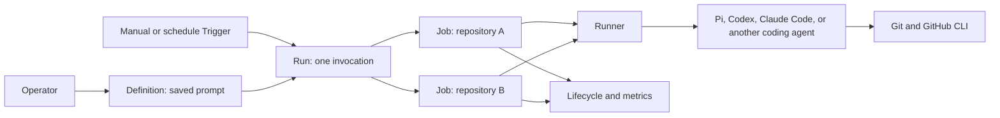

# Software Factory target architecture

> **Status:** Proposed revision

## 1. Executive summary

Factory is an orchestration system for software-engineering agents. A user
configures a Runner, adds Git repositories, saves a prompt as a Definition, and
runs that Definition against one or many repositories. Factory starts the
agents, tracks their lifecycle, and reports the outcome.

The current product has separate Workflow, revision, Automation, Occurrence,
Task, Execution, Attempt, and worker concepts. The target product has five
concepts: **Definition**, **Trigger**, **Run**, **Job**, and **Runner**.

V1 is local-first. It supports manual and scheduled Runs on local agent
Runners, repository fan-out, and operational metrics. Pi, Codex, and Claude
Code are initial runtime examples. Remote VM Runners are the next scaling step.
GitHub webhook Triggers follow later. Kubernetes is a possible future Runner
target, but it is not on the active roadmap.

The main tradeoff is trust. The agent uses the tools and credentials available
on its Runner, including authenticated `gh`. Factory does not intermediate
comments, branches, issues, or pull requests and cannot promise exactly-once
external side effects.

## 2. Context and scope

The current [architecture](../../ARCHITECTURE.md) already has useful execution
machinery: durable tasks, isolated worktrees, leases, events, cancellation,
cleanup, runtime supervision, and a repository catalog. It also already lets an
agent use authenticated `gh` from the Runner host.

The problem is the product model. A user who wants to run one prompt must
understand Workflows, revisions, Tasks, and workers. Scheduled work adds
Automations and Occurrences. Running the same prompt across five repositories
is not one visible operation.

This revision keeps the reliable execution machinery and simplifies the
operator experience. It covers the V1 journey and the boundaries later Runner
and Trigger types must preserve. It does not design a generic automation
platform or a deterministic GitHub action gateway.

## 3. System context

Factory owns Definitions, Triggers, Runs, Jobs, Runner coordination, repository
targets, lifecycle events, results, and metrics. The Runner owns the execution
environment, worktree, agent process, and available tools. The agent owns the
engineering work it performs with those tools. GitHub remains the source of
issues, pull requests, reviews, and repository state.

## 4. Proposed design

### V1 user journey

#### Configure a local Runner

As an operator, I want to connect a local agent Runner so Factory can run Pi,
Codex, Claude Code, or another supported coding agent on my machine.

One local launcher command starts the control plane and a local Runner process.
On first start, the Runner creates a durable random identity at
`~/.factory/runner/id`, then registers with the control plane. Restarting the
launcher reuses that identity.

The Runner performs bounded, non-interactive health checks for Git,
authenticated `gh`, and installed agent runtimes such as Pi, Codex, and Claude
Code. The setup screen shows each capability as ready, missing,
unauthenticated, or unhealthy. One host may advertise several runtimes. A
Definition selects the runtime and required tools; each Job still launches one
isolated agent process. V1 configuration does not install or authenticate
third-party CLIs for the user.

#### Configure repositories

As an operator, I want to add the GitHub repositories my team works on so I can
choose where a Definition runs.

Factory stores canonical repository identities and enabled state. Runners
acquire a configured repository on demand and never clone a URL supplied by a
prompt or webhook payload.

#### Save a shared Definition

As an operator, I want to save a prompt such as `Find bugs`, `Triage issues`, or
`Review pull request` so everyone using the same trusted Factory instance runs
the same instructions.

A Definition stores a name, prompt, required runtime, timeout, and execution
defaults. Definitions edit in place. Each Run stores the complete Definition
snapshot it used, so historical Runs remain understandable without exposing a
revision library.

#### Run once on one repository

As an operator, I want to select a Definition and repository and press **Run
once** so an agent completes the work end to end.

Factory creates one Run containing one Job. The Job moves through pending,
blocked, queued, preparing, running, and then succeeded, failed, cancelled, or
skipped. Attempt history, events, and cleanup remain implementation details
shown inside the Job when useful.

#### Run once across repositories

As an operator, I want to select five repositories and press **Run once** so the
same Definition runs independently against all five.

Factory freezes the complete target list and creates one Job per repository.
Jobs can run concurrently, fail independently, and be retried individually.
The Run shows aggregate progress without hiding per-repository outcomes.

#### Track the software factory

As an operator, I want a dashboard showing what is running, what failed, and
how long work takes so I can understand the factory rather than inspect process
logs.

V1 reports queued and running Jobs, success and failure counts, queue time,
cycle time, throughput, and Runner health. Metrics can be filtered by
Definition, repository, Runner, and time window.

Queue time runs from `admitted_at` to `started_at`. Cycle time runs from
`admitted_at` to `terminal_at`. Throughput is the number of Jobs with a
`terminal_at` in a time window. Success rate is succeeded Jobs divided by
succeeded plus failed Jobs; cancelled and skipped Jobs are excluded.

#### Run on a schedule

As an operator, I want to schedule a Definition across selected repositories so
routine engineering work runs without manual action.

A schedule is a Trigger attached to a Definition. At each due instant it creates
the same Run and Jobs as **Run once**. For example, a Monday `Find bugs`
Definition can inspect five repositories. The agents may use `gh` to create
issues or pull requests as instructed.

### Later user journeys

An operator can add a Runner on a remote VM without changing a Definition. This
is the first scaling path beyond the local machine. A later GitHub webhook
Trigger creates a Run when an issue or pull request event arrives,
such as running a shared `Review pull request` Definition when a pull request is
opened.

Kubernetes and other execution targets may be added through the same Runner
contract later. They are not active roadmap milestones.

These paths must create the same Run and Job records. They are not different
automation products.

### Agent-owned GitHub work

The agent reads and changes GitHub through `gh`, just as it does when run
directly by a developer. Factory does not define typed comment, branch, issue,
or pull-request actions. It does not publish patches or reconcile provider
side effects.

For a trusted local or VM Runner, the agent uses the Runner user's authenticated
`gh`. A later managed Runner profile may inject a short-lived,
repository-scoped `GH_TOKEN` for the Job. The token disappears when the agent
process ends.

Factory supplies stable `FACTORY_RUN_ID` and `FACTORY_JOB_ID` environment
values. Definitions can use those values in branch names, comments, or other
markers when retry-safe behavior matters. The Job result may report issue or
pull-request URLs, but Factory treats them as agent output rather than provider
state it owns.

### Component boundaries

The control plane owns saved configuration, admission, target snapshots,
scheduling, leases, results, and metrics. It never runs an agent process and
does not interpret prompt output as commands.

The Runner owns runtime discovery, repository preparation, process supervision,
events, cancellation, and cleanup. It does not decide which repositories a Run
targets.

The agent runtime owns model interaction and engineering tool use. Factory does
not reproduce tools already available to Pi, Codex, Claude Code, or another
configured coding agent.

The browser and future CLI use the same API. The primary navigation is
Overview, Definitions, Runs, Repositories, and Runners. A Job is viewed inside
its Run. Triggers are configured on a Definition.

### Decisions

#### Five product concepts

Definition, Trigger, Run, Job, and Runner are sufficient. Attempt remains Job
history, Repository remains configured infrastructure, and GitHub connection
details remain settings. We reject separate Runbook, Workflow revision,
Automation, Occurrence, and Provider Action product resources.

#### One Job per repository

A Run may fan out, but each Job owns one repository and optional work item.
This keeps worktrees, retries, credentials, cost, and results independent.

#### One execution path

Manual, API, schedule, and later webhook admission create the same Run and Job
records. A Trigger decides when to admit work. It does not execute an agent.

#### Agents use their tools

The Runner gives the agent a prepared repository and its configured tools.
Factory does not become a GitHub client on behalf of the agent. This preserves
the capability of the underlying agent and avoids a second action language.

## 5. Invariants and requirements

### Invariants

1. Every invocation creates one Run and at least one Job.
2. A Run freezes one Definition and one complete target set.
3. Every Job belongs to one Run and one repository.
4. Editing a Definition or Trigger never changes an existing Run.
5. Replaying one admission identity creates no duplicate Run or Job.
6. One active Attempt lease owns one agent process.
7. Runner loss cannot erase Job history or a retained recovery artifact.
8. One large Run cannot prevent an unrelated compatible Run from progressing.
9. Factory never claims exactly-once external effects performed by an agent.

### Requirements

- A manual Run can target one or up to 500 configured repositories.
- Invalid, duplicate, disabled, empty, or oversized target sets create no Run.
- A Run defaults to at most 20 active Jobs with fair admission across Runs.
- A Job can be cancelled or retried without replaying successful siblings.
- A failure before the agent process starts may retry under a bounded
  infrastructure policy. Any failure after process start requires an explicit
  warned retry.
- Retrying any Job after its agent started warns that external effects may
  already have happened.
- A Job waiting for a compatible Runner stays visible as blocked.
- Dashboard aggregates never hide the underlying Jobs.

## 6. Interfaces and data

| Resource | Owns |
|---|---|
| Definition | name, prompt, runtime and tool requirements, timeout, defaults, generation |
| Trigger | Definition, kind, enabled state, schedule or later event rule, target repositories, context, timeout override |
| Run | source identity, Definition snapshot, parameters, frozen target set, aggregate state |
| Job | Run, repository, ref or work item, Runner requirement, state, timestamps, result, metrics |
| Runner | stable identity, runtime and tool capabilities, capacity, health |

Attempt records remain behind Job and store leases, process identity, events,
timestamps, outcomes, and recovery state.

The control plane owns Job state. A Runner reports preparation, process start,
events, and completion under its Attempt lease; the control plane validates the
lease before applying a transition.

- `pending`: admitted but held by the Run concurrency limit.
- `blocked`: no healthy Runner satisfies the runtime, tools, or repository.
- `queued`: eligible for a compatible Runner to claim.
- `preparing`: claimed while the Runner prepares the repository and process.
- `running`: the agent process has started.
- `succeeded`, `failed`, `cancelled`, and `skipped`: terminal outcomes.

The Run state is derived from its Jobs. It is `running` while any Job is
preparing or running, `blocked` when all remaining Jobs are blocked, `queued`
when work remains but none is active, and `cancelling` after cancellation is
requested while work remains. Once every Job is terminal, the Run is `failed`
if any Job failed, `cancelled` if none failed and any Job was cancelled, and
otherwise `succeeded`. Per-state Job counts remain visible for mixed outcomes.

Every Job stores `admitted_at`, optional `started_at`, and `terminal_at` when it
finishes. A Runner is online when its last valid registration is no more than 30
seconds old. It is degraded when online but none of its enabled runtimes is
healthy, and offline after 30 seconds without registration.

IDs are random UUIDs. A Runner ID persists on its host. A manual or API Run uses
a caller request key. A scheduled Run uses `(Trigger ID, scheduled UTC instant)`.
A later webhook Run uses `(Trigger ID, delivery ID)`.

Existing Workflow current content maps to Definition prompt. A Workflow revision
maps to the snapshot already stored on historical work. Automation schedule
configuration maps to a Trigger. The Task execution contract informs the new Job
contract, and worker maps to Runner.

Historical Tasks, Executions, Attempts, events, and linked Occurrences remain in
a clearly labelled read-only **Legacy history** view. Their existing URLs and
identities remain valid. Factory does not create synthetic Runs for them or
project them as Jobs because they never belonged to a Run.

## 7. Failure behavior and lifecycle

Run admission stores the Definition snapshot, complete target set, and Jobs in
one transaction. A selector failure stores nothing.

If no compatible Runner is online, the Job remains blocked with a reason. If a
Runner disappears before its agent process starts, its lease expires and the
Job may follow its bounded infrastructure retry policy. Loss after process
start fails the Attempt and requires an explicit warned retry because the agent
may already have changed GitHub. Cancelling a Run cancels undispatched Jobs and
requests cancellation of active agents without rewriting terminal outcomes.

An agent may complete a GitHub write and then crash before reporting success.
Factory records the Job failure and retained events but does not repeat or undo
the write. A manual retry displays the duplicate-effect warning and gives the
new agent the stable Run and Job identities.

Migration starts with a preview of every Workflow and Automation. Factory stops
new legacy Automation evaluation and lets already admitted Tasks and Executions
finish or be cancelled. It then imports current Workflow content as Definitions.

Schedule Automations migrate losslessly. Their repository, context, timeout,
enabled state, schedule, and next due instant become Definition or Trigger
fields as appropriate. Current GitHub issue and pull-request polling Automations
have no V1 equivalent. The preview marks them unsupported, keeps their history
readable, and requires explicit operator confirmation before retiring them. It
recommends either a scheduled Definition whose agent queries GitHub with `gh`,
or the later webhook Trigger.

After every supported item imports or receives an explicit retirement decision,
Factory writes a cutover marker and enables new admission. No in-flight work is
translated between execution models. After cutover, completed standalone Tasks
and Occurrence-linked Tasks remain available only through Legacy history.

## 8. Security, privacy, and operations

V1 keeps the current trusted-host boundary. The operator API remains loopback
only. A local agent has the operating-system user's filesystem, network, Git,
and `gh` permissions. Factory must state this clearly and must not present a
prompt as a security boundary.

“Shared Definition” in V1 means shared by people using the same trusted local
Factory instance. V1 has no user identity, remote browser access, or per-user
authorization. Authenticated team access requires a later design.

Remote VM Runners use a separate TLS listener containing only enrollment and
the Runner lifecycle. A ten-minute, one-time token bound to the stable Runner
identity creates a per-Runner credential. Agent and provider credentials remain
host-managed trusted inputs. Future Runner targets must preserve these
boundaries.

A later public webhook listener exposes only signed, bounded delivery routes.
Webhook payloads and repository content are untrusted agent context and cannot
choose clone URLs, Runner credentials, or Definition instructions.

Each Runner advertises hard capacity. Runs have target, concurrency, timeout,
event, output, and retained-work limits. Reaching a limit produces a visible
blocked or failed Job rather than silently dropping work.

## 9. Acceptance criteria

- A new user can configure a local Pi, Codex, or Claude Code Runner and run a
  prompt against one repository.
- One launcher command starts the local instance, reuses its Runner identity,
  and reports Git, `gh`, and each configured agent runtime separately.
- A team can save and reuse one Definition without selecting revisions.
- One manual Run can execute the same Definition against five repositories and
  show independent Job outcomes.
- The dashboard reports failures, success rate, queue time, cycle time,
  throughput, active Jobs, and Runner health.
- A schedule creates the same Run and Jobs as manual **Run once**.
- An agent can use authenticated `gh` to comment, create an issue, push a branch,
  or open a pull request without Factory publishing the action.
- Retrying a Job after its agent started shows the duplicate-effect warning.
- Current Workflow, Automation, Task, Execution, Attempt, and Occurrence history
  remains readable after cutover.
- Standalone and Occurrence-linked Tasks keep their existing URLs and appear in
  Legacy history without synthetic Runs or Jobs.
- Migration preserves every schedule Automation field and requires an explicit
  retirement decision for each unsupported GitHub polling Automation.
- Definitions run unchanged on local and remote VM Runners and when webhook
  support is added later.

## 10. Test approach

Store and API tests prove Definition snapshots, atomic target creation,
idempotent admission, aggregate state, cancellation, retry, and bounded
pagination. State tests prove every Job transition, derived Run state, timestamp,
metric denominator, and 30-second Runner health boundary. Scheduler tests prove
capacity, blocked routing, per-Run concurrency, and fair progress.

Runner integration tests use fake Pi, Codex, Claude Code, and `gh` executables
to prove first-run identity creation, restart reuse, discovery, authentication
health, process cleanup, result capture, and stable Factory environment IDs. No
test uses live provider credentials.

Browser tests cover the complete V1 journey: configure a Runner, add
repositories, save a Definition, run one repository, run five repositories,
inspect mixed outcomes and metrics, retry one Job, and create a schedule.

Migration tests prove legacy admission stops before cutover, active work drains,
every schedule field imports once, unsupported GitHub polling Automations require
an explicit decision, history remains readable, and new admission starts only
after the cutover marker. Browser tests cover both a standalone historical Task
and an Occurrence-linked Task through their preserved URLs and Legacy history.

## 11. Risks and tradeoffs

- Agent-owned GitHub writes can be duplicated after a crash or retry. Stable
  identifiers, explicit Definition instructions, and a retry warning make the
  risk visible without building a second execution engine.
- A 500-repository Run can consume the fleet. Per-Run concurrency and fair
  scheduling bound its effect.
- Shared host credentials are broad. V1 labels local Runners as trusted, while
  later managed Runners use narrower temporary credentials.
- The compatibility window exposes old and new names. Keep it short and make
  all new creation use the target model.

## 12. Open questions

No question blocks V1. Remote credentials and public webhook deployment require
focused designs before those later milestones start. Any future Runner target,
including Kubernetes, requires its own accepted design before implementation.

## 13. Out of scope

- Deterministic GitHub action publishing or exactly-once external side effects.
- General business automation and non-engineering providers.
- Human project management, chat, inboxes, personas, or squads.
- DAGs, workflow chaining, visual pipelines, or synthesis Jobs.
- One agent process changing several repositories atomically.
- Remote operator access, automatic merge, approval, deployment, or release.
