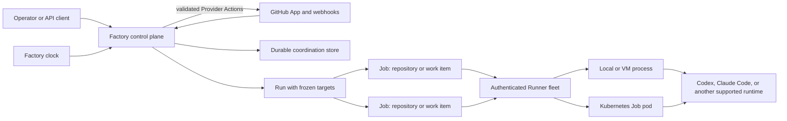

# Software Factory target architecture

> **Status:** Proposed for review

## 1. Executive summary

Factory currently runs reliable single-repository agent tasks, but its saved
instructions, Automations, Occurrences, Tasks, Executions, and one-runtime
workers expose more concepts than the product needs while still preventing one
Run from targeting a repository fleet. The target architecture makes the agent
Job the centre of the system.

A Job Definition stores one reusable software-engineering procedure. A manual,
scheduled, GitHub, or API invocation creates one durable Run that freezes the
definition and target set. Each target becomes one independent Job, and each
execution try remains an Attempt. Authenticated Runners provide local, VM, or
Kubernetes capacity and advertise the runtimes they can execute.

The main downside is migration. Existing Workflow, Automation, Occurrence,
Task, Execution, and worker data must remain understandable while new writes
move to the smaller model.

## 2. Context and scope

The current [architecture](../../ARCHITECTURE.md) is local-first. One Task
freezes one repository and worker, one Execution owns its queue state, and one
worker process owns one runtime. Versioned Workflows supply reusable Markdown
instructions. Typed Automations bind one Workflow to one repository and one
issue, pull-request, or schedule Trigger. One durable Occurrence creates at
most one Task.

Those boundaries proved durable task and attempt execution, typed provider
admission, prompt snapshots, and crash-safe deduplication. They do not match the
product direction in the [vision](vision.md): fleet-wide Runs are central,
triggers are only ways to admit the same work, and local, VM, and Kubernetes
capacity must be interchangeable.

This design defines the target product model, component boundaries, data
ownership, migration direction, failure behavior, and security requirements.
It does not prescribe a single large rewrite. Existing attempt, lease,
worktree, event, and cleanup contracts remain useful and should be reused.

## 3. System context

GitHub owns repository, issue, pull-request, review, and installation state.
Factory owns provider app and installation connection records, definitions,
triggers, provider delivery admission, Runs, Jobs, Attempts, Provider Actions,
routing, snapshots, and results. Runners own execution isolation, repository
materialization, process supervision, and local recovery. Agent runtimes own
their model interaction and native output.

## 4. Proposed design

### How it works

An operator creates a Job Definition named `Review pull request`. It contains
trusted review instructions, a required agent runtime family, a timeout,
attempt policy, structured result expectation, and permission to read code and
post a pull-request review comment. The definition has a GitHub pull-request
webhook Trigger filtered to opened and synchronized events.

GitHub sends a delivery. Factory verifies the signature, bounds the body, and
stores it under its delivery ID. Before acknowledging the request, receipt
admission freezes every matching Trigger and its complete behavior-bearing
Definition snapshot in the same transaction. The delivery processor creates
one Run from that frozen match, with bounded event context, repository,
pull-request identity, and head commit. A later edit, disable, or archive does
not change or suppress accepted work. The target set contains one item, so
Factory creates one Job.

The scheduler selects a healthy Runner that advertises the required runtime,
source access, labels, and free capacity. The Runner prepares the repository
and exact ref, creates an isolated worktree or pod workspace, and launches an
Attempt. The Attempt streams events and renews its lease. On completion,
Factory stores the result and any schema-valid proposed actions. The control
plane validates each proposal against the frozen policy and writes a durable
Provider Action before a trusted adapter publishes it. The agent process never
receives provider write credentials in this strongly enforced path.

A scheduled codebase review follows the same path. Its Trigger resolves a
bounded repository selector into a frozen list. One Run creates one Job per
repository. Jobs progress independently under a per-Run concurrency cap and
fair scheduling across unrelated Runs.

### Components and responsibilities

#### Control plane

The control plane owns Provider Apps, Provider Connections, Job Definitions,
Triggers, provider delivery admission, target resolution, Run and Job creation,
routing, leases, results, action policy, the Provider Action outbox, and
aggregate state. It depends on the durable store, provider adapters, and Runner
protocol. It does not run agent processes or hold Kubernetes administrator
credentials.

#### Provider adapters

A provider adapter verifies and stores external deliveries, normalizes
repository and work-item identity, resolves provider-backed selectors, brokers
read-only materialization credentials, and publishes durable allowed actions.
The first adapter is a GitHub App. It does not compose agent instructions or
interpret free-form agent output as authority.

Polling remains available as a scheduled query for bulk selection, backfill,
and reconciliation. It is not a separate Automation type.

#### Runner

A Runner is a stable authenticated execution environment. A local or VM Runner
detects installed and authenticated runtime CLIs and supervises local child
executors. A Kubernetes Runner advertises configured image profiles and creates
bounded Job pods. A Runner owns capacity, repository materialization, Attempt
supervision, and local cleanup. It does not choose business targets or provider
actions.

#### Agent runtime

An agent runtime executes the frozen prompt and input in the prepared
repository workspace. It emits bounded events, a result, and optional
schema-valid action proposals through the Runner. It does not receive
control-plane, Kubernetes, or provider write credentials in the strongly
enforced path.

#### Browser and CLI

The operator surfaces centre on Definitions, Runs, Jobs, Runners,
Repositories, and Overview. Triggers are edited on a Definition. Attempts are
shown inside a Job. The browser and future CLI use the same API and never open
the database directly.

### Decisions

#### One definition, several admission paths

A Job Definition is the only saved unit of agent instructions. It may have
zero or more Triggers and can always be invoked manually or through the API.
We reject separate Runbook and Automation product resources because they make
operators coordinate two lifecycles for one procedure.

#### Runs snapshot definitions instead of exposing revision history

Definitions edit in place with an optimistic concurrency generation. Every Run
stores the complete definition snapshot it used. Historical Runs therefore
remain reproducible without a user-managed immutable revision library. We
reject revision selection and a separate revision screen until governed SOP
publishing is a demonstrated requirement.

#### One Job owns one repository target

A Run may contain hundreds of Jobs, but one Job operates on one repository and
optional issue, pull request, commit, or ref. This keeps worktrees, credentials,
retries, cost, and outcomes isolated. Cross-repository atomic agent sessions
remain out of scope.

#### Triggers admit Runs

Manual, API, schedule, GitHub webhook, and scheduled GitHub query paths all
create the same Run record. The Run owns idempotency and target snapshots, so a
separate Occurrence resource is unnecessary. A Definition can have multiple
Triggers because several events may invoke the same procedure.

#### Runner and runtime are separate

A Runner represents compute and may advertise several runtime capabilities.
The scheduler chooses a Runner per Job. One runtime process still belongs to
one Attempt. This preserves process isolation without modelling one host with
several CLIs as several unrelated machines.

#### External writes are capabilities

A Definition declares its allowed provider and repository actions. Read and
report is the default. Provider comments, labels, issues, branches, and pull
requests require explicit capabilities. The agent proposes a typed action; the
control plane validates the target and payload, stores it in an outbox, and the
trusted provider adapter performs it with a short-lived write token. Branch
publication uses a retained patch or Git bundle rather than giving the agent a
write token. Merge, approval, and unbounded child Job creation are excluded
initially. Prompt text is not treated as a security boundary.

#### GitHub App is the remote provider identity

Remote and webhook deployments use a GitHub App for installation-scoped
repository access, webhook verification, and short-lived tokens. The current
authenticated `gh` path remains a local compatibility mode during migration.
It must be labelled as host-trusted because its broad credentials cannot
strongly enforce per-Job action policy.

#### Public ingress is separated from operator access

The first remote deployment keeps the browser and operator API on loopback or a
private Unix socket. A dedicated public webhook listener exposes only provider
delivery routes, and a separate TLS Runner listener exposes only authenticated
Runner routes. API invocation therefore remains private. Remote browser or
operator API access is out of scope until session or client identity,
authorization, CSRF protection, credential rotation, and audit behavior have a
separate accepted design. A reverse proxy may terminate webhook TLS, but it
cannot expose operator routes through the webhook listener.

## 5. Invariants and requirements

### Invariants

1. Every admitted invocation creates exactly one Run.
2. A Run freezes one complete Definition and one complete target set.
3. Every Job belongs to one Run and one repository.
4. Replaying the same trigger identity cannot create another Run or Job.
5. Editing or disabling a Definition or Trigger never changes an admitted Run.
6. One Attempt lease owns one active agent process.
7. A provider adapter never performs an action outside the Job's frozen action
   policy.
8. Provider payloads and repository contents remain untrusted agent context.
9. Runner loss cannot erase the Run, Job, Attempt history, or a retained
   recovery artifact.
10. One large Run cannot prevent an unrelated Run from making progress while
    compatible fleet capacity exists.
11. An agent process in the strongly enforced provider path never receives a
    provider write credential.
12. Every provider write is represented by one durable Provider Action before
    publication begins.

### Requirements

- A manual Run can target one explicit item or up to 500 explicit repositories
  or work items.
- Target creation is atomic. An invalid, duplicate, disabled, empty, or
  oversized target set creates no Run.
- A Run defaults to at most 20 active Jobs and uses round-robin admission across
  Runs with queued compatible work.
- Each Job defaults to one Attempt and may configure at most three automatic
  Attempts for infrastructure failures. Agent-reported failure is not retried
  automatically by default.
- The Run aggregate reports pending, blocked, queued, running, publishing,
  cancelling, succeeded, failed, cancelled, and skipped counts without hiding
  individual outcomes.
- Cancelling a Run cancels undispatched Jobs, requests cancellation of active
  Attempts, admits no new Provider Action proposals, and does not rewrite
  terminal Jobs. An action proven unsent is cancelled. An action whose send has
  begun is reconciled to `succeeded` or `uncertain` before the Job becomes
  terminal, even if the provider write completes after cancellation.
- Retrying publication reuses the original Provider Action and stable marker.
  Rerunning an agent creates a new Attempt and new Actions, preserves all prior
  history, and never replays its successful siblings. After any earlier Action
  was sent or became uncertain, rerun requires explicit operator confirmation
  that the same external effect may be produced again.
- Webhook requests are bounded to 1 MiB and acknowledged only after a verified
  delivery receipt and its frozen Trigger and Definition matches are durable.
- A Job waiting for compatible capacity stays visible and diagnosable rather
  than failing because a Runner is temporarily offline.
- A Job with required external writes enters `publishing` after its Attempt
  succeeds and becomes `succeeded` only after every Provider Action succeeds.
- An ambiguous provider response is reconciled by its stable action marker. If
  reconciliation cannot prove the outcome, the action becomes `uncertain` and
  is not retried blindly.

## 6. Interfaces and data

### Core resources

| Resource | Owns |
|---|---|
| Provider App | provider App identity, public route identity, private-key references, webhook-secret references and generations |
| Provider Connection | App identity, installation identity, enabled state, repository and permission grants |
| Job Definition | title, instructions, runtime requirement, defaults, result contract, action policy, generation |
| Trigger | Definition identity, kind, enabled state, event or schedule rule, target selector, parameter mapping |
| Provider Delivery | App and Connection identity, delivery key, verified payload, frozen Trigger and Definition matches, processing state, diagnostics |
| Run | source, idempotency key, Definition snapshot, parameters, trigger payload, target snapshot, aggregate state |
| Job | Run identity, repository, ref, optional work item, prompt and permission snapshot, result state |
| Attempt | Job identity, lease, Runner, runtime, timestamps, events, outcome, recovery state |
| Provider Action | Job identity, kind, target, validated payload, capability decision, stable marker, attempts, outcome |
| Runner | stable identity, credential, labels, runtime capabilities, source access, capacity, health |

The Definition snapshot is a bounded JSON object stored on the Run. It includes
all behavior-bearing fields. Display-only metadata may stay by reference.
Every Job stores its own resolved prompt, repository and work-item identity,
ref, action policy, and parameter snapshot so it remains understandable if the
Run or Definition is later archived.

### Trigger kinds

- `schedule` resolves a saved repository or work-item selector at each due
  instant.
- `github_webhook` maps a verified event to one or more explicit targets.
- `github_query` runs a bounded GitHub search on a schedule for bulk triage and
  reconciliation.

Manual and API invocation are Run sources rather than stored Trigger kinds.
An API caller supplies an idempotency key and explicit targets or a saved
selector.

### Naming and identity

Provider App, Provider Connection, Definition, Trigger, Run, Job, Attempt,
Provider Action, Runner, and Provider Delivery IDs are random UUIDs. A Runner
ID is persisted on its host or in a Kubernetes Secret and is independent of
hostname or pod UID.

Webhook delivery identity is `(Provider App, delivery ID)`. The public route
selects one App, so Factory can verify the raw body before parsing it. The
verified installation ID must then map to exactly one enabled Connection. At
receipt, Factory stores the App, Connection, raw verified body, and one frozen
match per eligible Trigger in one transaction. Each match contains the Trigger
ID and generation plus every behavior-bearing Trigger and Definition field
needed to resolve targets, parameters, runtime requirements, attempt policy,
and action permissions. Display-only metadata may remain by reference. A
matched Run uses `(trigger ID, provider delivery ID)` as its unique admission
key. A scheduled Run uses `(trigger ID, scheduled UTC instant)`. An API or
manual Run uses `(caller scope, request key)`.

A Job target identity is `(Run ID, repository ID, work-item kind, work-item
identity, ref)`. The exact target list is stored at admission and never follows
later selector membership.

A Provider Action has a stable marker derived from its immutable Action ID. The
adapter uses that marker in a comment, branch, issue, or pull-request artifact
and checks for it before retrying an ambiguous request. Retrying publication
reuses the same Action. Rerunning a Job creates a new Attempt and new Action IDs
while retaining earlier history. If any earlier Action was sent or is
uncertain, the operator API and UI distinguish `retry publication` from
`rerun agent`; the latter requires confirmation that it may repeat an external
effect. Provider operations that cannot be reconciled safely stop as
`uncertain` for operator resolution.

### Current-model mapping

| Current model | Target model |
|---|---|
| Workflow current instructions | Job Definition instructions |
| Workflow revision | Run Definition snapshot |
| Automation | Trigger plus invocation defaults attached to a Definition |
| Occurrence | Run admission identity and source snapshot |
| Task | Job |
| Execution | Internal queue compatibility state, later folded behind Job |
| Attempt | Attempt |
| Worker | Runner capability or compatibility executor |

Migration is additive first. Existing Workflows become Definitions. Existing
Automations become named Triggers attached to those Definitions, preserving
repository selectors, context parameters, timeout overrides, enabled state,
and due cursors. Existing Tasks, Executions, and Attempts remain historical
truth.

Cutover first stops old Automation evaluation. Only an Occurrence in `pending`
state without a linked Task is transactionally translated into one staged
single-target Run and Job using the Occurrence ID as the source idempotency key,
then linked to the new Run ID. `failed` and `task_deleted` Occurrences remain
terminal legacy history and are never translated or dispatched. The scheduler
cannot dispatch staged Jobs. An Occurrence with a Task and every queued or
active legacy Execution stays on the compatibility scheduler until terminal.
New target-model admission is enabled only after every eligible pending
Occurrence has translated or reached a visible terminal configuration error.
One cutover transaction writes the forward-only marker that makes staged Jobs
dispatchable and enables new admission. Before that transaction, rollback
deletes only staged records and restores their Occurrence links. Old and new
admission can therefore never both own the same source event.

Old mutation APIs then become read-only for one compatibility window and are
removed before a stable v1 contract. Compatibility views keep every legacy
record readable through the new vocabulary where the identity is unambiguous.

## 7. Failure behavior and lifecycle

A new Run is accepted only when its Definition snapshot, source identity, and
complete target set can be stored in one transaction. A selector failure stores
no partial Run. A provider delivery is different: its verified receipt and
frozen Trigger and Definition matches are stored first and acknowledged, then
processing retries with exponential backoff up to 30 minutes until every
frozen match has either admitted its Run or recorded a terminal configuration
error. Editing, disabling, or archiving a Trigger or Definition after receipt
does not change or suppress that delivery. Disabling it before receipt prevents
a match.

A Job remains queued or blocked when no compatible Runner is online. Runner
loss expires the active Attempt lease. Automatic retry occurs only when the
frozen policy permits it and the failure is classified as infrastructure. If
retry is exhausted, the Job fails and remains individually retryable.

Disabling a Trigger stops new admissions. Disabling or archiving a Definition
stops every attached Trigger and new manual Runs. Existing Runs and Jobs
continue. Deleting a Definition is archival while any Run references it.

A local or VM Runner drains on shutdown, stops claiming, and terminates active
process groups within the Attempt lease bound. A Kubernetes Runner stops
creating pods, observes existing pod completion, and leaves uncertain
workspaces or artifacts retained according to policy.

A successful Attempt with proposed external writes moves its Job to
`publishing`. Provider Actions retry bounded transport and rate-limit failures.
Before retrying an ambiguous response, the adapter queries for the stable
marker. It records `uncertain` and stops if the provider cannot prove whether
the action happened. The Job then fails with a publication-specific result and
keeps the agent result available for inspection.

Cancellation during publication stops Actions that the adapter can prove were
not sent and prevents new proposals. An Action whose send began still runs its
normal reconciliation to `succeeded` or `uncertain`; the Job remains visibly
`cancelling` with publication detail until that finishes, then becomes
`cancelled` without hiding the Action outcome. This avoids both a blind retry
and a false claim that cancellation prevented an external write.
`Retry publication` resumes the same Action and marker. `Rerun agent` is a
separate operation and, after any Action was sent or became uncertain, requires
an explicit duplicate-effect warning and confirmation before creating new
Action IDs.

A Run becomes terminal only when every Job is terminal. Mixed outcomes produce
a partial-failure aggregate, not success or total rollback.

## 8. Security, privacy, and operations

The server has separate operator, webhook, and Runner listeners. The operator
listener preserves the current loopback Host validation or uses a private Unix
socket. The webhook listener has no general API router. The Runner listener
requires TLS and authenticated Runner requests. A short-lived enrollment token
creates a protected long-lived Runner credential; the control plane stores only
its digest. Every registration, claim, heartbeat, event, and completion request
is authorized for that Runner and scoped Job.

GitHub webhook ingress verifies the raw body signature before parsing, rejects
oversized bodies, deduplicates delivery IDs, and validates the repository
against an installed and enabled catalog entry. Payload fields cannot choose an
arbitrary clone URL, change a Definition, expand action permissions, or select
a Runner credential.

A Provider App owns the GitHub App ID, unguessable public route identity,
private-key secret references, webhook-secret references, and their
generations. The secrets live in a protected file or deployment secret store,
not in the Factory database. Webhook rotation may accept current and previous
secret generations for one configured overlap; token minting uses only the
current private-key generation.

A Provider Connection belongs to one Provider App and owns one installation
ID, enabled or suspended state, and granted repositories and permissions. One
App may have many Connections. A verified webhook installation ID that is
missing, ambiguous, or belongs to another App is rejected before Trigger
matching.

Installation change events and periodic reconciliation update the repository
catalog. Suspension, deletion, or loss of a repository grant immediately stops
new admission and token minting. A queued affected Job becomes visibly blocked
and can resume only if the same Connection grant returns. Factory never falls
back to broader host credentials. Existing read tokens expire naturally, and
pending Provider Actions remain blocked rather than changing identity.

GitHub App tokens are short-lived and narrowed to one installation and
repository. Attempts receive read-only materialization permissions. Only the
trusted provider adapter receives the category-level write token required for a
validated Provider Action, and it exposes no token to the runtime. Tokens are
not stored in results or events. Local `gh` compatibility mode remains inside
the current trusted-host boundary and cannot claim the same enforcement
strength.

Raw Provider Delivery bodies are purged seven days after terminal processing.
An unprocessed delivery expires as a visible error after 30 days and its raw
body is purged. The delivery ID, payload hash, frozen match identities, outcome,
and diagnostics remain with control-plane history so a late redelivery cannot
create duplicate work. Runs keep only the bounded normalized fields needed for
their audit record.

The Kubernetes control plane is not exposed to Factory server credentials. A
cluster Runner uses a namespace-scoped service account with only the Job, Pod,
Secret reference, and workspace volume permissions it needs. Runtime images
are configured execution profiles rather than discovered on cluster nodes.

Each Definition and Trigger has a Run concurrency limit. Each Runner advertises
hard capacity. Each Run has a target limit, Attempt limit, timeout, event
budget, output budget, and retained-work budget. Reaching a limit blocks or
fails the affected Job with an operator-visible code instead of silently
dropping work.

## 9. Acceptance criteria

- The product exposes Provider App, Provider Connection, Definition, Trigger,
  Run, Job, Attempt, Provider Action, Runner, and Repository without requiring
  Workflow, Automation, or Occurrence knowledge.
- One manual Run can fan out over 100 repositories and preserve per-target
  retry, cancellation, and results.
- Manual, schedule, GitHub webhook, GitHub query, and API sources create the
  same Run and Job records.
- A replayed GitHub delivery, scheduled instant, or API request creates no
  duplicate Run or Job.
- Editing a Definition after admission cannot change any field shown on an
  existing Run or Job.
- Editing, disabling, or archiving a Definition after webhook receipt cannot
  change or suppress the Run created from that receipt.
- A local host can advertise both Codex and Claude Code under one Runner.
- A remote VM Runner can enroll, authenticate, execute, disconnect, and return
  without changing Job identity.
- A Kubernetes Runner can execute a Job in a bounded pod and preserve its
  result or recovery artifact after pod exit.
- Read-only Jobs cannot receive provider or Git credentials that permit writes
  in the strongly enforced GitHub App path.
- The webhook listener cannot serve operator or Runner routes, the Runner
  listener cannot serve operator routes, and a non-loopback operator listener
  is rejected.
- A successful Attempt cannot make its Job succeed until every required
  Provider Action reaches a proven success state.
- Raw webhook payloads expire without deleting their deduplication identity or
  normalized Run audit context.
- Existing Workflow, Automation, Occurrence, Task, Execution, and Attempt
  history remains readable through migration, and a cutover test proves no
  pending or active legacy work is lost or duplicated.
- Migration never dispatches `failed` or `task_deleted` Occurrences, and a
  preview reports the count and disposition of every current Occurrence state.
- Cancelling during publication cannot suppress reconciliation of an in-flight
  write, and rerunning after a sent or uncertain Action requires explicit
  duplicate-effect confirmation.

## 10. Test approach

Store and API tests prove idempotent Run admission, atomic target creation,
snapshot immutability, aggregate state, cancellation, per-Job retry, migration,
and bounded pagination. Scheduler tests prove round-robin progress across Runs,
capacity limits, blocked routing, and Runner return.

Provider tests use signed GitHub fixtures to prove raw-body verification,
delivery deduplication, receipt-time Trigger matching, repository validation,
App secret rotation, multi-installation routing, Connection suspension and grant
loss, receipt-time Definition snapshotting across edit and disable races,
asynchronous processing recovery, payload expiry, and least-privilege token
requests. Provider Action tests prove schema and capability rejection, durable
publication, stable-marker reconciliation across publication retry,
cancellation races for unsent, in-flight, and ambiguous writes, duplicate-risk
confirmation before full Job rerun, and that write tokens never enter an
Attempt. No test uses live provider credentials.

Runner integration tests prove multi-runtime discovery, authenticated remote
protocol behavior, lease loss, process cleanup, and recovery. Kubernetes tests
use a fake API for reconciliation and a real disposable cluster for one
end-to-end Job, cancellation, and pod-loss path.

HTTP tests start all three listeners and prove their route sets do not overlap.
They preserve loopback Host validation on the operator surface, require TLS and
Runner identity on remote execution routes, and expose only bounded signed
delivery admission publicly.

Browser tests cover creating and editing a Definition, attaching Triggers,
previewing a frozen target set, running 100 targets, mixed outcomes, individual
retry publication, confirmed agent rerun, Provider Action status, Connection
suspension, and Runner capability status. Migration tests preview every current
Occurrence state, stop old admission, translate only eligible pending
Occurrences, prove `failed` and `task_deleted` history cannot dispatch, inject a
failure after each staging write, drain queued and active Executions, enable new
admission, and prove rollback deletes staged records and restores links only
before the forward-only cutover marker.

## 11. Risks and tradeoffs

- Migrating names while preserving history can create two visible models. Keep
  the compatibility window short and show legacy records through the new
  vocabulary where identity is unambiguous.
- A 500-target Run increases provider, database, and fleet load. Atomic bounded
  target creation, per-Run concurrency, and fair dispatch contain it.
- GitHub App adoption adds installation and token-broker complexity. It is the
  cost of webhooks, remote Runners, and enforceable action policies.
- Local host credentials cannot prove least privilege. Label that mode clearly
  and do not present prompt rules as containment.
- Kubernetes workspace recovery is harder than long-lived local worktrees.
  Start with retained per-attempt volumes or encrypted Git bundles before
  treating pods as disposable.

## 12. Open questions

- Which high-impact actions should later require human approval? This does not
  block the first target because merge, approval, and unbounded child Jobs are
  out of scope.
- Should a later synthesis Job combine results from many targets? This does not
  block fan-out and is excluded from the first target.
- When should another Git provider be added? The core identities remain
  provider-neutral, but no plugin framework is required before a second real
  provider.

## 13. Out of scope

- General business automation and non-engineering provider ecosystems.
- Human issue boards, chat, inboxes, squads, or project management.
- DAGs, dependent steps, workflow chaining, and visual pipelines.
- One Attempt mutating several repositories atomically.
- Automatic merge, approval, deployment, or release promotion.
- Unbounded dynamic targets after Run admission.
