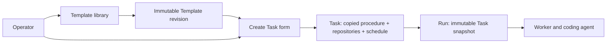

# Task templates

> **Status:** Proposed for review

## 1. Executive summary

Factory already lets an operator save and rerun a Task, but a Task combines two
different concerns: reusable agent instructions and the repositories, schedule,
and execution choices for one use of those instructions. A generic procedure
such as `Review code` therefore has to be copied, or its repository scope edited,
before it can be reused elsewhere.

This change adds a **Task Template** as a reusable starting point. A Template
stores a prompt and execution defaults, but no repositories or schedule. The
operator chooses **Use template**, reviews the prefilled Task, selects its
repositories and optional schedule, and saves an ordinary Task. The new Task
records which immutable Template revision it came from, while owning a complete
copy of every executable value. Later Template edits affect only future Tasks.

Factory will ship read-only starter Templates for code review and finding one
bug. Operators can duplicate them, create their own, or save an existing Task as
a Template. The main downside is one more product concept. The UI must keep the
distinction concrete: Templates describe how to work, Tasks bind that procedure
to repositories and timing, and Runs record what happened.

## 2. Context and scope

The current [Tasks and Runs design](../tasks/design.md) deliberately made Task
the only authoring model. A Task stores its prompt, runtime, execution profile,
timeout, concurrency limit, repository set, and optional schedule. Pressing Run
now invokes every repository saved on the Task. Run now does not accept a
temporary repository or prompt override.

Today an operator can create `Review Factory`, paste a review prompt, select the
Factory repository, and run it repeatedly. To run the same procedure against a
different repository, they must edit the Task, manually create a copy, or create
one broad Task that always runs every selected repository. None of these choices
represents a reusable procedure cleanly.

This design adds Template storage, revision history, starter content, APIs, and
browser flows. It does not change Run admission, scheduling, Worker routing, or
agent execution. A Task created from a Template is an ordinary Task after it is
saved.

The proposed [software pipeline design](https://github.com/owainlewis/factory/pull/333)
turns the executable part of a Task into a graph. Task Templates must not become
a second workflow system. Section 6 defines both possible release orders. If
Templates ship first, the Pipeline release migrates the complete Template model,
including provenance and API names. If Pipelines ship first, this feature is
implemented directly with Pipeline names and skips the temporary Task names.

## 3. System context



The Template service owns reusable procedure content, immutable revisions,
archive state, starter identity, and provenance. It does not own repositories,
schedules, Runs, or execution state. The existing Task service continues to own
repository scope, schedule, execution configuration, and Task generations. The
Run service and Worker remain unchanged.

## 4. Proposed design

### How it works

An operator opens **Templates** and sees `Review code`, `Find and fix a bug`, and
their own Templates. Each card states the operator-written summary, whether it
is a Factory starter or user-owned, its runtime default, and when it was updated.
Prompt content is loaded only after the operator opens a Template.

They open `Review code` and choose **Use template**. Factory opens the existing
New Task composer with these fields prefilled from one immutable Template
revision:

- Name: `Review code`
- Prompt: the Template prompt
- Runtime, execution profile, timeout, and concurrency defaults

The operator selects `factory`, changes the Task name to `Review Factory`, and
optionally edits any prefilled value. Repository selection and scheduling are
always Task fields and are never stored on the Template. The composer labels
changed procedure fields as `Customized` before save.

Saving creates one ordinary Task. In the same transaction, Factory stores the
source Template ID, source revision ID, source digest, and the exact set of
customized fields. The Task also stores its complete prompt and execution
settings exactly as it does today. Run now and scheduled admission read only the
Task. They never dereference mutable Template state.

If the Template is edited tomorrow, Factory creates a new immutable revision.
`Review Factory` does not change and no schedule changes behavior. Its detail
page says `Created from Review code · revision 3` and, when a newer revision
exists, `A newer Template revision is available`. V1 offers **View changes** and
**Create another Task**. It does not merge the new revision into an existing
Task.

An operator can also choose **Save as template** on an existing Task. Factory
copies only its prompt and execution defaults. It deliberately omits
repositories, schedule fields, pending occurrences, archive state, and Run
history. The operator supplies a new Template name and summary before save.

### Starter Templates

Factory seeds two stable, read-only starter Templates into a new or upgraded
database. They are visible in the same library and can be duplicated, but not
edited or archived.

`Review code` is read-only work. Its prompt instructs the agent to inspect the
repository, run relevant checks, report only reproducible findings ordered by
severity, cite paths and lines, and make no file changes or commits. A clean
review must say that no material defect was found and name the checks run.

`Find and fix a bug` is change-producing work. Its prompt instructs the agent to
find one reproducible defect, fix its cause with the smallest coherent change,
add or update a regression test, run relevant checks, and report the evidence.
If no defect can be proved, it must leave the repository unchanged and say so.

Starter IDs and revision manifests are fixed by the Factory release. Each
starter manifest entry has a positive, monotonically increasing release version.
Upgrading may add a new starter revision but never rewrites an old revision
referenced by a Task. Restoring the exact content from an older release still
uses a new release version and therefore creates a new revision. Duplicating a
starter creates a user-owned Template with a new ID and no ongoing link to
future starter updates.

### Components and responsibilities

The Template service validates names, summaries, procedure fields, revision
limits, starter rules, optimistic concurrency, and archive state. It depends on
the execution-profile catalog only to describe and validate saved defaults. It
does not decide Worker eligibility or mutate Tasks.

The Task creation service validates the final prefilled or customized Task,
loads the named Template revision when provenance is supplied, computes the
customized-field set, and writes the Task plus provenance atomically. It does
not copy repository or schedule data from a Template.

The Template library UI owns list, search, preview, create, edit, duplicate,
archive, and Use template interactions. It does not run a Template directly.
Use template always passes through the Task composer so repository scope and
schedule are explicit.

The Task UI owns the final editable values and displays Template provenance. It
does not imply that a Task stays synchronized with its source Template.

### Decisions

#### Templates copy values instead of staying live

A Task gets a complete copy of the chosen Template revision. We reject live
inheritance because a Template edit could silently change a scheduled Task or
make old Runs impossible to explain. Copying creates some drift, but makes every
Task and Run reproducible.

#### Templates contain procedure, not scope

A Template stores the prompt and execution defaults. It never stores
repositories, schedules, or concurrency currently consumed by other Tasks.
Concurrency remains an execution default and may be prefilled, but repository
scope and timing must be chosen in the Task composer. We reject a full Task
clone as the primary model because it would reproduce the binding that makes
generic procedures hard to reuse.

#### The prefilled Task remains editable

Use template is a starting point, not a lock. An operator may adjust the prompt
or execution settings before saving. Factory records which fields differ from
the source revision. We reject a parameter language in V1 because generic code
review and bug finding require no interpolation, and prompt templating would add
escaping and injection rules before the need is proven.

#### No direct Template run

Templates cannot be run from the library. Use template opens the Task composer
and requires an explicit repository choice. We reject a one-off launch dialog
because it would create a second Task-like admission path and unclear history.
The saved Task can be archived after a one-off Run.

#### Template history is immutable

Editing a Template creates a revision. Existing Tasks retain provenance to the
old revision. We reject in-place prompt updates because provenance without the
original bytes would be misleading.

#### One template system can grow into pipeline recipes

V1 revisions contain a `single_agent_v1` procedure. When graph execution ships,
that procedure migrates losslessly to one Agent node. A later `graph_v1`
revision can store the frozen Pipeline graph. We reject separate Task Template
and Pipeline Template products because a one-node graph and a multi-node graph
are two sizes of the same software procedure.

## 5. Invariants and requirements

### Invariants

- `INV-1`: Creating a Task from a Template copies every executable value into
  the Task; Run admission never reads Template state.
- `INV-2`: Editing, archiving, or upgrading a Template never changes an existing
  Task or Run.
- `INV-3`: Every procedure change creates an immutable revision with a stable ID
  and digest. A metadata-only edit does not create a revision.
- `INV-4`: Template provenance names an existing revision and truthfully records
  every copied field that the Task customized at creation.
- `INV-5`: A Template revision contains no repository IDs, schedule, pending
  occurrence, Task archive state, or Run history.
- `INV-6`: One retained mutation scope and client request key commits at most
  one Template mutation, revision, or Task creation.
- `INV-7`: A starter revision referenced by a Task remains readable after an
  application upgrade.
- `INV-8`: Template prompts are never exposed in list APIs, logs, metrics, or
  error text.
- `INV-9`: Archiving a user Template prevents future Task creation from it but
  preserves its revisions and existing Task provenance.
- `INV-10`: A retained `single_agent_v1` revision keeps its original canonical
  bytes and digest while producing exactly one Template-local Agent node with
  the stored source-node UUID, prompt, and execution defaults. A compacted
  revision remains a content-free tombstone and never gains reconstructed
  procedure or Graph bytes.
- `INV-11`: Every Pipeline newly instantiated from a Template after the Pipeline
  release mints new Pipeline-bound Stage UUIDs and records a complete
  source-node to execution-Stage mapping. The one-time migration of an existing
  Task is the explicit exception: it preserves that Task's ID as its sole Stage
  ID under the Pipeline migration contract.
- `INV-12`: Current, starter, and Task- or Pipeline-referenced revision bodies
  are never independently compacted. Purging an eligible archived user Template
  deletes its complete aggregate, including its current revision, under the
  stricter aggregate checks in section 7.

### Requirements

- The main navigation contains **Templates** next to Tasks.
- The Template library supports search by name, active and archived filters,
  preview, create, edit, duplicate, archive, and Use template.
- Template list responses contain the bounded operator-written summary and no
  prompt bytes. Detail and retained revision responses contain the full prompt;
  an explicitly compacted unreferenced revision returns only its tombstone.
- Use template opens the existing Task composer and requires at least one
  repository before the Task can run or be scheduled.
- The composer clearly marks any procedure field changed from the source
  revision and previews the source revision number.
- An existing Task shows its source Template and whether a newer revision exists.
- Factory keeps direct Task creation without a Template. New and updated clients
  supply its existing `request_key` field so the server can enforce replay; the
  bounded compatibility path below accepts current keyless direct clients until
  the Pipeline API rename.
- Template names are required, Unicode-trimmed, limited to 200 characters, and
  unique case-insensitively among active user Templates.
- Summaries are optional and limited to 1 KiB of UTF-8. Prompts retain the
  existing 64 KiB limit.
- Factory permits at most 500 active or archived user Templates, 5,000 retained
  user revision bodies, 20,000 total user revision records including compacted
  tombstones, and 320 MiB of retained user Template prompt bytes. One Template
  Graph has at most the Pipeline limit of 20 source nodes. Section 7 defines
  previewed, operator-confirmed reclamation. A limit failure reports the current
  use and eligible reclaimable amount and creates no partial record.
- List APIs return at most 200 items per page and use stable cursor pagination.

## 6. Interfaces and data

The browser uses these resources:

```text
GET    /api/v1/task-templates
POST   /api/v1/task-templates
GET    /api/v1/task-templates/{template_id}
PATCH  /api/v1/task-templates/{template_id}
PUT    /api/v1/task-templates/{template_id}/archived
POST   /api/v1/task-templates/{template_id}/duplicate
GET    /api/v1/task-templates/{template_id}/revisions/{revision_id}
GET    /api/v1/task-templates/storage
POST   /api/v1/task-templates/storage/compaction-previews
POST   /api/v1/task-templates/storage/compactions
POST   /api/v1/tasks
```

Create and edit Template requests contain `request_key`, `name`, `summary`,
`procedure`, and, for edit, `expected_generation`. `procedure` is a tagged
object. V1 accepts only:

```json
{
  "kind": "single_agent_v1",
  "prompt": "Review the repository...",
  "runtime": "codex",
  "execution_profile_id": "",
  "timeout_seconds": 7200,
  "concurrency_limit": 10
}
```

`PATCH` treats name and summary as Template metadata. Every successful metadata
mutation increments Template generation but does not create a revision or
advance `current_revision_id`. Supplying a canonically different procedure
creates one revision and advances the pointer in the same transaction. Supplying
an identical procedure is a metadata-only edit. Newer-revision notices compare
source and current revision numbers, not Template generation.

Duplicate has this complete request:

```json
{
  "request_key": "client-generated UUID",
  "source_revision_id": "revision-id",
  "expected_generation": 4,
  "name": "My code review",
  "summary": "Review one repository without changing it."
}
```

The named source revision must belong to the Template. `expected_generation`
prevents duplicating from a stale detail view, but the source revision may be
older than current. An archived source may be duplicated because archive blocks
new linked Tasks, not reading or copying retained content. Duplicate creates one
active user Template at generation 1 and one immutable revision. It copies the
canonical procedure bytes but mints new user Template, revision, and
Template-local source-node IDs. For `graph_v1`, it remaps every Template-local
node and Edge reference before hashing the new Template Graph. It stores
`duplicated_from_template_id` and `duplicated_from_revision_id` as provenance.
The mutation scope is `task-template:{source_template_id}:duplicate`. Success
returns the standard recorded mutation envelope containing the new Template ID,
generation 1, and revision ID; an identical replay returns that envelope.

Task creation keeps the existing full Task fields and adds optional provenance:

```json
{
  "request_key": "client-generated UUID",
  "name": "Review Factory",
  "prompt": "Review the repository...",
  "runtime": "codex",
  "execution_profile_id": "",
  "timeout_seconds": 7200,
  "concurrency_limit": 10,
  "repository_ids": ["repository-id"],
  "schedule": {"enabled": false},
  "template_source": {
    "template_id": "template-id",
    "revision_id": "revision-id",
    "digest": "sha256:..."
  }
}
```

When `template_source` is present, the server loads that exact revision,
verifies the digest, compares prompt, runtime, profile, timeout, and concurrency,
and stores their difference as a canonical `customized_fields` array. The
request does not have to match the Template because customization is allowed.
Supplying an unknown, archived, compacted, mismatched, or corrupt source rejects
the whole Task creation. Direct Task creation omits `template_source`.
`request_key` is required whenever `template_source` is present. During the Task
Template release only, a direct Task request with neither `template_source` nor
`request_key` remains valid for compatibility with the existing public request
type and embedded composer. The server generates a random internal key, writes
the Task and ledger receipt normally, returns the unchanged full
`protocol.Task` JSON body, exposes the generated key only in an
`X-Factory-Request-Key` response header, and marks the response with
`Deprecation: true`. A repeated keyless request creates another Task, matching
today's non-idempotent behavior; it cannot recover a lost response. The updated
embedded composer always sends a client key. The keyless exception disappears
with the intentional Task-to-Pipeline API rename, so it does not enter the
Pipeline API.

For the same compatibility window, a non-empty `request_key` on a direct Task
request is an opaque, case-sensitive JSON string. Factory preserves its exact
decoded UTF-8 bytes, applies no trimming or UUID validation, and relies on the
existing 1 MiB HTTP request-body limit as its bound. This matches the current
public `SaveTaskRequest` contract. Newly introduced Template mutation APIs and
Template-derived Task creation require canonical client UUIDs. After the
Pipeline rename, the new Pipeline API requires UUID keys for every create.

Archive and restore use the same endpoint. Its body contains `archived`,
`expected_generation`, and `request_key`. Restoring reclaims the Template's
normalized name inside the mutation transaction. If an active user Template now
owns that name, Factory returns `template_name_conflict`, leaves the original
Template archived, and records no successful mutation result.

SQLite adds `task_templates`, `task_template_revisions`, and nullable provenance
columns on `tasks`. A Template row stores ID, normalized name key, display name,
summary, generation, current revision ID, starter key, starter release version,
archive state, and timestamps. A revision stores ID, Template ID, revision
number, optional starter release version, `content_state` (`retained` or
`compacted`), nullable canonical procedure JSON, SHA-256 source digest, nullable
immutable `single_agent_source_node_id`, optional duplicate provenance, author
kind, creation time, and nullable compaction time. Procedure JSON is required
only while content state is retained. The source-node field is required
only for `single_agent_v1` and names a node inside that Template revision. For
`graph_v1`, Template-local node IDs are defined in canonical procedure JSON and
the single-agent field is null. Neither form is used directly as a Pipeline Stage
ID. Every revision also stores `source_node_ids_json`, the canonical ordered set
of one to twenty node UUIDs extracted and validated from the single-agent field
or Graph at creation. This bounded identity set survives procedure compaction.
Duplicate provenance has foreign keys to its source Template and revision;
the reference checks in section 7 prevent compaction or purge while the
duplicate is retained. Task provenance stores Template ID, revision ID, Template name
snapshot, digest, and canonical customized fields. The Task continues to store
its complete executable values.

After Pipelines ship, Pipeline provenance adds canonical
`template_node_map_json`. It is an ordered array of every
`{"source_node_id":"...","stage_id":"..."}` pair and is required when a
Pipeline has Template provenance. Its source IDs must equal the complete node
set in the referenced Template Graph and its Stage IDs must equal the complete
node set in the copied execution Graph. Both sides are unique. A direct Pipeline
has no Template provenance and a null map.

The storage GET returns the four configured limits, current body, record, and
byte use, reclaimable counts, and next mutation-ledger expiry. A compaction
preview request contains an optional Template ID and `max_actions`, from 1 to
1,000. This limit counts top-level reclamation actions, not revision members:
one `purge_template` aggregate is one action. Each purge action contains the
Template ID plus the complete ordered array of member revision IDs, digests,
and content states. Every compacted member also includes its complete ordered
`source_node_ids` array; retained members omit that redundant field because
their procedure body remains readable until apply.
`compact_body` contains its one revision ID and digest; and
`delete_tombstone` contains its revision ID, digest, and complete ordered
`source_node_ids` array. The total nested purge membership cannot exceed the
global 20,000 revision-record limit, while at most 1,000 tombstone-deletion
actions each expose the existing maximum of 20 source-node UUIDs. Across purge
members, at most 400,000 source-node UUIDs can appear. Preview and
apply responses contain no names, summaries, prompts, or procedure bytes and
have a fixed 32 MiB serialized-response limit; a maximum-shape fixture proves
these field and cardinality bounds fit below it.

Action generation is canonical and mutually exclusive. Factory determines
eligible `purge_template` aggregates first, emits one action per aggregate, and
excludes every member revision from `compact_body` and `delete_tombstone`.
Independent revision actions are emitted only for Templates outside the purge
set, in stable action-kind, Template-ID, and revision-ID order.

The response also contains one random opaque token, a ten-minute expiry, the
database-generation fence, and aggregate bytes and slots. SQLite stores the
token hash, authenticated actor ID, original filter and `max_actions`, canonical
preview JSON, its SHA-256 digest, database-generation fence, and expiry in
`template_compaction_previews`; the plaintext token encodes no trusted data.
Canonical preview JSON is capped at 32 MiB. At most 16 unexpired previews and
256 MiB of preview JSON may exist. Preview creation removes expired rows and the
actor's prior unconsumed preview, then fails without a token if either bound
would still be exceeded.

Apply contains `request_key` and the preview token and uses mutation scope
`template-storage:compact`. After authentication and authorization, it checks
`mutation_requests` for the scope, request key, and canonical request digest
before looking up or expiring the token. A committed exact replay therefore
returns its receipt even after the ten-minute preview expiry. With no committed
result, an unknown or expired token returns
`template_compaction_preview_expired` without work. A first apply loads the
exact stored preview by token hash and actor, verifies its digest, and rechecks
its complete canonical action set transactionally. It never recomputes a
different preview from current eligibility.

A successful first apply deletes its preview row in the same transaction and
returns a compact receipt containing a new compaction ID, the canonical preview
digest, committed action and revision-member counts, counts by action kind,
freed bytes and slots, and commit time. It does not repeat action or revision
IDs; those belong to the operator-confirmed preview. The receipt is under the
mutation ledger's 16 KiB result-envelope limit. Replaying the same apply returns
that exact recorded receipt without needing the preview or any row deleted by
the compaction.

SQLite also adds `mutation_requests`. Its primary key is `operation_scope` plus
the SHA-256 hash and byte length of the exact request-key string; it never stores
the raw key. It also stores the SHA-256 digest of the canonical request, result
resource kind and ID, canonical
`result_envelope_json`, and creation time. Stored ledger envelopes are
reference-and-metadata receipts, never resource detail, and are limited to 16
KiB. Template mutation clients refetch detail after success. The existing
`POST /api/v1/tasks` response contract is unchanged during this release: after a
new create or keyed replay, the handler uses the receipt's Task ID to return the
full current `protocol.Task` shape and status expected by existing clients. Task
rows cannot be purged while their receipt is live, so replay can load that body.
For a storage apply, the resource kind is `template_compaction` and the resource
ID is the new compaction ID. The
application checks this row before optimistic-concurrency validation. A matching
replay returns the stored envelope byte-for-byte. A different digest returns
`request_key_conflict`. The ledger row, result envelope, and resource mutation
commit in one transaction, so none can exist alone. Each row has
`expires_at = created_at + 90 days`. Exact replays remain available through that
instant.

SQLite also adds `mutation_request_aliases` for durable legacy lookup after the
Pipeline rename. Its primary key is legacy `operation_scope` plus the same exact
key hash and byte length; it stores no raw key. It also stores the frozen legacy
request digest, migrated resource kind, ID and location, canonical
`api_migrated` result envelope, creation time, and original expiry. The envelope
is limited to 16 KiB and contains no resource detail. One semantic
`(operation_scope, request_key)` can identify exactly one alias, and no live
`mutation_requests` row may retain the same pair. New Pipeline mutation routes
do not treat a pre-migration request as their own replay; removed legacy routes
and scope-specific migration lookups read only the alias envelope.

Hourly maintenance deletes expired aliases and mutation rows in batches of
1,000. At 100,000 total unexpired rows across both tables, Factory first removes every expired
batch and then, if still full, stops new Template mutations and Task creates with
`mutation_request_limit_reached`; exact replays and Runs continue. Health shows
the row count and earliest expiry, so capacity returns within 90 days without an
unsafe purge. The ledger never stores prompt, summary, repository, or schedule
bytes. Its 90-day replay guarantee applies to authoring mutations; scheduler and
Run idempotency retain their existing separate contracts.

Task creation begins using this ledger for both direct and Template-derived
Tasks. This fixes the current behavior where `SaveTaskRequest.RequestKey` is
accepted but not enforced. The scope for a Task create is `task:create`; each
Template operation uses its operation plus Template ID where one exists. Keys
are not global across unrelated scopes. A keyless compatibility create receives
a server-generated internal key before the transaction and is recorded under
the same scope, but only its response header reveals that key.

### Naming and identity

Ordinary user Template IDs, stored revision IDs, and
`single_agent_source_node_id` values are distinct cryptographically random UUIDs
from the existing `newID` path. Request keys on new Template and
Template-derived Task APIs are client-generated UUIDs validated before the
transaction begins. Direct Task compatibility accepts the opaque legacy key or
generates the explicit keyless fallback described above. A generated key or
resource-ID failure creates nothing. Revision numbers increase inside the same
transaction that advances the Template generation. Names use the existing
trimmed case-insensitive Task key rules.

Starter Templates use stable reserved keys such as `factory.review-code` and
`factory.find-fix-bug`. A starter manifest is the explicit exception to random
resource-ID generation. It contains a fixed stored Template UUID, a fixed stored
revision UUID per release version, and a fixed Template-local source-node UUID.
These UUIDs are distinct from the reserved starter key used for lookup and the
SHA-256 digest used to authenticate canonical procedure bytes. Startup inserts
missing starter revisions idempotently. A higher
release version creates the next Template revision even when its procedure
matches an older revision. Reusing one release version with different canonical
bytes is corrupt release metadata: startup reports that starter unhealthy and
does not advance it. The current pointer advances only through every missing
intermediate manifest version in order, so skipped or reordered starter history
cannot be hidden. Reusing a manifest-defined Template-local UUID for another
revision is corrupt release metadata.

Renaming or changing the summary updates metadata and increments Template
generation, but does not create a procedure revision or change
`current_revision_id`. IDs, revision IDs, Task provenance, and old Run snapshots
remain stable. Task detail uses the current Template name when available and the
snapshotted source name when it is not. Newer-revision notices do not appear for
metadata-only edits. Every metadata mutation still uses optimistic concurrency
and the durable request ledger.

### Pipeline release order and migration

The Pipeline feature and this feature may be released in either order, but a
release must use one complete vocabulary. If Pipelines land first, this design
is implemented as `pipeline_templates`, `pipeline_template_revisions`, nullable
provenance on `pipelines`, `/api/v1/pipeline-templates`, and **Create Pipeline**
copy. No Task Template tables or endpoints are created.

If Task Templates land first, the Pipeline schema migration performs these
steps in the same write-frozen transaction that renames Tasks to Pipelines:

1. Rename `task_templates` to `pipeline_templates` and
   `task_template_revisions` to `pipeline_template_revisions`, preserving every
   primary key, revision number, digest, starter version, and archive state.
2. For each retained `single_agent_v1` revision, keep procedure JSON and source
   digest byte-for-byte unchanged. Add a separately stored canonical
   `template_graph_json` and `template_graph_digest` to the renamed revision.
   The derived Template Graph has one Agent node named `Execute`, `activation:
   all`, no Edges, and that node as entry. It uses the revision's immutable
   `single_agent_source_node_id` UUID. The source digest continues to
   authenticate the original procedure; the Template Graph digest independently
   authenticates the derived reusable graph recipe. Copy prompt, runtime,
   execution-profile default, and timeout into the Agent Stage. Map
   `concurrency_limit` to the Pipeline concurrency default. Leave Stage
   concurrency and requested token ceiling null. This matches the current Task
   limit, which bounds Sessions across repositories rather than limiting a
   distinct Stage.
3. For each already compacted revision, preserve `content_state`, source digest,
   source-node IDs, duplicate provenance, and compaction time. Rename the row but
   leave procedure JSON, `template_graph_json`, and `template_graph_digest`
   null. Do not derive or verify content from a digest. It remains unavailable
   through `template_revision_compacted` and follows the same tombstone deletion
   rules after migration. Populate and verify the separately retained
   `source_node_ids_json` for retained revisions before they can become eligible
   for later compaction; for existing tombstones, validate only the bounded UUID
   set already stored at their original compaction.
4. Rename Task provenance columns to Pipeline provenance columns without
   changing Template ID, revision ID, name snapshot, source digest, or
   customized fields. The migrated Pipeline still owns its complete executable
   Graph and never reads a Template during admission. Provenance continues to
   identify and verify the immutable source procedure. For each migrated Task,
   keep the Pipeline design's Stage ID rule: the new one-node Pipeline Stage ID
   is the former Task ID. Store a source-node map from the revision's
   `single_agent_source_node_id` to that Pipeline-bound Stage ID. The copied
   Pipeline Graph and its execution digest are computed after this substitution
   and after applying any Task customization. A direct Task with no Template
   provenance has no source-node map.
5. For each retained Task or Task Template mutation result, including
   `template-storage:compact`, atomically move its request key, frozen scope and
   request digest from `mutation_requests` into one
   `mutation_request_aliases` row. The migration maps the stored result resource
   kind and ID to its Pipeline equivalent, records the new location, renders one
   canonical `api_migrated` envelope, preserves creation time and original
   expiry, then removes the old ledger row in the same transaction. A storage
   apply alias embeds its already committed compact receipt, so replay needs
   neither its deleted preview nor reclaimed rows. Preflight rejects duplicate
   alias keys, an alias/live-row collision, envelopes over 16 KiB, or any result
   that cannot be retargeted. Resource-backed Task and Template results must
   identify an existing migrated resource. A storage apply has no resource row:
   preflight instead validates its stored receipt schema, compaction ID, preview
   digest, counts, freed capacity, commit time, and expiry before moving it.
   Removed legacy routes and migration lookups replay the stored alias envelope
   byte-for-byte. New Pipeline mutation routes accept only requests first made
   in the new vocabulary and never claim the pre-migration request as a replay.
   Uncommitted ten-minute preview rows have no replay guarantee; migration
   deletes them transactionally and the operator creates a new Pipeline Template
   storage preview after upgrade.
6. Replace `/api/v1/task-templates` with `/api/v1/pipeline-templates` and
   `/api/v1/tasks` with `/api/v1/pipelines` in the same server and embedded-UI
   release. **Templates** remains the browser label. This is the intentional
   pre-launch breaking API rename approved by the Pipeline design. There is no
   general compatibility alias or new Task admission after upgrade.
7. Keep narrow replay-only handlers on every removed legacy mutation route until
   the last matching migrated ledger row expires: Task create, Template create,
   Template edit, duplicate, archive, restore, and storage compaction apply. Each
   handler accepts only its frozen legacy body and request key, canonicalizes it
   with the frozen legacy schema, and queries only that route's retained
   operation-scope alias. An exact retained match returns its stored
   `api_migrated` envelope with the new Pipeline or Pipeline Template identity,
   location, or compact receipt. An unknown or expired key returns HTTP 410 with
   the relevant `*_api_removed` code; a changed body returns
   `request_key_conflict`. These handlers cannot create or mutate a resource.
   The new client can retrieve the same result from a scope-specific lookup such
   as `GET /api/v1/mutation-replays/task-create/{request_key}` or
   `GET /api/v1/mutation-replays/template-edit/{template_id}/{request_key}`; the
   fixed storage lookup is
   `GET /api/v1/mutation-replays/template-storage-compact/{request_key}`.
   Fixed operation-kind routes always query one retained legacy scope, so a key
   reused in another scope cannot collide. Each replay-only route is removed
   automatically after its final legacy expiry and health reports every removal
   date.

For a new `graph_v1` revision after the Pipeline release, the source procedure
is the Template Graph and its node IDs are Template-local. Creating a Pipeline
from either revision kind mints one fresh Pipeline-bound Stage UUID per source
node, rewrites entry and Edge references, validates ownership, computes the
execution Graph digest, and stores the complete source-node map in Pipeline
provenance. Two Pipelines from one Template therefore share no Stage IDs.
Editing a migrated `single_agent_v1` revision in the graph editor creates a new
`graph_v1` revision. It never rewrites the source revision.

Migration preflight branches on procedure kind and content state. A retained
`single_agent_v1` revision requires a valid `single_agent_source_node_id`, an
exact singleton `source_node_ids_json`, canonical source bytes matching the
source digest, and a derived Graph matching its new Graph digest. A retained
`graph_v1` revision requires a null single-agent field, canonical Graph content,
an exact one-to-twenty-node identity set, and matching source and Graph digests.
A compacted revision requires null procedure and Graph content, a valid retained
source digest, a bounded unique source-node set, and permits a null Graph digest
when no Graph was ever derived. Common checks reject an unknown kind or state,
missing referenced revision, provenance digest mismatch, duplicate node
identity, incomplete source-node mapping where provenance exists, Stage-ID
collision inside a converted Graph, invalid alias or ledger envelope, or a
ledger result that cannot be retargeted. The existing owner-only
backup and offline rollback boundary from the Pipeline design apply. A failure
leaves the pre-migration database unchanged.

## 7. Failure behavior and lifecycle

If a Template changes while its editor is open, edit returns
`template_generation_conflict`. The UI keeps the draft, refreshes the current
revision, and asks the operator to compare before retrying.

If Use template references a revision whose Template was archived after the
composer opened, Task creation returns `template_archived` and creates nothing.
The UI keeps the filled Task and offers **Create without Template link**. This
fallback sends a new idempotency key and an ordinary direct Task request.

If an execution profile saved as a Template default is removed, disabled, or no
longer compatible, the Template remains readable. Use template opens with the
field marked unavailable and requires a valid replacement before Task save.

If a requested historical revision has been explicitly compacted, preview,
duplicate, and Use template return `template_revision_compacted` with its ID,
digest, and compaction time. Factory never substitutes the current revision.

Create, edit, duplicate, archive, restore, and all Task-creation writes are
atomic through the durable mutation ledger. Writes with a caller-supplied key
are idempotent: a retry with the same scope, request key, and canonical body
returns the recorded result before checking the request's now-stale expected
generation. Reusing the key with different content returns
`request_key_conflict`. A keyless direct compatibility create has only
transactional atomicity, not client-visible replay, because each request gets a
new internal key. Database busy and temporary I/O failures return a retryable
error without a resource or ledger orphan.

Archiving a user Template is reversible. Restore uses optimistic concurrency and
leaves the Template archived on a name conflict. Archive does not disable Tasks,
cancel Runs, or remove revisions. Starter Templates cannot be archived.
Shutdown needs no new drain path because Template operations are bounded HTTP
transactions and do not start background work.

Template storage reclamation is explicit and never removes provenance that a
Task or Pipeline still needs. The Templates storage panel and
`factory templates compact` first produce a preview token with exact eligible
IDs, bytes, reference counts, and a database-generation fence. Apply requires
that token and operator confirmation. The transaction rechecks every condition:

- An archived user Template may be purged only when no Task or Pipeline points
  to any of its revisions, no duplicate revision record, retained or compacted,
  names the Template or any revision as its source, and no unexpired mutation
  result points to the Template or any revision. `purge_template` is aggregate
  deletion, not revision compaction: the preview must include every revision ID,
  digest, and content state, plus the complete source-node set for every
  compacted member. Apply deletes the Template plus every revision record
  transactionally.
  This includes the current revision and compacted tombstones regardless of
  their individual 90- or 365-day ages. If any revision is omitted or fails an
  external-reference or replay check, the whole Template is ineligible. Starter
  Templates are never purge candidates. A successful purge frees one Template
  slot, all of its retained-body and prompt-byte use, and all of its total
  revision-record slots.
- A non-current user revision body may be compacted only when it is at least 90
  days old, no Task or Pipeline points to it, no duplicate revision record,
  retained or compacted, names it as its source, and no unexpired mutation result
  points to it. Compaction retains a
  tombstone with Template ID, revision ID, revision number, source digest,
  the separately stored `source_node_ids_json`, creation time, and compaction
  time. It also retains `duplicated_from_template_id` and
  `duplicated_from_revision_id` as non-content provenance columns, so the source
  remains referenced after the duplicate revision body is compacted. It removes
  every content-bearing representation, including canonical procedure JSON and
  any separately derived `template_graph_json`, and disables View changes for
  that revision. It retains source and Template Graph digests, but no prompt or
  execution-default bytes. The tombstone does not count toward retained-body or
  prompt byte limits, but it does count toward the 20,000 total revision-record
  limit.
- Every duplicate-reference check in purge, body compaction, and tombstone
  deletion scans provenance columns on both retained revisions and compacted
  tombstones. A source becomes eligible only after the referencing duplicate
  record itself is safely purged or permanently deleted.
- Every replay-reference check scans both live `mutation_requests` receipts and
  migrated `mutation_request_aliases` until their recorded expiry. Reclamation
  cannot make either replay envelope point at a deleted resource.
- A compacted tombstone may be deleted permanently only when it has been
  compacted for at least 365 days and the same Task, Pipeline, duplicate, current,
  starter, and replay reference checks still pass. Its ID, digest, and source
  node set are included in the preview. Deletion frees one total revision-record
  slot. Revision numbers are never reused.
- Current revisions are never eligible for independent body compaction or
  tombstone deletion; they may be removed only inside an eligible
  `purge_template` aggregate. Starter revisions, externally referenced
  revisions, and revisions named by unexpired replay records are never eligible
  for any reclamation action. A changed reference set, aggregate membership, or
  preview fence aborts the whole apply with `template_compaction_stale`.

Factory runs expired mutation-ledger cleanup automatically, but never compacts a
Template body automatically. If safe compaction cannot free enough capacity, an
operator can raise the four Template storage limits with the offline
`factory templates set-limits` command. The command requires the server to be
stopped, validates a database backup and free disk, caps retained prompt bytes
at 2 GiB, writes the new limits transactionally, and reports the rollback
command. Lowering a limit below current use is rejected. Thus a long-lived
installation can recover authoring without deleting referenced history or
weakening an unexpired replay guarantee.

If starter seeding fails validation or storage at startup, Factory reports the
specific starter key as unhealthy but continues serving existing Tasks and
Runs. Template creation is disabled until the fault is repaired; execution is
not. A valid restart retries the idempotent seed transaction.

## 8. Security, privacy, and operations

Template prompts are trusted operator instructions under Factory's existing
local control-plane authorization boundary. Repository contents, issue text,
pull-request feedback, and agent output remain untrusted and are never evaluated
while rendering a Template. Markdown previews are escaped with the same safe
renderer used for Task content.

Template endpoints use the same operator authorization as Task authoring. A
remote Worker cannot list, read, or mutate Templates. Workers receive only the
resolved Task or Run snapshot, never Template credentials or mutable Template
state.

Prompts and summaries may contain private code or business context. Full prompts
appear only in detail endpoints and the authenticated editor; bounded summaries
also appear in the authenticated list. Logs, metrics, conflict errors, and
starter health diagnostics contain IDs, sizes, and digests, not prompt or
summary bytes. SQLite backups must be protected under the same policy as
existing Task prompts.

The limits in sections 5 and 6 bound database growth, response size, mutation
history, and diff work.
Canonicalization and hashing run before a write and reject invalid UTF-8. The
browser computes no trusted digest. Server-side comparisons cap each field and
run in linear time over at most one Template revision and one Task request.

## 9. Acceptance criteria

- `AC-1`: An operator can create `Review Factory` from the `Review code`
  starter, select one repository, save it, and run it through the unchanged Run
  admission path.
- `AC-2`: Creating two Tasks from one Template with different repository sets
  produces independent Tasks with the same source revision and no shared mutable
  execution fields.
- `AC-3`: Editing a Template procedure creates a new revision and leaves all
  existing Task and Run snapshots byte-for-byte unchanged.
- `AC-4`: Customizing a prefilled prompt or execution default records the exact
  canonical field name and the Task runs the customized value.
- `AC-5`: Saving a Task as a Template omits repositories, schedule, pending
  occurrence, archive state, and history.
- `AC-6`: Archived Templates cannot create linked Tasks, but their prior
  revisions and existing Task provenance remain readable; restore either
  succeeds atomically or leaves the Template archived on a name conflict.
- `AC-7`: For every request with a caller-supplied key, duplicate or
  lost-response retries create at most one Template, revision, duplicate,
  archive transition, or Task. A keyless direct compatibility create retains the
  documented pre-existing non-idempotent retry behavior.
- `AC-8`: List, log, metric, and error surfaces do not expose full Template
  prompts.
- `AC-9`: An unavailable execution-profile default blocks Task save until the
  operator selects a valid profile, without making the Template unreadable.
- `AC-10`: Upgrading starter content creates a new immutable revision and does
  not change a Task created from an earlier release.
- `AC-11`: In the Task Template release, existing direct Task creation, editing,
  scheduling, admission, retries, and history continue without a Template. The
  existing keyless direct-create request still succeeds with a generated
  compatibility key header, deprecation header, and unchanged Task-shaped JSON
  body. A direct request with an existing non-UUID opaque key also succeeds,
  while Template-derived creates reject a missing or non-UUID key. The
  later Pipeline release performs its separately approved pre-launch API rename
  and preserves only the bounded replay-only path in section 6.
- `AC-12`: Every retained `single_agent_v1` fixture keeps identical source bytes
  and digest and gains a separately hashed one-Agent-node Template Graph with
  its stored source UUID and identical prompt and execution defaults. An already
  compacted fixture remains a content-free tombstone with null procedure and
  Graph bodies and no invented Graph digest.
- `AC-13`: A lost-response replay of every caller-keyed authoring mutation
  returns its recorded result even when its original expected generation is now
  stale; a changed request body returns `request_key_conflict`. A keyless direct
  compatibility create cannot replay a lost response because the caller never
  knew its generated key.
- `AC-14`: A pre-Pipeline database migrates Template resources, all immutable
  revisions, Task provenance, and mutation-ledger results to Pipeline names
  without losing or retargeting a source revision. Each migrated Task preserves
  its former ID as its sole Stage ID, while every later Template instantiation
  mints fresh Stage IDs.
- `AC-15`: Newly creating two Pipelines from one Template revision produces
  disjoint Pipeline-bound Stage UUID sets, complete source-node maps, and
  otherwise equivalent executable Graphs.
- `AC-16`: A Task created from a Template can select an execution profile that
  differs from the Template default; the Task stores and runs that profile and
  provenance records `execution_profile_id` as customized.
- `AC-17`: Duplicate can copy a retained revision from an active or archived
  source exactly once, with new Template-local identities and explicit source
  provenance; stale generation and changed-key replays are rejected.
- `AC-18`: A previewed compaction removes only eligible unreferenced procedure
  bodies, retains the specified bounded tombstones, aborts on a new reference,
  safely deletes only 365-day unreferenced tombstones, and frees the reported
  body, record, and byte capacity. Purging an eligible archived user Template
  atomically deletes its current revision and every other revision or tombstone,
  while any omitted aggregate member or external reference rejects the purge.
  Aggregate purges subsume member actions, and retained or compacted duplicate
  provenance blocks reclamation of its source.
- `AC-19`: Through each request's original 90-day expiry, an exact lost-response
  replay on the legacy Task create route returns the migrated Pipeline identity
  without admitting new work; changed, expired, and unknown requests fail as
  specified.
- `AC-20`: A name- or summary-only edit increments Template generation without
  creating a revision, changing `current_revision_id`, or showing a newer
  procedure notice on sourced Tasks.
- `AC-21`: Through each original ledger expiry, every removed Task Template
  mutation route, including storage compaction apply, replays its stored
  `api_migrated` alias envelope from its fixed legacy scope without admitting a
  new mutation. A new Pipeline route does not claim that legacy request as its
  own replay; changed, expired, and unknown legacy requests fail as specified.
- `AC-22`: The authenticated storage panel previews at most 1,000 exact
  reclamation actions, 20,000 nested revision members, and 400,000 nested
  source-node IDs in a 32 MiB response. It persists the exact bounded preview
  behind its actor-bound token and applies it idempotently while the token is
  unexpired. A committed apply
  durably replays the same compact receipt after the token expires and reclaimed
  rows are gone; an uncommitted expired token or changed reference fence performs
  no partial work.

## 10. Test approach

Store tests cover revision creation, optimistic concurrency, idempotency,
archive and restore, stable starter seeding, name conflicts, byte limits, and
atomic Task provenance. Snapshot comparisons prove `INV-1` through `INV-7` and
`AC-2` through `AC-7`; metadata-only fixtures prove `AC-20`.

HTTP tests cover pagination, prompt omission from lists, full detail access,
unknown and archived revisions, digest mismatch, request-key conflicts, and
existing direct Task compatibility. They prove a keyless direct create succeeds
with distinct generated-key headers, the deprecation marker, and the unchanged
full Task JSON response. They replay opaque whitespace-sensitive and non-UUID
direct keys up to the existing body bound, verify raw keys are not persisted,
and prove a keyless or non-UUID Template-derived create fails while the updated
composer supplies a UUID. They
cover duplicate source selection,
profile overrides, archived-source duplication, and the replay-only migrated
Task route at both sides of expiry. Structured log capture proves `INV-8` and
`AC-8`; contract assertions prove `AC-16`, `AC-17`, and `AC-19`.

React tests cover Template search, starter labels, preview, create, edit,
duplicate, archive, Save as template, Use template, customized markers, newer
revision notices, unavailable profiles, storage use, compaction preview, stale
preview recovery, and apply results. These prove `AC-22`. Playwright creates and runs both
starter cases against a fixture repository and verifies the selected repository
and frozen source revision. These prove `AC-1`, `AC-4`, `AC-5`, `AC-9`, and
`AC-11`.

Migration fixtures seed old, reverted, and new starter bodies and compare prior
Task and Run bytes. They migrate Template and provenance rows across the
Pipeline rename, include an unreferenced compacted `single_agent_v1` tombstone,
and prove that its digest, source-node IDs, provenance, and compaction time
survive while all procedure and Graph content remains null. They atomically move
retained Task and Template mutation results into durable legacy alias envelopes,
replay them on every removed route and scope-specific lookup, and prove new
Pipeline mutation routes do not claim those requests. A committed storage apply
fixture migrates after its preview and resource rows are gone and replays the
same receipt on the removed route; an uncommitted preview is invalidated.
Preflight fixtures cover retained single-agent, retained graph, and
compacted states independently. A graph-conversion fixture preserves the former
Task ID for a migrated Stage, then newly creates two Pipelines from one revision
with fresh IDs and proves `INV-10`, `INV-11`, `AC-12`,
`AC-13`, `AC-14`, `AC-15`, `AC-19`, and `AC-21`. Compaction fixtures race a new
provenance reference against apply, preserve referenced bytes, verify retained
tombstones, purge complete archived aggregates containing current revisions and
young tombstones, reject incomplete or newly referenced aggregates, prove purge
actions subsume all member actions, and exercise ledger expiry and cap recovery.
They prove `INV-12` and `AC-18`, retain duplicate provenance after body
compaction, block source reclamation from retained and compacted duplicate rows,
and exercise
the 1,000-action, 20,000-member, and serialized-response bounds at maximum
storage. A lost-response fixture deletes the maximum aggregate and proves that
the replayed apply receipt is byte-identical after token expiry without
consulting the deleted preview or resource rows. Preview persistence fixtures
verify actor binding, stored canonical contents and digest, token replacement,
expiry, and the 16-row and 256 MiB bounds.
The maximum tombstone-deletion fixture proves every retained source-node UUID is
present in both independent deletion and aggregate purge previews. The full
20,000-revision, 400,000-node fixture proves the response stays under 32 MiB and
preview storage stays under its 256 MiB total cap. Privacy
assertions prove compacted
rows retain no prompt or execution defaults in either source or derived Graph
storage. Existing
Linux, macOS, browser, migration, race, security, and release checks remain
required.

## 11. Risks and tradeoffs

- Templates add a third top-level noun. Keep the UI definition visible and use
  the fixed flow Template to Task to Run.
- Copy semantics allow Tasks to drift from their source. Show provenance,
  customized fields, and newer-revision notices. Do not imply synchronization.
- Starter prompts can be mistaken for guarantees. Label them as editable
  starting points and keep their expected behavior explicit.
- A future graph could make current storage look temporary. Use a tagged
  procedure and specify the lossless one-node migration now.
- Saving execution-profile IDs can reduce portability between Factory installs.
  Treat them as optional defaults and require a valid local choice at Task save.

## 12. Open questions

- Should a future version update an existing Task from a newer Template
  revision? This does not block implementation. Start with View changes and
  Create another Task; automatic or three-way merging is unsafe.
- Should Templates be importable and exportable as files? This does not block
  implementation. First prove the local library and define a signed or clearly
  untrusted exchange format separately.
- Should a Template support typed inputs such as issue number or focus area?
  This does not block implementation. Start without interpolation and add typed,
  escaped inputs only when concrete repeated cases require them.

## 13. Out of scope

- Live synchronization from a Template into existing Tasks.
- Template variables, expression evaluation, shell substitution, or secrets.
- Direct execution from the Template library.
- Sharing Templates between Factory installations or publishing a marketplace.
- Template-level repositories, schedules, Runs, analytics, or permissions.
- Implementing the pipeline graph or multi-Stage Template editor in this change.
