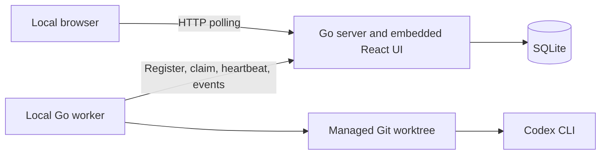

# Factory V2 MVP

> **Status:** Proposed for review

> **Implementation:** The control plane, UI, and local Unix worker execution
> core are implemented. Durable worker manifests, restart reconciliation,
> retained-worktree limits, and the cleanup CLI remain in issue #132.

## 1. Executive summary

Factory V1 is a local Rust supervisor that can watch one repository or an
explicit repository fleet and run Codex or Claude Code on the same machine. It
is reliable, but it has no shared API or UI and cannot show independently
registered workers.

The V2 MVP adds the smallest useful control-plane and worker split. A local Go
server serves a React UI and stores tasks in SQLite. One local Go worker
registers with the server, polls for work, and launches Codex in a managed Git
worktree. The UI shows registered workers and lets the operator delegate a
titled task to one worker. The task description is the Codex prompt.

The MVP is local-only, Unix-only, Codex-only, and manually triggered. It has no
login, OIDC, source poller, scheduler, Postgres, WebSocket, remote worker,
automatic retry, or workflow synchronization. The main downside is that it does
not yet deliver the full fleet architecture. It proves the control-plane
boundary and preserves the hard reliability work before adding scale.

## 2. Context and scope

V1 combines source polling, scheduling, durable task storage, workspace
management, process supervision, and agent execution in one local supervisor.
It can coordinate an explicit fleet of repository-owned configurations and
supports Codex, Codex Minimal, and Claude Code runtimes. It uses SQLite and has
strong behaviour around cancellation, bounded output, worktree ownership, and
repository-safe recovery.

V2 changes one boundary: task coordination moves into a server, while workspace
and agent execution move into a worker process. The first worker runs on the
same machine as the server. The browser, server, and worker communicate through
ordinary HTTP polling.

The API and UI can hold several worker registrations so assignment behaviour
is real from the start. The supported MVP deployment still runs those workers
on the control-plane host. Remote worker transport and authentication come
later.

Workers may advertise several repositories. Repository is therefore a
first-class task field rather than server-wide configuration. The MVP can
delegate manual tasks across several local repositories even though automatic
GitHub ingestion comes later.

V1 remains present and usable. V2 is added beside it with separate binaries,
state, configuration, and tests. The MVP does not import V1 history or replace
the V1 daemon.

Success means a person can start the server and worker, open the UI, see the
worker and its repositories, delegate a titled task, watch Codex run, inspect
the result, and cancel a run without using the V1 process.

## 3. System context



The server owns durable coordination. It does not run Codex or touch repository
working trees. The worker owns local execution. It does not read or write the
server database. Codex owns adaptive engineering work inside its worktree.

The server listens only on `127.0.0.1`. The browser and worker must run on the
same host. Remote network access is not part of the MVP.

## 4. Proposed design

### How it works

The operator starts `factory-server`. It opens its SQLite database, applies
migrations, serves the compiled UI, and begins accepting worker heartbeats.

The operator starts `factory-worker` with one or more configured repository
paths. The worker creates a stable worker ID on first start, verifies Git and
Codex, and registers its name, health, Codex version, capacity, and repository
identities with the server.

The operator opens the UI. The Workers page shows the local worker as online,
with its Codex version, capacity, and repositories. The operator opens the task
drawer, enters a title and description, chooses the worker and one of that
worker's repositories, and delegates the task. The server stores the normalized
task and one execution targeted to that worker.

The worker reserves its one local execution slot, creates a claim request ID
and opaque lease token, then polls the claim endpoint. The server atomically
changes the execution from `queued` to `preparing`, creates an attempt, and
stores the claim result. Replaying the same request returns the same attempt.

The worker creates a managed Git worktree using the configured repository path.
It then starts Codex and moves the attempt to `running`. While Codex runs, the
worker renews the lease and sends bounded progress events. The browser polls
the task detail endpoint every two seconds and shows new events.

When Codex exits, the worker posts the result. The server accepts it only when
the lease still owns the attempt. It records `succeeded`, `failed`, or
`cancelled`. Successful clean worktrees are removed. Failed, cancelled, dirty,
or unpublished worktrees are retained for inspection.

### Components and responsibilities

#### `factory-server`

The server owns the HTTP API, UI assets, SQLite migrations, worker health,
tasks, attempts, leases, cancellation requests, and bounded event history. It
depends on SQLite and the compiled UI. It does not execute source adapters,
Git, Codex, or sandbox commands.

#### `factory-worker`

The worker owns runtime health checks, local capacity, repository path mapping,
worktree lifecycle, Codex process supervision, event collection, lease renewal,
and cancellation. It depends on Git, Codex, and a Unix process model. It does
not schedule tasks, choose global task priority, or access SQLite.

Each attempt runs through a small supervisor subprocess of the worker binary.
The supervisor owns the Codex process group and watches a control pipe from the
main worker. Parent exit closes the pipe, which makes the supervisor terminate
Codex before it exits. Every successful server lease renewal also sends a new
lease deadline over the pipe. The supervisor terminates Codex when that
deadline passes even if the main worker is hung or stopped. The main worker
records the supervisor process ID, process identity, and process-group ID for
startup reconciliation.

#### React UI

The UI owns task creation, task and attempt display, worker health display, and
cancellation controls. It depends only on the server API. It does not contain a
second copy of server state or talk directly to workers.

The UI has four MVP surfaces:

- Work is the default view. It shows queued, running, succeeded, failed, and
  cancelled tasks as compact status columns on desktop and one grouped list on
  narrow screens.
- Workers shows every registered worker, health, active and total capacity,
  Codex version, repositories, and last-seen time.
- Delegate task is a drawer containing title, description, worker, repository,
  and timeout.
- Task detail shows the description, assigned worker, status, elapsed time,
  progress, result, cancellation, and retry.
- Worker detail shows retained worktrees and the exact local cleanup command for
  each one.

### Decisions

#### Local-only with no login

The MVP has no browser login or OIDC. OIDC is a protocol for delegating login to
an external identity provider. It is useful when several people access a
hosted control plane, but it adds configuration, redirects, sessions, roles,
and failure modes that do not help a single local operator.

The server binds to loopback and refuses a non-loopback address. This limits
network exposure but does not authenticate local callers. The actual trust
boundary is the trusted single-user host and its local processes.
Authentication must be designed before remote binding or remote workers are
supported.

#### SQLite instead of Postgres

One server process owns one SQLite database in WAL mode. Twenty workers would
not by itself require Postgres, but remote workers and high availability are
outside this MVP anyway. SQLite removes a service, credentials, migrations
across deployments, and local setup work. Postgres is reconsidered only if
more than one server process must coordinate the same state.

#### HTTP polling only

Workers and browsers use short HTTP requests. There are no WebSockets,
server-sent events, brokers, or held claim requests. This costs up to one poll
interval of latency and keeps one simple request path authoritative.

#### Manual tasks only

The MVP accepts tasks from the UI. It has no source poller, schedule evaluator,
repository workflow sync, cron support, or external ticket identity. Those
features can create tasks through the same service after the worker path is
proven.

#### One normalized task contract

Every task has a title and description. The description is the agent prompt.
It also selects one registered worker and one repository advertised by that
worker. There is no separate prompt shape for the UI, future ticket pollers, or
future schedules. Each input maps its source into the same task service.

Provider-specific payloads were rejected for the MVP because they would leak
GitHub or Jira concepts into worker execution. A later source integration may
add origin, external ID, and URL beside the task, but title and description
remain the execution input.

#### Multi-repository by construction

The control plane has no singleton current repository. A worker advertises each
repository it can serve, and every task names one repository ID. Worktree
ownership, retained-worktree limits, task history, and UI filters remain
repository-scoped.

The later ingest extension is a separate Go process that may monitor up to ten
configured GitHub repositories. It maps each eligible item to repository,
title, description, and configured worker, then calls the same task API as the
UI. It holds GitHub credentials locally, keeps an independent cursor and error
state per repository, and polls at most two repositories concurrently. One
broken repository does not stop the other nine.

The normalized future flow is:

```text
GitHub item -> repository + title + description -> task -> worker -> pull request
```

The final pull request remains an agent outcome governed by the task
description and human review. It is not a deterministic control-plane action.

#### Multica-inspired visual system

The UI follows the useful parts of
[Multica's](https://github.com/multica-ai/multica) visual language without
copying its branding or code. It uses a quiet neutral shell, white content
surfaces, compact rows and cards, subtle borders, semantic design tokens, and
colour only for status and important actions. Active work stays visible while
old attempt detail is collapsed. Secondary actions appear on hover or in a
small menu.

The design avoids large metric tiles and infrastructure-heavy dashboards. Work
is the primary surface and Workers is the operational surface.

#### Codex only

The worker directly implements the Codex adapter. The protocol still records
the runtime name as `codex`, but the code does not introduce a plugin system for
one implementation. A runtime interface is extracted when a second runtime is
implemented in V2. V1's existing generic runtime support remains available and
is not removed.

#### Keep task, execution, and attempt

A task is the user's titled intent and description. An execution is its
assignment to one worker and runtime. An attempt is one worker process
invocation. The MVP creates one Codex execution per task, but retaining these
three records avoids mixing user intent with assignment and lease history.

#### Keep leases and process supervision

The worker renews a short lease while it owns work. Lease tokens fence late
writes after a crash. If the worker loses the server, it stops Codex before the
lease expires. This is more work than a basic queue, but it is part of the
reliability kernel and prevents overlapping agents.

#### React SPA embedded in Go

The UI is a TypeScript React application built with Vite and TanStack Query.
The Go binary embeds and serves the production assets. There is no Node process
in production and no cross-origin API configuration. Client-side task and
worker detail routes fall back to the embedded application shell. Hashed assets
are cached immutably, the shell is not cached, and the server applies a
same-origin content security policy to the UI.

## 5. Invariants and requirements

### Invariants

1. At most one unexpired attempt owns an execution.
2. Attempt writes require the current opaque lease token.
3. Replaying one claim request returns the same attempt or the same empty result.
4. A worker reserves a local slot before it asks for work.
5. A worker claims only executions assigned to its worker ID.
6. An execution targets only a repository advertised by its assigned worker.
7. A terminal attempt never becomes active again.
8. Task state is computed from execution state and is not stored separately.
9. Losing the lease causes the supervisor to stop the complete Codex process
   group even when the main worker is hung.
10. The server never receives an arbitrary local working-directory path from a
   task.
11. Task title, description, worker, and repository do not change after
    creation.
12. One exclusive process owns a worker data directory at a time.
13. Cleanup touches only a manifest-recorded V2 worktree below the worker data
    directory.
14. Prompts, command arguments, model reasoning, and secrets do not enter normal
   server logs.
15. V2 never changes the V1 SQLite database or V1 managed workspaces.

### Requirements

- The server must refuse non-loopback listen addresses.
- The worker must run on Unix and report a clear error on unsupported systems.
- The worker must persist its worker ID across restarts.
- The worker must hold an exclusive lock on its data directory for its complete
  lifetime and refuse to start when another process holds it.
- The worker must advertise its repositories, Codex version, health, capacity,
  active count, worker version, and last heartbeat.
- A worker is online when its last heartbeat is no more than thirty seconds
  old. Otherwise the UI shows it as offline and it cannot claim work.
- The UI must show Work, Workers, Delegate task, and Task detail surfaces.
- Workers must show worker name, online state, capacity, active count, Codex
  version, repositories, worker version, and last-seen time.
- Task creation must accept a title, description, worker, repository, timeout,
  and client request key.
- Title is required and limited to 200 Unicode characters.
- Description is required, limited to 64 KiB, and becomes the Codex prompt.
- Choosing a worker must restrict the repository choices to repositories that
  worker advertised.
- One worker may advertise and execute tasks for several repositories.
- An offline worker remains selectable, but the UI must warn that its task will
  remain queued until the worker returns.
- Task title must appear on the Work view, task detail, and active worker work.
- The UI must use semantic tokens for application canvas, surface, raised
  surface, border, text, muted text, selection, and task status.
- The server must reject duplicate request keys without creating duplicate
  tasks.
- The server must return the original result when a claim request is repeated.
- The worker must claim the oldest eligible queued execution assigned to its
  worker ID after filtering for repositories it currently advertises and for
  repositories below their retained-worktree limit.
- The worker must renew an active lease every ten seconds.
- Cancellation must immediately terminate queued work and reach connected
  active work within ten seconds.
- The worker must enforce a task timeout capped at eight hours.
- Automatic retry is not supported. An operator may create a new attempt with
  an explicit retry action.
- Disabling a worker and worker labels are not supported in the MVP.
- Configuration changes apply after a worker restart. Hot reload is not
  required.
- The worker must list retained worktrees and provide preview and confirmed
  cleanup commands.

## 6. Interfaces and data

### Repository layout

V1 stays at the repository root. V2 is added beside it:

```text
Cargo.toml                 # V1
src/                       # V1
tests/                     # V1

go.mod                     # V2
cmd/
  factory-server/
  factory-worker/
internal/
  controlplane/
  worker/
  protocol/
web/
migrations/
docs/v2-architecture/
```

The Go server and worker packages do not import one another. Both depend on
small protocol types. The MVP uses one handwritten TypeScript API client.
OpenAPI generation is deferred until another API consumer makes contract drift
a real problem.

### Server API

The first API surface is:

- `PUT /api/v1/workers/{worker_id}` registers or updates the local worker and
  acts as its heartbeat.
- `POST /api/v1/workers/{worker_id}/claims` accepts a worker-generated request
  ID and lease token, claims at most one eligible execution, and returns `204`
  when no work is available. Exact replay returns the stored result.
- `POST /api/v1/attempts/{id}/start` records that Codex started.
- `PUT /api/v1/attempts/{id}/heartbeat` renews the lease and returns whether
  cancellation was requested.
- `POST /api/v1/attempts/{id}/events` stores an ordered event batch.
- `POST /api/v1/attempts/{id}/complete` records one terminal result.
- `GET /api/v1/attempts/{id}` returns state for worker startup reconciliation.
- `GET /api/v1/workers` returns current worker health.
- `GET /api/v1/workers/{id}` returns worker detail and advertised repositories.
- `GET` and `POST /api/v1/tasks` list and create tasks.
- `GET /api/v1/tasks/{id}` returns task, execution, attempt, and result detail.
- `GET /api/v1/attempts/{id}/events?after=N` returns later events.
- `POST /api/v1/tasks/{id}/cancel` cancels a queued execution immediately or
  records desired cancellation for its active attempt.
- `POST /api/v1/executions/{id}/retry` requeues a failed or cancelled
  execution. Its next claim creates the new attempt.

Task creation accepts one normalized body:

```json
{
  "request_key": "4a11cc72-2bb7-4f5e-92d6-e1d2087f6d94",
  "title": "Fix stale worker status",
  "description": "Find and fix the stale worker status bug. Add a regression test.",
  "worker_id": "3f441724-98c3-43ac-97f7-f87c92cbb9a8",
  "repository_id": "b3195042-65f3-47b8-80e2-a5d09db33a31",
  "timeout_seconds": 7200
}
```

The server trims the title, rejects a blank title or description, preserves
description whitespace, validates the worker and repository relationship, and
stores the body before returning `201`. It does not accept a separate `prompt`
field. The worker builds the Codex input from a fixed Factory safety preamble,
task title, task description, and repository identity.

A claim body contains:

```json
{
  "request_id": "3dc612bd-5eea-4385-b66b-bdcbb6c5d157",
  "lease_token": "worker-generated-256-bit-secret"
}
```

`(worker_id, request_id)` is unique. In one SQLite transaction, the server
stores either the claimed attempt ID or an empty result and stores only the
SHA-256 digest of the supplied lease token. Repeating the same body returns the
same attempt only while that attempt is active and its lease is unexpired.
Replaying an expired or terminal claim returns `409 lease_not_owner`, and the
worker must not create a worktree or start Codex. Reusing the request ID with a
different token returns `409 claim_request_conflict`. Empty claim records
return `204` for five minutes, which is longer than the ten-second HTTP request
deadline. The worker creates a new request ID after receiving `204`.
Attempt-backed records remain with attempt history.

The worker polls for a claim every two seconds while it has capacity. Empty
polls add 20 percent jitter. Transport failures back off from one second to
thirty seconds. The UI polls the task list every five seconds, active task
detail every two seconds, and worker health every ten seconds. A hidden browser
tab pauses polling and refreshes when visible.

Worker list and detail responses include the title of the most recently updated
active execution, when one exists. This keeps the control plane authoritative
for the Workers surface instead of asking the browser to join task state into a
second local model.

### Data

`workers` stores the worker ID, name, worker version, Codex version, capacity,
active count, health, retained-worktree summaries, registration time, and last
heartbeat.

`repositories` stores the repository ID and normalized Git remote identity.
`worker_repositories` records which repositories each worker currently
advertises and the worker's configured display key.

`tasks` stores the task ID, client request key, title, description, repository
ID, timeout, and created time. It does not store state.

`executions` stores the execution ID, task ID, assigned worker ID, required
runtime, state, and created time. The MVP always uses `codex`.

`attempts` stores the attempt ID, execution ID, worker ID, attempt number,
state, lease digest, lease expiry, process observations, result, error, and
timing.

`claim_requests` stores worker ID, request ID, lease digest, optional attempt
ID, and created time. Its unique worker and request ID pair makes claim retries
idempotent.

`attempt_events` stores `(attempt_id, sequence)`, event kind, bounded payload,
and server time. The pair is unique, so replaying a batch is safe.

### State model

Execution state is authoritative. Task state is calculated when queried from
its execution. The MVP has one execution per task, so the mapping is exact.
`preparing` appears as `running` at task level.

| Operation | Required execution | New execution | Attempt change |
| --- | --- | --- | --- |
| Create task | none | `queued` | none |
| Claim | `queued` | `preparing` | create `preparing` |
| Start Codex | `preparing` | `running` | `preparing` to `running` |
| Complete successfully | `running` | `succeeded` | `running` to `succeeded` |
| Complete with error | `preparing` or `running` | `failed` | active to `failed` |
| Cancel queued | `queued` | `cancelled` | none |
| Finish cancellation | `preparing` or `running` | `cancelled` | active to `cancelled` |
| Lease expiry | `preparing` or `running` | `failed` | active to `lost` |
| Explicit retry | `failed` or `cancelled` | `queued` | none until next claim |

Every transition and its related attempt update occur in one SQLite
transaction. A terminal attempt never changes. A stale lease token cannot
change an execution after another attempt exists.

### Worker configuration

The worker uses one local TOML file:

```toml
server = "http://127.0.0.1:7337"
name = "owains-mac"
max_concurrent = 1
data_directory = "/Users/owainlewis/.factory-v2/workers/owains-mac"

[repositories.factory]
path = "/Users/owainlewis/Code/github/owainlewis/factory"
```

Repository keys are operator-chosen stable names. Paths are canonicalized at
startup. Missing, duplicate, non-Git, or unreadable paths stop registration.
Changing a path for an existing key changes where future work runs but does not
move retained worktrees. Two local worker processes must use different data
directories. The worker takes an exclusive advisory lock on
`<data_directory>/worker.lock` before reading its ID or manifests and holds the
lock until exit.

### Local attempt manifest and worktree ownership

Before creating a worktree, the worker atomically writes
`attempts/<attempt_id>.json` using a same-directory temporary file, file
`fsync`, rename, and parent-directory `fsync`. The initial manifest has empty
process fields and contains:

- schema version, worker ID, task ID, execution ID, and attempt ID;
- repository ID, canonical source path, remote identity, and base commit SHA;
- V2 worktree path and branch name;
- supervisor process ID, process identity, process-group ID, and lease deadline;
- lifecycle state, created time, updated time, and cleanup result.

Every manifest change uses a same-directory temporary file, file `fsync`,
rename, and parent-directory `fsync`. Codex cannot start until the update
containing supervisor process identity and process-group identity is durable.
Lease deadline, lifecycle, retention, and cleanup changes use the same update
sequence.

V2 worktrees exist only below `<data_directory>/worktrees/`. Their local branch
uses `factory-v2/<task-id-prefix>-<attempt-id-prefix>`. Before removal, cleanup
checks the manifest, canonical path, worker ID, repository identity, branch,
and `git worktree list`. A path outside the V2 worktree root, a missing
manifest, or any identity mismatch stops cleanup. V2 never removes a V1
worktree or branch.

`factory-worker cleanup ATTEMPT_ID` prints the manifest, Git status, branch, and
retention reason without changing anything. Adding `--confirm` first durably
marks the verified manifest `cleanup_started`, then removes only that worktree,
then durably marks the manifest cleaned. If the worker crashes after recording
`cleanup_started`, startup may finish the recorded cleanup. It does not delete
a pushed branch or pull request.

### Naming and identity

The worker creates a UUID on first start and stores it with owner-only
permissions in its data directory. Deleting that file creates a new worker.
The old worker remains offline in history.

The server creates repository, task, execution, and attempt UUIDs. The client
request key is a browser-generated UUID unique in the database. Repository
identity is the normalized Git remote identity. The worker's configured key is
its display name for that repository.

If two workers advertise the same normalized remote, the server links both to
one repository. If a configured key later resolves to a different remote, the
worker reports a configuration error until the operator chooses a new key.

The worker generates each random 256-bit lease token and keeps it in memory.
SQLite stores only its SHA-256 digest. The token's entropy prevents an offline
database reader from guessing the raw value.

V2 state is stored below `~/.factory-v2/` by default:

```text
~/.factory-v2/
  server/factory.sqlite3
  server/factory.sqlite3.v2-control-plane
  workers/owains-mac/worker-id
  workers/owains-mac/attempts/
  workers/owains-mac/worktrees/
```

The server writes the adjacent `v2-control-plane` marker before creating its
database. It refuses to open an existing database without that marker, which
keeps an accidentally selected V1 or unrelated SQLite file untouched.

`FACTORY_V2_DATA_HOME` may override the root. V2 refuses a data root containing
a V1 database marker, and V1 never searches this path.

## 7. Failure behavior and lifecycle

If SQLite cannot open or migrate, the server exits without serving the UI. If
the database becomes unavailable at runtime, mutating endpoints return `503`
and claims stop.

On startup and every five seconds, the server runs one expiry transaction. It
changes each expired active attempt to `lost` and its execution to `failed`
only when the stored attempt ID and lease expiry still match. This makes dead
work visible without requiring another worker request.

If Codex or Git is missing or unhealthy, the worker reports unhealthy and does
not claim work. It repeats health checks every thirty seconds and recovers
without a restart.

If an assigned worker is offline, its execution remains queued. If it returns
with the assigned repository, it may claim the execution on its next poll. If
it no longer advertises that repository, the task detail shows
`repository unavailable` and the execution remains queued until the
configuration is restored.

An attempt lease lasts thirty seconds. The worker renews it every ten seconds
and retries a failed renewal every two seconds. If thirty seconds pass after
the last successful server response, the worker terminates the Codex process
group. A late heartbeat, event, or completion receives
`409 lease_not_owner`.

If the main worker crashes, its control pipe closes. The per-attempt supervisor
then terminates Codex and its descendants. If the supervisor crashes while the
main worker remains alive, the worker terminates the recorded process group.
After each successful server renewal, the main worker gives the supervisor a
new monotonic deadline. Missing that deadline terminates the process group even
when the main worker is hung or stopped.

After a complete restart, the worker reads every local attempt manifest before
registering. It verifies recorded process identity, terminates any remaining
owned process group, asks the server for the attempt state, and compares the
manifest path with both the filesystem and `git worktree list`. A correctly
registered worktree whose durable state is `cleanup_started` is revalidated,
removed, and durably marked cleaned before other classification. An absent
worktree in `cleanup_started` is durably marked cleaned. A correctly registered
worktree in any other non-terminal state is marked retained. A manifest written
before worktree creation whose path is absent from both sources is marked
`not_created` and does not consume retained capacity. A path present in only
one source, or with an identity mismatch, is marked inconsistent and makes the
worker unhealthy until the operator resolves it. Any other unexpectedly absent
previously created worktree is marked missing, reported in worker detail, and
does not consume retained capacity. The worker never resumes Codex
automatically and does not claim new work until reconciliation finishes.

If the terminal request is lost, the worker retries it with the same lease
token. The server returns the stored terminal result when it already accepted
the request.

Cancelling a queued task changes its execution to `cancelled` immediately.
Cancelling active work records desired cancellation. The next attempt heartbeat
returns that state. The worker sends a graceful termination signal, waits five
seconds, then kills the process group. If it cannot prove that the group
stopped, it marks itself unhealthy and accepts no more work.

Ctrl-C on the worker stops claims, cancels active Codex processes, waits up to
thirty seconds, records best-effort terminal state, and exits. Ctrl-C on the
server stops new requests, waits up to ten seconds for active HTTP requests,
flushes SQLite, and exits. The worker then reaches its lease deadline and stops
Codex if the server does not return.

Successful clean worktrees are removed after completion. Failed, cancelled,
dirty, or unpublished worktrees are retained. The worker retains at most ten
per repository. At a repository's limit it continues heartbeats and may claim
work for other advertised repositories, but it does not claim more work for
that repository. The Workers page groups retained attempt IDs and their cleanup
commands by repository. The operator previews and confirms cleanup through
`factory-worker cleanup`.

## 8. Security, privacy, and operations

The MVP has no application authentication because the server is reachable only
on loopback. It must validate the configured listen address at startup and
must not provide an override that binds publicly.

Any local user or process able to reach loopback can use the UI and API. The
supported MVP therefore requires a trusted single-user host where all local
processes are in the operator's trust boundary. Remote workers, shared users,
public binding, multi-user hosts, and hosted deployment require a separate
authentication and transport design before implementation.

The server accepts browser mutations only as same-origin JSON requests. It
checks `Host`, rejects cross-origin `Origin` values, sends no permissive CORS
headers, and rejects form content types. This prevents an unrelated website
from using the operator's browser to submit local tasks.

Git, GitHub, Codex, and sandbox credentials stay on the worker. The server
stores no credential values. Prompts and agent summaries are sensitive project
data and remain in the local SQLite database until removed.

Managed worktrees isolate branch and working-tree state. They do not isolate
the host filesystem, process list, network, or credentials. The MVP is suitable
only for trusted local tasks.

The server limits an API body to 1 MiB. An event batch contains at most 100
events and 256 KiB. One event is at most 64 KiB. One attempt stores at most
10 MiB of events, a 256 KiB result, and a 64 KiB error. When the event budget
is full, progress events are rejected while heartbeat, cancellation, and
terminal completion continue to work.

The worker defaults to one concurrent Codex process. The maximum supported MVP
value is four. Each task timeout defaults to two hours and cannot exceed eight
hours.

The server exposes a basic health endpoint and writes structured logs with
request IDs. Logs include IDs, state changes, durations, and error classes.
They exclude prompts, event payloads, command arguments, environment values,
and model output.

## 9. Acceptance criteria

- V1 builds and tests without changes to its behaviour or state paths.
- The Go server starts with no external database or Node production process.
- The server refuses `0.0.0.0`, a non-loopback IP, and an externally resolving
  hostname.
- One Unix worker registers and appears online in the UI.
- Two simulated workers register with different capacity and repositories, and
  both appear correctly on the Workers page.
- An unhealthy Codex installation appears unhealthy and receives no work.
- The Delegate task drawer requires title, description, worker, and one of that
  worker's repositories.
- A task stores title and description once when its request is repeated.
- A task delegated to worker A cannot be claimed by worker B.
- The worker claims the task, creates a managed worktree, starts Codex, reports
  progress, and records the result.
- Tasks for two repositories advertised by one worker create worktrees from the
  correct repository in both cases.
- A second claim cannot own an execution with an unexpired attempt.
- Losing a successful claim response and replaying the same request while its
  lease is active returns the same attempt without creating another attempt.
- Replaying that request after lease expiry returns `lease_not_owner` and does
  not create a worktree or start Codex.
- The server startup sweep and periodic sweep mark expired active attempts
  `lost` and their executions `failed`.
- Cancelling queued work assigned to an offline worker makes it `cancelled`
  without creating an attempt.
- UI cancellation stops Codex and its child processes within fifteen seconds.
- Disconnecting the worker from the server stops Codex within thirty seconds of
  the last successful lease renewal.
- Killing and restarting the worker leaves no unattended Codex child and does
  not create an overlapping attempt.
- Stopping the main worker process without closing its pipe causes the
  supervisor deadline to stop Codex within thirty seconds of the last renewal.
- A second worker process using the same data directory is refused while the
  first holds its lock.
- The UI works through HTTP polling with no WebSocket or server-sent event
  connection.
- A failed task can be retried only through an explicit operator action.
- Ten retained worktrees for one repository stop new claims for that repository
  without stopping heartbeats, task inspection, or claims for another
  repository. Preview and confirmed cleanup of one manifest-owned worktree
  restores that repository's capacity without deleting its branch or any V1
  path.
- Startup reconciliation distinguishes a worktree that was never created, a
  partially created or inconsistent worktree, a removed worktree, a missing
  worktree, and a genuinely retained worktree. Only genuinely retained
  worktrees consume retained capacity. A crash after the durable
  `cleanup_started` update is recovered by finishing removal when the verified
  worktree remains, or by recording cleaned when it is already absent, before
  the durable cleaned update. An absent created worktree without
  `cleanup_started` is reported missing.
- Before every worktree is created, its initial manifest is durably written
  through a same-directory temporary file, file `fsync`, rename, and
  parent-directory `fsync`. Every later manifest update is durable, and process
  identity is recorded before Codex starts.
- V2 never opens or modifies a V1 SQLite database.

## 10. Test approach

State tests prove every row in the transition table, computed task state,
terminal monotonicity, duplicate task requests, queued cancellation, lease
fencing, and explicit retry behaviour.

SQLite integration tests run concurrent claims against a real temporary
database. They prove that one execution has one owner, lost claim responses are
idempotent, conflicting claim requests fail, event replay is idempotent, and
startup and periodic expiry sweeps close dead attempts.

Worker tests use a fake Codex executable that emits events, exits with selected
codes, hangs, forks children, and ignores graceful termination. Tests cover
timeout, cancellation, server loss, main-worker crash, stopped main worker,
supervisor crash, exclusive data-directory locking, atomic manifests, startup
reconciliation, safe cleanup, full output, and retained worktree capacity.

HTTP contract tests cover every endpoint, malformed input, body limits, stale
leases, and terminal retries.

Browser tests cover the Multica-inspired Work and Workers views, task
delegation, worker-specific repository choices, offline warnings, task
progress, failure, cancellation, retry, long text, and narrow layouts against
the real Go server and fake worker. Screenshot checks verify the semantic
surface hierarchy and status treatment in light mode.

The full repository check runs the existing Rust checks plus Go formatting,
static analysis, Go tests, the UI build, and browser tests.

## 11. Risks and tradeoffs

- The Go worker may lose V1 supervision behaviour. Port the existing
  process-group, cancellation, output-bound, worktree, and recovery tests before
  trusting real Codex work.
- Local-only access does not prove remote fleet security. The server must refuse
  public binding so this limitation cannot become an accidental deployment.
- SQLite prevents multiple active server replicas. This is an intentional MVP
  limit and does not block several workers once remote authentication exists.
- Manual tasks do not prove source polling or schedule behaviour. Add those
  only after the task and worker lifecycle is reliable.
- Multi-repository ingest will add GitHub rate limits and failure isolation.
  Keep it outside the MVP while preserving repository IDs in every task.
- The three-record task model costs more code than one queue table. It preserves
  clean lease history and avoids a migration when explicit retries arrive.
- Retained worktrees consume disk. The hard limit stops new claims and makes
  cleanup an explicit operator action.

## 12. Open questions

There are no blocking open questions for the MVP.

## 13. Out of scope

- Windows workers.
- Browser login, OIDC, users, roles, and sessions.
- Public or private-network server binding.
- Remote workers and worker authentication.
- TLS termination.
- Postgres and multiple server replicas.
- Source polling, ticket ingestion, and source revalidation, including the
  ten-repository ingest stretch goal.
- Schedules and cron.
- Repository workflow synchronization.
- Claude Code and runtime plugins.
- Worker labels, pools, placement rules, and task priority.
- Automatic retries.
- WebSockets, server-sent events, and message brokers.
- OpenAPI generation.
- Docker Sandbox execution.
- V1 history migration or V1 cutover.
- Automatic merge.
