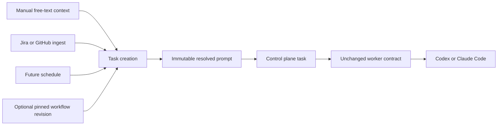

# Reusable workflows for Factory V2

> **Status:** Proposed for review

## 1. Executive summary

Factory V2 can delegate a free-text task to a worker, but every operator must
remember and rewrite the team's implementation, review, and maintenance
process. This makes the result depend on personal agent skills and local
habits. V2 will add reusable workflows: named, versioned prompts stored by the
control plane. A task becomes free-text context plus an optional workflow. The
control plane saves the exact resolved prompt, and the worker runs it through
its existing agent contract. The main downside is that prompts standardize the
agent's process but cannot guarantee that every worker has the same tools or
credentials.

## 2. Context and scope

The implemented [V2 architecture](../v2-architecture/design.md) accepts a
title, description, worker, repository, and timeout. The description becomes
the agent prompt. This is a useful normalized execution contract, but it has no
shared place for team instructions such as coding standards, sub-agent review,
ticket updates, verification, and pull-request templates.

This change adds a control-plane workflow library and lets manual delegation,
future source pollers, and future schedules use the same workflow. Manual
context remains free text. It may contain a Jira ticket, merge-request URL,
branch, repository request, or ordinary instructions. Factory does not require
the operator to classify or parse that text.

This design changes prompt creation in the control plane. It does not change
worker assignment, leases, attempts, worktrees, runtime selection, or
cancellation.

## 3. System context



The control plane owns workflow definitions, revisions, prompt composition,
and task snapshots. A workflow record owns stable identity, enabled state, and
its current revision. Each immutable revision contains the workflow name,
summary, and instructions. The worker receives one resolved prompt and does
not fetch, interpret, or synchronize workflows. External systems may add
provenance for deduplication, but that metadata is not part of the agent
execution contract.

## 4. Proposed design

### How it works

An operator creates a workflow named `Implement a ticket`. Its instructions
tell the agent to read the live ticket, inspect the repository, implement the
change, run checks, request an independent review, address findings, open a
pull request, and update the ticket. Saving creates revision 1.

The operator opens Delegate task, selects that workflow, chooses a worker and
repository, and enters:

```text
Work on JIRA-123:
https://jira.example.com/browse/JIRA-123
```

The UI selects the workflow's current revision and submits that immutable
revision ID. In one transaction, the server verifies that the revision belongs
to an enabled workflow, stores the free-text context, composes the resolved
prompt, and creates the task and execution. The resolved prompt has stable
sections:

```text
Follow this workflow:

<workflow instructions>

Work on this context:

<free-text context>
```

The worker adds its existing fixed Factory safety preamble, title, and
repository identity, then runs the resolved prompt. Task detail shows the
workflow name and revision, the original context, and the resolved prompt.

Choosing `Blank task` stores no workflow reference. In that case the context is
also the resolved prompt, preserving current behavior.

### Components and responsibilities

#### Control-plane store and API

The control plane owns workflow identity, immutable revisions, enabled state,
prompt composition, size validation, and task snapshots. It depends on SQLite.
It does not execute workflows or inspect the meaning of their instructions.

#### React UI

The UI owns workflow management, workflow selection, and free-text context
entry. It depends on the control-plane API. It does not compose prompts or
store workflow state outside the server.

#### Worker

The worker owns agent execution exactly as it does today. It depends on the
resolved prompt included in a claim. It does not know whether the task used a
workflow or came from a person, poller, or schedule.

#### Pollers and schedules

A poller or schedule creates a normal task with context and an optional pinned
workflow revision ID. It may attach source metadata for deduplication and
display. It does not copy workflow text or compose the final prompt.

### Decisions

#### Context stays free text

Manual context is one free-text field. Factory does not require ticket, merge
request, branch, or repository target types. Typed work-item schemas were
rejected because agents already understand these references and the schemas
would add provider-specific UI and validation before it is needed. Automated
sources may store structured provenance without changing manual delegation.

#### Workflows are prompts, not programs

A workflow is Markdown instructions. There is no template language, step
graph, condition, shell action, tool installer, or runtime override. This keeps
policy in a readable prompt and execution mechanism in Factory. Deterministic
approval or deployment stages require a separate design if they become
necessary.

#### Tasks snapshot the resolved prompt

Workflow edits affect only tasks created after the edit. Every task stores its
workflow name, revision number, context, and resolved prompt. An execution
retry uses the existing task snapshot. This was chosen over resolving a
workflow at claim time because late resolution would make queued work change
without an operator action.

#### Workflows are shared across repositories

The first workflow library belongs to the control plane, not one repository.
The same implementation or review process can therefore be used across a
fleet. Repository-specific instructions remain in the repository and may be
referenced by the workflow. Repository scoping and workflow import or export
are deferred.

#### The server composes prompts

The server, not the browser, poller, or worker, creates the resolved prompt.
This gives every task source the same behavior and lets the worker remain a
small runtime-specific data plane.

## 5. Invariants and requirements

### Invariants

1. A workflow revision never changes after it is created.
2. A task's context and resolved prompt never change after task creation.
3. A task with a workflow records the exact workflow name and revision used.
4. Workflow edits and disables do not change queued, running, or terminal
   tasks.
5. Blank tasks resolve to their free-text context without added workflow text.
6. The control plane is the only component that composes workflow and context.
7. Workers receive a resolved prompt and do not read workflow records.
8. A disabled workflow cannot be used for a new task.
9. Context is stored separately and never overwrites workflow instructions.
10. Existing tasks created before this feature keep their original prompt.

### Requirements

- Workflow name is required, ASCII case-insensitively unique, and limited to
  100 Unicode characters. Non-ASCII bytes are compared exactly.
- Workflow summary is optional and limited to 500 Unicode characters.
- Workflow instructions are required and limited to 48 KiB. This reserves at
  least 16 KiB for composition labels and useful task context.
- Manual context is required and remains limited to 64 KiB.
- The complete resolved prompt is limited to 64 KiB after UTF-8 composition.
- The final agent input, including the safety preamble, title, repository
  identity, and resolved prompt, is limited to 72 KiB and is validated by the
  control plane before task creation.
- Editing a workflow's name, summary, or instructions creates the next integer
  revision rather than updating text in place.
- Workflow lists are paginated with the existing task-list limits: 50 by
  default and 200 at most.
- A workflow retains at most 100 revisions. Creating another revision at that
  limit is rejected; revisions are not pruned while external requests may
  still refer to them.
- The UI offers `Blank task` and every enabled workflow in Delegate task.
- Task detail shows context separately from the workflow snapshot.
- Exact execution retry continues using the task's stored resolved prompt.
- Disabling a workflow takes effect for new task creation immediately and does
  not cancel work.

## 6. Interfaces and data

The API adds:

- `GET /api/v1/workflows?name=NAME&enabled=BOOL&limit=N&cursor=C` lists bounded
  workflow summaries. Optional exact-name and enabled filters are applied
  before cursor pagination.
- `POST /api/v1/workflows` creates a workflow and revision 1. Its body includes
  a client mutation key.
- `GET /api/v1/workflows/{id}` returns metadata and the current revision.
- `POST /api/v1/workflows/{id}/revisions` creates and activates a new revision.
  Its body includes a client mutation key and the expected current revision ID.
- `PUT /api/v1/workflows/{id}/enabled` idempotently enables or disables use.

Task creation keeps `description` as the free-text context for API
compatibility and adds an optional pinned `workflow_revision_id`:

```json
{
  "request_key": "4a11cc72-2bb7-4f5e-92d6-e1d2087f6d94",
  "title": "Implement JIRA-123",
  "description": "Work on JIRA-123: https://jira.example.com/browse/JIRA-123",
  "workflow_revision_id": "9ec13fe1-4f41-49e2-94c9-5bb4b7f3c807",
  "worker_id": "3f441724-98c3-43ac-97f7-f87c92cbb9a8",
  "repository_id": "b3195042-65f3-47b8-80e2-a5d09db33a31",
  "timeout_seconds": 7200
}
```

The UI gets the current immutable revision ID from the workflow response and
sends that exact ID, so a concurrent edit cannot change the selected
instructions. The server validates the revision and enabled workflow inside
the task-creation transaction. An exact task request-key replay returns the
original task before revalidating workflow state.

`GET /api/v1/tasks/by-request-key?key=REQUEST_KEY` provides the indexed recovery
path for a client whose create response was lost. The query value supports the
existing request-key character set without path ambiguity. Lookup, storage,
comparison, and hashing all use the task contract's `strings.TrimSpace`
canonical form. It returns the original task before the client resolves mutable
worker, repository, or workflow names. Task creation still checks the same
globally unique key before validation, so a concurrent create between lookup
and submission returns the original task.

Explicit task-history deletion atomically replaces the task's request key with
a tombstone containing only the SHA-256 digest of its canonical UTF-8 bytes and
the deletion time. Lookup and creation return `410 request_key_deleted` while
that tombstone exists, so a replay cannot silently create duplicate work after
its original result was deliberately removed. Startup and periodic maintenance
delete tombstones after 30 days. The replay guarantee therefore lasts while
task history exists; duplicate blocking continues for 30 days after deletion,
after which the key may be reused. Tombstones retain no task, prompt, result,
event, or workflow content.

The stored task adds nullable workflow ID and revision ID, workflow-name and
revision-number snapshots, and a required resolved prompt. Browser list and
detail projections keep `task.description` as the original free-text context;
task detail also returns `resolved_prompt`.

The claim projection deliberately keeps the existing worker contract:
`claim.task.description` contains the resolved prompt. Current worker binaries
already treat this field as their complete task instructions, so a server
upgrade does not require a coordinated worker rollout or workflow-specific
worker code.

The canonical fixed prompt formatting and 72 KiB limit live in the shared
protocol package used by the control plane and updated workers. The package
does not read workflow storage or execute a runtime.

Existing task rows are migrated with no workflow, their current description as
context, and the same description as their resolved prompt. Existing API
clients that omit `workflow_revision_id` therefore keep current behavior.

Optional source provenance is a later additive task field. It may hold a
provider, external key, URL, and revision for deduplication, but it does not
participate in prompt composition in this feature.

Workflow creation accepts:

```json
{
  "request_key": "e3f257f6-bb5d-47cd-b903-8966c4bd36d8",
  "name": "Implement a ticket",
  "summary": "Implement, verify, review, and open a pull request.",
  "instructions": "Read the live ticket..."
}
```

Creating a revision accepts the same editable fields, a new `request_key`, and
`expected_revision_id`. The server stores each mutation key and request digest
on the workflow or revision record it created. Exact replay returns that
record before checking current state. Reusing a key with different input
returns `request_key_conflict`. A non-replay edit whose expected revision is no
longer current returns `workflow_revision_conflict`.

### Naming and identity

The server creates one stable `workflow_id` UUID and one immutable
`workflow_revision_id` UUID for each revision. The workflow ID survives
rename. Revision numbers are display values and are not API identity.

The server trims each name and maps ASCII `A` through `Z` to lowercase for its
unique lookup key. Other UTF-8 bytes remain unchanged; V2 does not perform
Unicode case folding or canonical-equivalence normalization. A blank,
duplicate, or overlong name is rejected without creating a record.

Revision numbers start at 1 and increase by one in the same transaction that
stores the immutable revision and updates the current revision. Tasks snapshot
the workflow name and revision number, so later rename, disable, deletion, or
revision-library changes do not make task history unclear.

## 7. Failure behavior and lifecycle

Creating or editing a workflow is atomic. Validation or database failure
leaves the previous current revision unchanged. Exact mutation-key replay
returns its first result. Concurrent non-replay edits use
`expected_revision_id`; only one can advance the current revision and the
other receives `workflow_revision_conflict`.

Task creation fails with `workflow_revision_not_found` when the revision ID is
unknown, `workflow_disabled` when its workflow is disabled,
`resolved_prompt_too_large` when composition exceeds 64 KiB, and
`agent_prompt_too_large` when the complete worker input exceeds 72 KiB. No task
or execution is created in those cases. The operator can correct the input and
submit again with the same request key because failed validation does not
reserve that key.

A control-plane restart requires no workflow recovery beyond normal SQLite
startup. A task committed before a crash contains its complete prompt. A
worker that already claimed a task continues with that snapshot. Server
shutdown does not modify workflows or tasks.

Disabling a workflow blocks subsequent task creation as soon as the disable
transaction commits. Existing executions, retries of those executions, and
task history remain valid. Re-enabling restores use of the same current
revision. Hard deletion is not exposed in the first version.

Creating a 101st revision returns `workflow_revision_limit` and leaves the
current revision unchanged. Revisions are not pruned because a pending source
request may hold an immutable revision ID outside the control-plane database.
One hundred revisions is enough for the MVP and provides an explicit storage
bound.

The control plane and worker share one canonical agent-prompt formatter. Before
creating a task, the control plane formats the exact input using the selected
repository identity and rejects more than 72 KiB. Existing worker binaries use
the same current fixed format, so this server-side guarantee protects them
without a coordinated rollout. Updated workers also check the 72 KiB limit
before starting the runtime as defense in depth. A future format or preamble
change must remain within this contract or introduce an explicit worker
protocol version gate.

## 8. Security, privacy, and operations

Workflow instructions are trusted operator policy. Free-text context, ticket
bodies, merge-request text, and linked content are untrusted. The resolved
prompt places trusted workflow instructions before a clearly delimited context
section. The fixed worker safety preamble remains first. This structure reduces
ambiguity but does not remove model prompt-injection risk.

V2 is still a local, unauthenticated control plane bound to loopback. Any local
caller that can create tasks can also read workflow instructions. Workflow
editing requires the same local trust as worker configuration. Authentication
and separate editor or runner roles must be designed before hosted access.

Prompts may contain private engineering policy and ticket context. They remain
in the control-plane SQLite database and task detail API, must not enter normal
server logs, and follow the existing task retention or deletion policy.
Workflow revision instructions are bounded to 48 KiB, resolved prompts are
bounded to 64 KiB, server-validated final agent input is bounded to 72 KiB,
workflow listing is paginated, and revision history is capped at 100 records
per workflow.

Workflows standardize instructions, not machines. Operators remain responsible
for installing any tool and credential that a workflow expects. The first
version adds no worker capability matching.

## 9. Acceptance criteria

- An operator can create, edit, disable, enable, and list workflows in the UI.
- Editing a workflow creates an immutable numbered revision.
- Delegate task can run blank context or combine context with an enabled
  workflow.
- Jira text, a merge-request URL, a branch name, and a repository-wide request
  are all accepted as ordinary context without target-type fields.
- Task detail shows the original context, workflow name and revision, and exact
  resolved prompt.
- Delegate task uses the pinned workflow revision selected by the operator even
  when another operator edits the workflow before submission completes.
- Editing or disabling a workflow after task creation does not change that
  task's claim payload.
- A Codex worker and a Claude Code worker both run workflow tasks without
  workflow-specific worker code.
- Existing clients that create tasks without `workflow_revision_id` behave as
  before, and already registered worker binaries receive the resolved prompt
  through their existing claim field.
- Invalid, disabled, duplicate, and oversized workflow operations return stable
  API errors and create no partial records.
- Lost workflow-create and edit responses are recovered by exact
  mutation-key replay, and concurrent edits cannot overwrite one another.
- The revision limit rejects a new edit without removing revisions used by
  tasks or pending sources.

## 10. Test approach

Store and HTTP tests will cover name normalization, immutable revision
increments, lost-response replay, mutation-key conflict, concurrent edit
conflict, enable and disable behavior, pinned prompt composition, UTF-8 byte
limits, atomic task snapshots, migration backfill, enabled-filtered pagination,
the revision limit, and stable errors.

Worker protocol tests will prove that claims carry the stored resolved prompt
in `task.description` for blank and workflow tasks, including a worker built
before the workflow migration. Store and worker tests will prove that the
shared formatter produces identical bytes and that the server rejects final
input over 72 KiB before creating a task. Existing lease, retry, cancellation,
and reconciliation tests must continue to pass unchanged.

React unit tests will cover workflow management, workflow selection, context
preservation during polling, validation, and task detail. A real browser test
will create a workflow, delegate Jira-style context through it, edit the
workflow while the task is queued, and prove that a real worker receives the
original resolved prompt.

## 11. Risks and tradeoffs

- Prompt-only workflows cannot enforce every step. Human review, worker
  credentials, and repository controls remain required.
- A global workflow may not fit every repository. Workflows should direct the
  agent to read repository-owned instructions, and repository scoping can be
  added after real use.
- Saving context and the resolved prompt duplicates some text. The duplication
  is intentional because it preserves both the human input and exact execution
  record.
- A workflow cannot receive more than 100 revisions in the MVP. The server
  rejects further edits rather than invalidating pinned requests.
- A provider URL can change after submission. The workflow should reread live
  state when freshness matters, while the stored context preserves what
  Factory received.

## 12. Open questions

- None block task breakdown. Hosted authorization, repository scoping, and
  workflow import or export require separate designs when they enter scope.

## 13. Out of scope

- A workflow graph, conditional steps, approvals, or a general job engine.
- Prompt variables, interpolation, or provider-specific input forms.
- Automatic URL parsing or typed ticket, merge-request, branch, and repository
  targets.
- Installing skills, tools, models, or credentials on workers.
- Repository-scoped workflow synchronization.
- Source pollers, scheduled triggers, and structured provenance storage.
- Hosted authentication and workflow editor roles.
